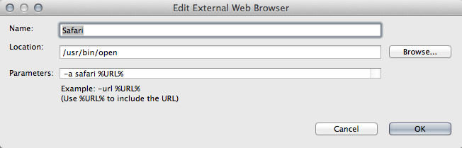
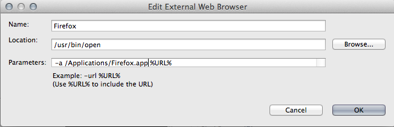

# Use External Web Browsers

To customize the browser Studio uses to launch Mobile Web applications, Studio Preferences must be updated to include additional web browsers. Open Studio Preferences and navigate to **General** \> **Web Browser**. Follow the browser-specific directions below.

## Safari

Click the **New** button, and configure the information as shown below for OSX:

## Google Chrome

One method is to change the default system browser to be Google Chrome. Then set the external browser to "Default system web browser".

## Firefox

Click the **New** button, and configure the information as shown below for OSX:

