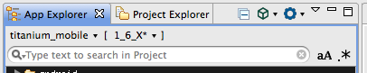

# Contributing Documentation

This document provides basic information on how to contribute to the Appcelerator documentation space within Confluence.

## Keep it simple and consistent

Try and avoid complex formatting, and keep the tone simple and easy to understand, with a minimum of jargon.

## User macros and plugins

Keep the usage of user macros and plugins to a minimum. Several macros and plugins are not supported when the documentation is published and may result in poorly formatted content or render the page completely invalid. For the most part, Confluence's native user macros and plugins are supported. For more information about macro and plugin usage, content your local tech writer.

## Table of contents

If a page has more than three heading and/or the page length exceeds the fold, use the **Table of Contents macro** at the top of the page. The topmost level of a heading element is h2. We reserve the h1 heading for other documentation publication purposes.

## Structure your document using headings h2 to h5

Giving your documents a logical structure in the form of section headings makes them easier to follow. This is done using the `h2` to `h5` heading macro, which translate to their respective HTML tags. These headings are automatically used to update the Table of contents macro, which provides an essential navigation tool for the reader.

::: warning ⚠️ Warning
As an HTML `h1` tag is already used for the page title, headings within the document should range from `h2` to `h5`.
:::

## Emphasize important information using panels

The `info`, `note`, `tip` and `warning` panels are great for bringing the user's attention to something outside the main flow of the text.

::: tip 💡 Hint
A tangental point, related to the main text, that the reader may find useful
:::
::: warning ⚠️ Warning
A related point that should be noted or emphasized
:::
::: tip ✅
A relevant suggestion that may make life easier for the user
:::
::: danger ❗️ Warning
A related issue or gotcha that the user should be aware about
:::

## Use the code macro for syntax highlighting

Surrounding your code with the `code block` macro code escapes all of the content, meaning that it will not interfere with the rest of the page. Furthermore, you can set the language used for syntax highlighting, by selecting the appropriate languages from the Syntax highlighting drop-down when editing the code block macro.

```javascript
var window = Titanium.UI.createWindow();
window.open();
```

In addition to `JavaScript`, the `XML`, `HTML`, and `SQL` values are also available. If the language you wish to display is not supported, use the `code` macro without any arguments, or disable syntax highlighting altogether.

If a code sample is 10+ lines in length, you should enable the option Show line numbers in the Code Block macro.

## Inline code highlighting

When a code sample needs to be mentioned inline to a sentence (as apposed to a block element (see code macro)), use the monospace formatting on the term in question. For example: "... and when `foo` is `false`, `bar` is `true`.".

## Writing navigation instructions

When writing about how to navigate the Studio user interface, bold terms that refer to menu options and buttons. For example:

* In Firefox, select **Extensions** (called **Add-ons** in some Firefox configurations) from the **Tools** menu.

* To the right of the path for the **Error Log**, click **View** > **Display Log**.

## Images

All images used in our documentation must be attached to the target page. Do not link images outside Confluence. We need to guarantee that the image is available to the doc site and offline users of our documentation.

When formatting images, you can add a line break to make them separate visually on the page. This is especially useful if you wish to inline an image in a bulleted list. This can be accomplished by typing **Shift** + **Enter**.

Which results in:

* Item 1

* Item 2

    
* Item 3

If the image has a large field of white around the item of interest, place a border around it via the Image Property feature.

If an image is larger than 980px, set the size of the image to 500px via the Image Property feature. Confluence will make the image interactive in the sense that if the viewer clicks on the resized item, it will show the image at it's original size or a larger view constrained to the size of the browser.

Don't iterate the names of the images, reattach, and repoint the page to use different images. Version out your images. If you need to make a change to an existing image, make the necessary changes and ensure it has the same name as the image it will be replacing. Confluence will automatically version out the image once you attach it to the page.

## Labels

<table class="sectionMacro conf-macro output-block"><colgroup><col> </colgroup><tbody class=" "><tr class="sectionMacroRow"><td class="columnMacro conf-macro output-block" rowspan="1" colspan="1"><p>Labels are key words or tags that you can add to pages. Adding labels to pages is important as it helps promote the page in the search index.</p><h4 id="src-30083166_ContributingDocumentation-Labelingtips" class="heading "><span>Labeling tips</span></h4><p></p><ul class=" "><li class=" "><p>Don't use plurals (e.g. contributes, documents, uploads)</p></li><li class=" "><p>Only use key terms (e.g. contribute documentation)</p></li><li class=" "><p>Don't use past or active tense of a term (e.g contributed, contributing); only use the present tense (e.g. contribute, upload)</p></li></ul><h3 id="src-30083166_ContributingDocumentation-Commenting" class="heading "><span>Commenting</span></h3><p>Upon edit a page, add a comment as to what you changed and why. This helps everyone identify those changes in case of the need to revert the page back to a previous version.</p><h3 id="src-30083166_ContributingDocumentation-JIRALinking" class="heading "><span>JIRA Linking</span></h3><p></p><p>If you must use a JIRA ticket in your document, simply copy and paste the URL of the JIRA ticket. Confluence will handle the conversion of this link into a live JIRA link and present the JIRA link, status of ticket, and summary automatically. Don't include JIRA macros in public-facing documentation.</p></td></tr></tbody></table>
