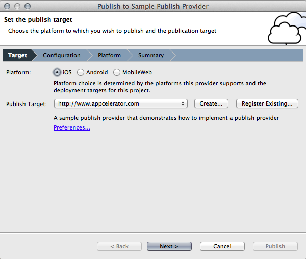
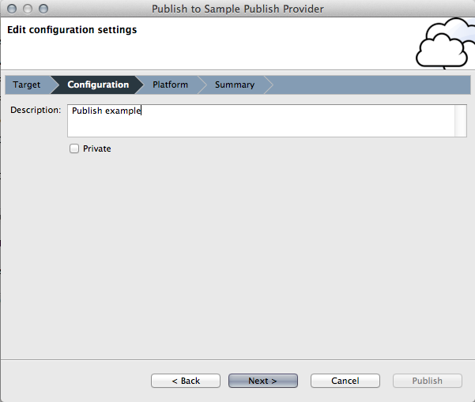
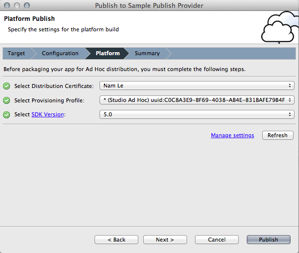
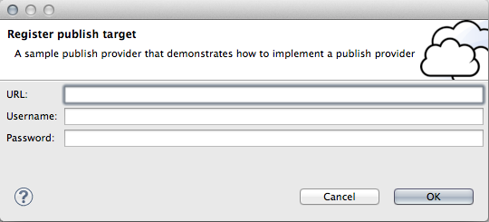
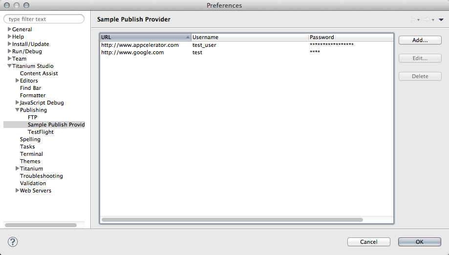
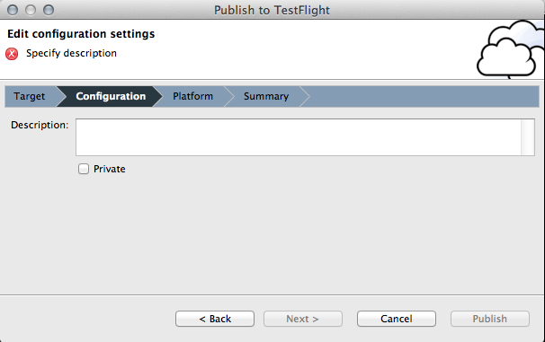

# Adding a new Publish Provider

## Overview

The Publish Provider extension point allows users to build Titanium Mobile projects and publish the output to a target of their choice (for example, enterprise app store, upload service, or ftp server). The extension leverages the Titanium Mobile packaging process for iOS, Android and Mobile Web. Publishing utilizes menus, preferences and a publish wizard to guide users through the publishing process. Publish providers are able to extend nearly all aspects of the publish process, providing a customized user experience for Titanium Studio users.

A sample publish provider implementation is referenced in this document and can be downloaded here: [https://github.com/appcelerator/titanium\_studio\_sdk/tree/master/samples/publish/plugins](https://github.com/appcelerator/titanium_studio_sdk/tree/master/samples/publish/plugins)

## Prerequisites

Knowledge of Eclipse plugin development is necessary to develop a plugin that extends the built-in publish functionality available for Titanium projects. Developers will utilize Eclipse and Titanium Studio extension points.

## Required APIs

To implement the publish extension, the only requirement is that there is an available API to which files can be published. Additional APIs can be integrated to enable creating new user accounts, creating new publish targets, or management of the publish target.

## Publish Workflow

1. Menus are contributed to Titanium Mobile projects to initiate the publish wizard, access shortcuts for management, and update any preferences associated with the publish provider. The menus are contributed using eclipse extension points. See the "**Contribute to Publish Menus**" for more information.

2. The publish wizard walks the user through the publish operation, requesting data from the user. The first page of the publish wizard, the Target page, allows users to specify which platforms and target to publish to. The available platforms and publish target is defined in the extension point and the IPublishTarget subclass. See the **"IPublishType and IPublishTarget"** section for more information.

    
3. The next page of the publish wizard is the Configuration page. This page allows publish providers to request information specific to their publish operation. If no additional information is required, the Configuration page is not shown. See the **"Configuration Page"** section for more information.

    
4. The next page of the wizard is the Platform page. The page displayed is determined by the selected platform on the Target page. This page is specific to how projects are built using Titanium, so these pages are not customizable.

    
5. The final page of the wizard is the Summary page. This page displays the settings for the publish operation. There is a section in on the page that allows publish providers to display settings specific to the publish provider. See the **"Summary Page"** section for more information.

    
6. Clicking the "Publish" button will initiate the publish operation. The publish operation consists of two parts: the Titanium build and the distribution operation. The Titanium build is performed by Titanium Studio. The result of the build is stored at a specified location. Publish providers are expected to implement the distribution operation, which is specific to the purpose of the publish provider. The distribution is performed in the following method:

    ```
    com.appcelerator.titanium.publish.IPublishType#publish(com.appcelerator.titanium.publish.IPublishTarget, java.util.Map)
    ```

The publish operation is performed as an org.eclipse.debug.core.ILaunch, utilizing an org.eclipse.debug.core.ILaunchConfiguration to store information.

## Publish Provider Extension Point

The Publish Provider extension point defines how publishing is performed for a particular provider. The publish provider extension point is

```
com.appcelerator.titanium.publish.publishProviders
```

The Publish Provider definition is defined as follows:

**Identifier:** com.appcelerator.titanium.publish.publishProviders
**Since:** Extension point
**Description:** This extension point allows the contribution of publishing to a specific target type. The extension defines how users will create, register, and manage publish targets of the particular type. The extension is used to Publish a Titanium Mobile project to the publish target.

### Markup

```xml
<!ELEMENT extension (provider)+>
<!ATTLIST extension
  point CDATA #REQUIRED
  id    CDATA #IMPLIED
  name  CDATA #IMPLIED
>
```

```xml
<!ELEMENT provider (supportedPlatform+)>
<!ATTLIST provider
  id                          CDATA #REQUIRED
  class                       CDATA #REQUIRED
  name                        CDATA #REQUIRED
  description                 CDATA #IMPLIED
  url                         CDATA #IMPLIED
  icon                        CDATA #IMPLIED
  wizard_icon                 CDATA #IMPLIED
  createPublishTargetUrl      CDATA #IMPLIED
  registerPublishTargetDialog CDATA #IMPLIED
  preferencePageId            CDATA #IMPLIED
>
```

* **id** - The identifier of the provider

* **class** - The class that defines the publish type. At minimum it is expected to implement IPublishType, but most implementations should simply extend AbstractPublishType

* **name** - The name of the provider that is presented to users.

* **description** - A description of the provider

* **url** - The url of a page containing information about the publish provider

* **icon** - Icon used to represent the publish type in menus

* **wizard\_icon** - Icon used in Wizard and Dialogs related to the publish type

* **createPublishTargetUrl** - The url of a page to create a new publish target of this type

* **registerPublishTargetDialog** - The dialog class that extends `com.appcelerator.titanium.publish.ui.RegisterPublishTargetDialog`

* **preferencePageId** - Preference page id for this publish type

```xml
<!ELEMENT supportedPlatform EMPTY>
<!ATTLIST supportedPlatform
  name (iOS|Android|MobileWeb)
>
```

Used to specify a supported platform

* **name** - Platform name

### Example

```xml
<extension point="com.appcelerator.titanium.publish.publishProviders">
      <provider
            class="com.appcelerator.titanium.publish.sample.SamplePublishType"
            createPublishTargetUrl="http://publisher.com/web/page/to/create/a/new/target/container"
            description="A sample publish provider that demonstrates how to implement a publish provider"
            icon="icons/full/obj16/weather_clouds.png"
            id="com.appcelerator.titanium.publish.sample.provider"
            name="Sample Publish Provider"
            preferencePageId="com.appcelerator.titanium.publish.preferences.SamplePreferencePage"
            registerPublishTargetDialog="com.appcelerator.titanium.publish.sample.ui.SampleRegisterTargetDialog"
            url="http://publisher.com/web/page/with/more/information"
            wizard_icon="icons/full/wizban/clouds.png">
         <supportedPlatform name="iOS"/>
         <supportedPlatform name="Android"/>
         <supportedPlatform name="MobileWeb"/>
      </provider>
   </extension>
```

## Implementation

### Implement IPublishType and IPublishTarget

Provide an implementation of IPublishTarget. This defines an object that contains information to describe the publish target. Subclassing **com.appcelerator.titanium.publish.PublishTarget** will provide a more consistent behavior to other publish providers. See **com.appcelerator.titanium.publish.sample.SamplePublishTarget** for an example implementation:

```
/**
 * Test Publish Target. Cotnains a username and password
 */
public class SamplePublishTarget extends PublishTarget
{
 public static final String USERNAME = "user_name"; //$NON-NLS-1$
 public static final String PASSWORD = "password"; //$NON-NLS-1$

 /**
  * Creates a new sample publish target
  *
  * @param name
  * @param properties
  */
 public SamplePublishTarget(String name, Map<String, String> properties)
 {
  super(name, properties, SamplePublishType.ID);
 }

 /**
  * Returns the username associated with this sample publish target
  *
  * @return username
  */
 public String getUsername()
 {
  return getProperties().get(USERNAME);
 }

 /**
  * Returns the password associated with this sample publish target
  *
  * @return password
  */
 public String getPassword()
 {
  return getProperties().get(PASSWORD);
 }
}
```

Provide an implementation of IPublishType. This defines how the publication process works for the provider. It also defines the UI elements used in the Publish Wizard. Subclassing **com.appcelerator.titanium.publish.AbstractPublishType** will provide a more consistent behavior to other publish providers. See **com.appcelerator.titanium.publish.sample.SamplePublishType** for an example implementation:

```
/**
 * Test Publish Type. Performs a build and displays the location and settings of the publish
 */
public class SamplePublishType extends AbstractPublishType
{
 public static final String ID = "com.appcelerator.titanium.publish.testProvider.provider"; //$NON-NLS-1$
 public static final String PUBLISH_PROPERTY_DESCRIPTION = "description"; //$NON-NLS-1$
 public static final String PUBLISH_PROPERTY_PRIVATE = "private"; //$NON-NLS-1$

 /*
  * (non-Javadoc)
  * @see com.appcelerator.titanium.publish.IPublishType#createPublishTarget(java.lang.String, java.util.Map)
  */
 public IPublishTarget createPublishTarget(String name, Map<String, String> properties) throws PublishException
 {
  return new SamplePublishTarget(name, properties);
 }

 /*
  * (non-Javadoc)
  * @see com.appcelerator.titanium.publish.IPublishType#getManagePublishTargetUrl(com.appcelerator.titanium.publish.
  * IPublishTarget)
  */
 public String getManagePublishTargetUrl(IPublishTarget publishTarget)
 {
  // The publish url is the publish target name
  return publishTarget != null ? publishTarget.getName() : null;
 }

 /*
  * (non-Javadoc)
  * @see com.appcelerator.titanium.publish.IPublishType#publish(com.appcelerator.titanium.publish.IPublishTarget,
  * java.util.Map)
  */
 public IStatus publish(IPublishTarget publishTarget, Map<String, String> parameters) throws PublishException
 {
  String platform = parameters.get(PUBLISH_PROPERTY_PLATFORM);
  String target = publishTarget.getName();
  String publishTypeValueId = publishTarget.getType();
  String output = parameters.get(PUBLISH_PROPERTY_OUTPUT);
  String description = parameters.get(PUBLISH_PROPERTY_DESCRIPTION);
  String isPrivate = parameters.get(PUBLISH_PROPERTY_PRIVATE);

  // This is where the magic happens. output is the path to the file that will be published
  // to whatever is the appropriate URL

  return new Status(IStatus.OK, SampleProviderPlugin.PLUGIN_ID, MessageFormat.format(
    Messages.TestPublishType_Test_publish_output, platform, target, publishTypeValueId, output, new File(
      output).canRead() ? "found" : "missing", description, isPrivate));
 }

 /*
  * (non-Javadoc)
  * @see com.appcelerator.titanium.publish.IPublishType#contributesConfigurationControl()
  */
 public boolean contributesConfigurationControl()
 {
  return true;
 }

 /*
  * (non-Javadoc)
  * @see com.appcelerator.titanium.publish.IPublishType#createConfigurationControl(org.eclipse.swt.widgets.Composite,
  * java.util.Map, com.aptana.core.util.StatusCollector)
  */
 public void createConfigurationControl(Composite parent, Map<String, Object> model, StatusCollector statusCollector)
 {
  new SampleConfigurationControl(model, statusCollector).create(parent);
 }

 /*
  * (non-Javadoc)
  * @see com.appcelerator.titanium.publish.IPublishType#contributesSummaryComponent()
  */
 public boolean contributesSummaryComponent()
 {
  return true;
 }

 /*
  * (non-Javadoc)
  * @see com.appcelerator.titanium.publish.IPublishType#createSummaryComponent(org.eclipse.swt.widgets.Composite,
  * java.util.Map, com.aptana.core.util.StatusCollector)
  */
 public ISummaryWizardPageComponent createSummaryComponent(Composite parent, Map<String, Object> model,
   StatusCollector listener)
 {
  return new SampleSummaryComponent();
 }
}
```

### Contribute to Publish Menus

Menus are contributed to the Titanium Publish menu. A base implementation of ContributionItem is provided to provide a consistent look and feel to the menus. Providers should subclass **com.appcelerator.titanium.publish.ui.PublishContributionItem** to provide custom behavior.

Contributing to the publish menu is accomplished using the Eclipse [org.eclipse.ui.menus](http://help.eclipse.org/indigo/index.jsp?topic=%2Forg.eclipse.platform.doc.isv%2Freference%2Fextension-points%2Forg_eclipse_ui_menus.html) extension point. Following is an example menu contribution for the Sample menus:

```xml
<extension point="org.eclipse.ui.menus">
 <menuContribution locationURI="menu:com.aptana.explorer.deploy?after=group.deploy">
  <dynamic
   class="com.appcelerator.titanium.publish.sample.ui.SampleContributionItem"
   id="com.appcelerator.titanium.publish.SampleContributionItem">
   <visibleWhen checkEnabled="false">
    <and>
     <reference definitionId="com.appcelerator.titanium.isMobileProject"/>
     <or>
      <reference definitionId="com.appcelerator.titanium.isIPadProject"/>
      <reference definitionId="com.appcelerator.titanium.isIPhoneProject"/>
      <reference definitionId="com.appcelerator.titanium.isAndroidProject"/>
      <reference definitionId="com.appcelerator.titanium.isMobileWebProject"/>
     </or>
    </and>
   </visibleWhen>
  </dynamic>
 </menuContribution>
</extension>
```

The following Titanium-specific reference definitionIds can be used:

* com.appcelerator.titanium.isMobileProject

* com.appcelerator.titanium.isIPadProject

* com.appcelerator.titanium.isIPhoneProject

* com.appcelerator.titanium.isAndroidProject

### PublishProvider extension

All the subsequent steps are used in the definition of the PublishProvider. Additional information about the extension point can be found in the reference at the top of the page. Following is the extension for the Sample publish provider:

```xml
<extension point="com.appcelerator.titanium.publish.publishProviders">
 <provider class="com.appcelerator.titanium.publish.sample.SamplePublishType"
  createPublishTargetUrl="http://publisher.com/web/page/to/create/a/new/target/container"
  description="A sample publish provider that demonstrates how to implement a publish provider"
  icon="icons/full/obj16/weather_clouds.png" id="com.appcelerator.titanium.publish.testProvider.provider"
  name="Sample Publish Provider"
  preferencePageId="com.appcelerator.titanium.publish.preferences.SamplePreferencePage"
  registerPublishTargetDialog="com.appcelerator.titanium.publish.sample.ui.SampleRegisterTargetDialog"
  url="http://publisher.com/web/page/with/more/information"
  wizard_icon="icons/full/wizban/clouds.png">
  <supportedPlatform name="iOS"/>
  <supportedPlatform name="Android"/>
  <supportedPlatform name="MobileWeb"/>
 </provider>
</extension>
```

## Customization

### Provide Publish Target Dialog

The publish target dialog provides the UI for creation and modification of a publish target. The dialog class has to subclass **com.appcelerator.titanium.publish.ui.RegisterPublishTargetDialog**. The default implementation requests a name for the publish target.

Providers should customize this dialog if additional information is required to implement a **IPublishTarget**. Providers should also provide validation for the fields they are requesting. The Sample provider defines a custom dialog, **com.appcelerator.titanium.publish.sample.ui.SamplePublishTargetDialog**. The dialog is defined in the Publish Provider extension point using the **registerPublishTargetDialog** attribute

This is the Sample publish target dialog:



Implementors wanting customized behavior should override the following methods:

* org.eclipse.jface.dialogs.Dialog#createDialogArea(org.eclipse.swt.widgets.Composite) to add custom UI

* com.appcelerator.titanium.publish.ui.RegisterPublishTargetDialog#validatePublishTarget() to provide custom validation of target

* com.appcelerator.titanium.publish.ui.RegisterPublishTargetDialog#savePublishTarget() to provide external saving of the target

### Preference Page

A preference page can be defined to allow the management of the publish targets. The preference page is defined using the Eclipse [org.eclipse.ui.preferencePages](http://help.eclipse.org/indigo/index.jsp?topic=%2Forg.eclipse.platform.doc.isv%2Freference%2Fextension-points%2Forg_eclipse_ui_preferencePages.html) extension point. An abstract implementation of a Publish Provider preference page is provided: **com.appcelerator.titanium.publish.preferences.AbstractPublishTargetPreferencePage**.

The id of the preference page should be defined in the Publish Provider extension point using the **preferencePageId** attribute. The Sample provider defines the preferencePage using the following extension:

```xml
<extension  point="org.eclipse.ui.preferencePages">
  <page
     category="com.aptana.ui.io.preferences.RemotePreferencePage"
     class="com.appcelerator.titanium.publish.sample.preferences.SamplePreferencePage"
     id="com.appcelerator.titanium.publish.preferences.SamplePreferencePage"
     name="Sample Publish Provider">
  </page>
</extension>
```



Implementors wanting a customized look should override the following methods:

* `com.appcelerator.titanium.publish.preferences.AbstractPublishTargetPreferencePage#createPublishTargetTableColumns()` - specifies what columns are displayed in the table

### Publish Wizard

#### Configuration Page

The publish wizard can be customized in two different ways: custom configuration wizard page and custom summary wizard page.

The custom configuration wizard page allows providers to request specific data from the user during publish. The UI for the page is defined in the IPublishType `contributesConfigurationControl()` and `createConfigurationControl()` methods. An example contribution is demonstrated in the Sample provider class **com.appcelerator.titanium.publish.sample.SamplePublishType**:



#### Summary Page

The custom summary wizard page allows providers to display information retrieved in the configuration wizard page. The UI for the page is defined using IPublishType `contributesSummaryComponent()` and `createSummaryComponent()`. An example contribution is demonstrated in the Sample provider class **com.appcelerator.titanium.publish.sample.SamplePublishType**:


## Distribution

To distribute your provider into an existing Titanium Studio instance, it is recommended to do the following:

1. Create a feature and associate with the new plugin. [More info](http://wiki.eclipse.org/FAQ_How_do_I_create_a_feature%3F)

2. Export the feature: Right-click on the feature project and select Export...Then Plug-In Development->Deployable features. Export the feature as an archive.

3. In your existing Titanium Studio instance, Use Help > Install New Software.... In the dialog, select Add.. and specify the archive that was generated from the previous step.

4. Uncheck the category option to view the new feature. Follow the prompts to install
