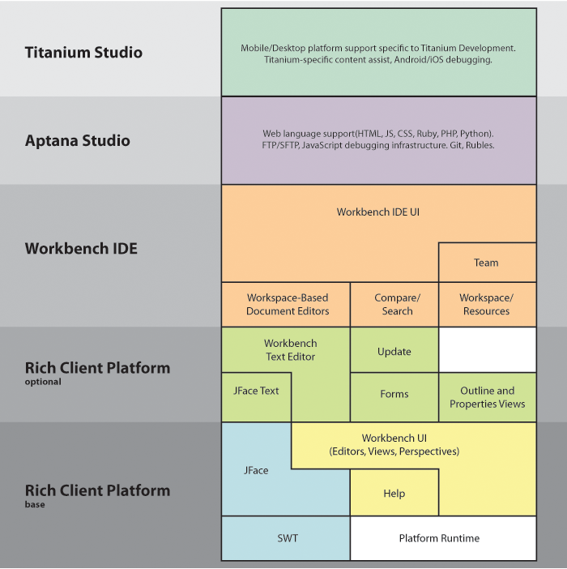

# Studio Architecture

Studio is built on top of the Eclipse platform, a layer of plugins, and wrapper code around the core Eclipse infrastructure. As such, it is compatible with many existing Eclipse plugins, and can itself be extended with additional plugins built on top.

## Plugin architecture

For a full discussion of the plugin architecture, see the [Eclipse article](http://www.eclipse.org/articles/Article-Plug-in-architecture/plugin_architecture.html). In short, Eclipse allows extensions through plugins via XML configuration files called extension points. Extension points allow new plugins to contribute to an existing feature.

As an example, Eclipse provides a "Team" infrastructure for source control providers to which to attach. Individual providers, such as Git, will implement a set of classes and extension points that then enable wizards, menus, and other elements to connect to Git.

## Block diagram

Studio exists in layers, each piece building on the layer below. As shown in the diagram, Titanium Studio builds on top of Aptana Studio, which then builds on top of the generic Eclipse IDE platform.

::: warning ⚠️ Warning
Though the Eclipse layer appears to be the largest here, Titanium Studio encompasses roughly 350 plugins, with about 150 in Aptana, another 150 for Eclipse, and the remainder Titanium-specific.
:::



## Editor Contributions

In this snippet from the JS editor plugin.xml, you can see the variety of items to which an editor to contribute: editors, menus, content types, parsers, preference pages, etc.

```xml
<?eclipse version="3.4"?>
<plugin>
   <extension-point id="com.aptana.editor.js.typeMaps" name="%extension-point.typemaps.name" schema="schema/typeMaps.exsd"/>
   <extension
         point="org.eclipse.ui.editors">
      <editor
            class="com.aptana.editor.js.JSSourceEditor"
            contributorClass="com.aptana.editor.common.CommonTextEditorActionContributor"
            default="true"
            extensions="js,htc,jsx"
            icon="icons/js.png"
            id="com.aptana.editor.js"
            name="%editor.js.name">
         <contentTypeBinding
               contentTypeId="com.aptana.contenttype.js">
         </contentTypeBinding>
      </editor>
   </extension>
   <extension
         point="org.eclipse.core.contenttype.contentTypes">
      <content-type
            base-type="org.eclipse.core.runtime.text"
            default-charset="UTF-8"
            file-extensions="js,htc,jsx"
            id="com.aptana.contenttype.js"
            name="%content-type.js.name"
            priority="normal">
      </content-type>
   </extension>
   <extension
         point="org.eclipse.core.runtime.preferences">
      <initializer
            class="com.aptana.editor.js.preferences.PreferenceInitializer">
      </initializer>
   </extension>
   <extension
         point="com.aptana.parsing.parser">
      <parser
            class="com.aptana.editor.js.parsing.JSParser"
            content-type="com.aptana.contenttype.js">
      </parser>
   </extension>
   <extension
         point="org.eclipse.ui.menus">
      <menuContribution
            allPopups="false"
            locationURI="popup:#AbstractTextEditorContext?after=additions">
         <command
               commandId="com.aptana.editor.js.quick_outline"
               style="push">
         </command>
      </menuContribution>
   </extension>
   <extension
         point="org.eclipse.ui.bindings">
      <key
            commandId="com.aptana.editor.js.openDeclaration"
            contextId="com.aptana.scripting.context"
            schemeId="org.eclipse.ui.defaultAcceleratorConfiguration"
            sequence="F3">
      </key>
   </extension>
   <extension
         point="org.eclipse.ui.preferencePages">
      <page
            category="com.aptana.editor.common.preferences.EditorsPreferencePage"
            class="com.aptana.editor.js.preferences.JSPreferencePage"
            id="com.aptana.editor.js.preferences.JSPreferencePage"
            name="%page.js.name">
      </page>
   </extension>
   <extension
         point="com.aptana.buildpath.core.buildParticipants">
      <participant
            class="com.aptana.editor.js.validator.JSLintValidator"
            id="com.aptana.editor.js.validator.JSLintValidator"
            name="%validator.jslint.name"
            priority="50">
         <contentTypeBinding
               contentTypeId="com.aptana.contenttype.js">
         </contentTypeBinding>
      </participant>
   </extension>

</plugin>
```

Studio also provides over 40 of its extension points that downstream products can extend, on top of extending our existing classes via subclassing.
