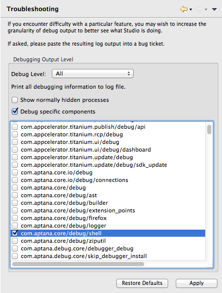

# Debugging Studio

## Overview

Studio uses a number of techniques for enabling debugging. If a Studio developer asks you to enable debugging, please follow the steps below.

## Enable Debug Logging

1. Open **Preferences > Studio > Troubleshooting**

    
2. Change the severity drop-down to see the desired level of messages written to the log. Caution--"ALL" really does mean all messages!

3. If you wish to show only show specific error messages, you can enable "specific component" debugging and check the area in question. If you are unsure, ask a Studio developer to help you find the area you need. Some common areas:

    * com.aptana.core/debug/builder: Writes out when studio starts and stops building projects

    * com.aptana.core/debug/shell: Writes out what processes Studio is running on the command line

## Using the Studio Console

If Studio does not appear to work properly, particularly if it crashes during startup, you can try and use the console to figure out what is happening.

1. Follow the instructions [here](/guide/Axway_Appcelerator_Studio/Axway_Appcelerator_Studio_Guide/Customizing_Studio/Adding_Command-Line_Options/) for adding a launcher argument.

2. Add **\-console** to the launch arguments for Studio or Eclipse.

3. After the application launches, you'll see a separate console window start. Type ss at the command prompt in this window, and you'll get a list of bundles.

4. Pick the one which is not starting. If you don't see any Studio features at all, you might pick **com.aptana.core.ui**; note the bundle number. See if the bundle says "Started".

5. If not, type **start #**, replacing **#** with the number you just saw above. Note any error message displayed and log that with a support ticket.
