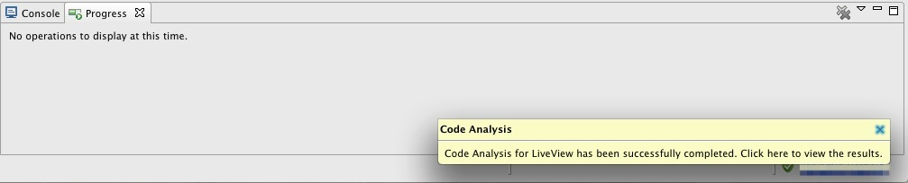
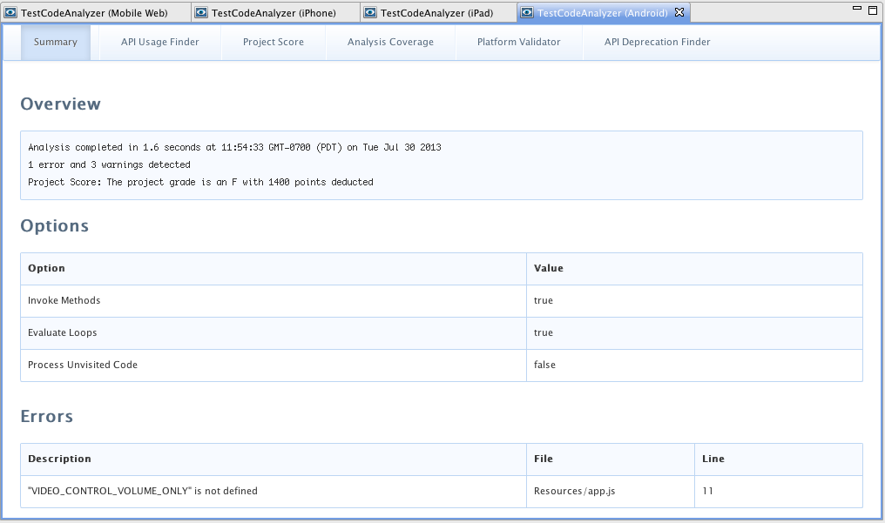
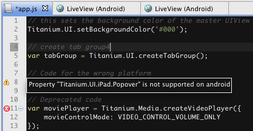

# Code Analyzer

This page describes how to use the Appcelerator Studio Code Analyzer to analyze JavaScript code in your mobile projects.

## Introduction

The Appcelerator Studio Code Analyzer uses the Titanium Code Processor tool to analyze the JavaScript code in mobile projects. It provides a wide variety of useful functionality, including runtime-error detection, Titanium API deprecation warnings, platform-specific API validation, etc. The code analyzer reads the API documentation for the Titanium SDK used by the project to check API usage. As such, the SDK specified in the project's `tiapp.xml` file must be installed.

The Titanium Code Processor must be installed to use this option in Appcelerator Studio. The code processor should already be automatically installed with Appcelerator Studio if you chose to install additional Appcelerator updates. If not, from the menu, select **Help** > **Check for Appcelerator Updates**.

The analyzer works with classic mobile and Alloy projects. For Alloy projects, the analyzer processes the Titanium files generated by the Alloy compiler (inside the `Resources` directory), then maps the errors and warnings back to the files in the `app` folder if it can. Not all errors and warnings will map back to the files in the `app` folder. Some files are generated from the Alloy CLI and not based on any files created in the `app` directory.

::: danger ❗️ Warning
**Deprecation notice**: As of Studio 4.3.0, Code Analyzer is no longer available.
:::

## Analyzing an Application

To use the code analyzer, run the code analyzer from the right-click context menu on your mobile project to start code analysis for a specific platform or platforms. Once it is done, a pop-up appears for you to click on to display the results, and the code analyzer indicates in your code any deprecated APIs or misused platform-specific APIs.

### Starting Code Analysis

In the **Project Explorer** view, either:

* Right-click your project, select **Code** **Analysis**, then select an option, or

* Select your project, and from the menu bar, select **Run > Code Analysis**, then select an option.

You can choose to either run code analysis for a single platform or for multiple platforms:

* For a single platform, select one of the first set of options, which correspond to the deploy targets in the `tiapp.xml` file.

* For multiple platforms, select **Multiple...**. A dialog appears. Select the platforms to analyze, then click **Analyze**.

A dialog appears or progress indicator starts indicating the code analysis has started. The speed of the code analyzer depends on the complexity of your code.


### Displaying the Results

Once the code analyzer is done, a **Code Analysis** pop-up appears in the bottom-right corner indicating that the code analysis is done (see image below). Click on the pop-up to display the results, which opens a new view.

::: warning ⚠️ Warning
You may receive an error stating "Page load failed with error: The requested URL was not found on this server." Rerun the code analyzer.
:::



To view the results of the last analysis, in the **Project Explorer** view, right-click your project, select **Code** **Analysis**, then select **View Current Results**. A new view opens with the results of the last run of the code analyzer.



### Saving the Results

To save the currently displayed results:

1. Right-click on the results in the Editor, which open a right-context menu.

2. Select **Export...**. A dialog appears.

3. Navigate to and select and location to save the results.

4. Click **Open**.

Studio saves the results in the location you chose in a folder called `<Project_Name> (<platform>)`.

To export results for multiple platforms:

1. In the **Project Explorer** view, right-click your project and select **Code Analysis > Export Results...**. A dialog appears.

2. Select the platforms to export results for.

3. Enter a directory to export the results to in the **Export Location** textbox.

4. Click **Export****.**

Studio saves the results in the location you chose in a folder called `<Project_Name> (<platform>)`.

### Interpreting the Results in the Project Files

The code analyzer displays icons in your code to indicate errors or warnings that might need to be addressed. In the **Project Explorer** view, any file that displays a red box with a white 'x' icon indicates that the file contains an error or warning found by the code analyzer. Open the file to see the errors or warnings. In the left margin to the left of the line numbers, a yellow triangle with a black exclamation point indicates a warning and a red circle with a white 'x' indicates an error. Hovering over one of these icons displays a pop-up with more information.

In the example below, the `app.js` file contains code for the wrong platform (line 8), indicated with a warning icon, and which does not exist (line 11), indicated with an error icon. The mouse cursor is hovering over the warning icon, displaying a message saying why this code is not supported.



::: warning ⚠️ Warning
When running the code analyzer on multiple platforms, only the results for the last platform ran are shown in the project files. For example, if the code analyzer is ran for the Android and iPad platforms, since iPad was the last platform ran, the warning message in the previous example will not be shown.
:::

These results are also shown in the **Problems** view, which displays an aggregated list of warnings and errors across all files and projects. To display the **Problems** view, in the menu, select **Window > Show View > Other_._** The **Show View** dialog appears. Navigate to **General > Problems** and click the **OK** button. The **Problems** view opens below the **Editor****.** Using the **Problems** view shows all of the errors and warnings for running the code analyzer against multiple platforms.

### Interpreting the Results in the HTML Page

Studio opens a new view to display an HTML page with different tabs of results from the code analyzer and its plugins:

| Tab Section | Description |
| --- | --- |
| **Summary** | Provides a summary of the API warnings and errors, and code processor options and plugins used. |
| **API Usage Finder** | Provides a breakdown of the APIs by usage and by file. |
| **Project Score** | This score is a work in progress and is only an estimate based on Appcelerator best practices and the code analyzer's interpretation of the JavaScript specification. This score should not be used to evaluate personal performance. This score is generated based on the errors and warnings found by the code analyzer. |
| **Analysis Coverage** | Provides coverage statistics about the files and how much code the code analyzer was able to visit and process. Results can vary depending on the configuration settings. |
| **Platform Validator** | Provides detailed results of any invalid platform-specific API usage. Lists each occurrence of a misused API and its location (filename and line number). |
| **API Deprecation Finder** | Provides detailed results of any deprecated API usage. Lists each occurrence of a deprecated API and its location (filename and line number). |

#### Error and Warning Interpretation

The table below lists some of the common errors and warnings, how to interpret them and how to resolve them. This is not an exhaustive list of warning and errors generated by the code analyzer. You may receive some false positives based on your code analyzer configuration settings (see the "Configuring Code Analyzer" section). Additionally, your code may run fine but the code analyzer was unable to evaluate the context for some of your code.

| Error/Warning | Reason for Error/Warning | Suggested Resolution |
| --- | --- | --- |
| "Maximum callstack exceeded" or "Maximum recursion depth reached" | You have a recursive call where the context could not be definitively evaluated, so the code analyzer processed as deep as it could until it ran out of stack space or its internal limit was reached. For example:<br /><br />```javascript<br />// Since the initial value cannot be definitively evaluated,<br />// the code analyzer continually processes the function<br />// until its stack space runs out<br />function factorial (value) {<br />    if (value == 0) {<br />        return 1;<br />    } else {<br />        return value * factorial(value - 1);<br />    }<br />}<br />factorial(Date.now());<br />``` | May be a false positive. |
| "Null value has no property <X>" or "undefined value has no property <X>" | You are referencing a property of an object that does not exist or does not have a value.<br /><br />This may be caused by using`Ti.include` calls that could not be resolved. | It is recommended to change your `Ti.include` calls to `require` calls. |
| "A value that could not be evaluated was passed to require" or  <br />"A value that could not be evaluated was passed to Ti.include" | You are passing a variable and not a hard-coded value to your `require` or `Ti.include` method and the code analyzer could not process it. As a side effect, this may generate other errors or the code analyzer may skip parts of the application. For example:<br /><br />```javascript<br />// If getPath was not defined or Invoke Methods was disabled,<br />// the code analyzer cannot resolve the following path<br />var path = getPath(Ti.Platform.osname);<br />require(path + "/foo");<br />``` | Hard code the module you want to load in to your `require` or `Ti.include` call. |
| "Property <X> is not supported on <platform>" | According to the documentation file inside the Titanium SDK, this API does not exist for the platform you are running the code analyzer for. | May be a false positive if **Process Univisited Code** is enabled in your Code Analyzer settings since it visits all code.<br /><br />May need to place conditional code around this API call.<br /><br />May be a bug in the documentation file. |
| "<X> has been deprecated" | According to the documentation file inside the Titanium SDK, this API has been marked deprecated and will be removed in a future SDK version. | Update your code to the non-deprecated API.<br /><br />May be a bug in the documentation file. |
| "<X> is not defined" | The code analyzer could not find this API reference. | Check your spelling and that the API exist. |

## Configuring the Code Analyzer

To configure the Code Analyzer:

1. Open **Appcelerator Studio Preferences**.

    * On Mac OS X, in the menu, select **Appcelerator Studio > Preferences**.

    * On Windows, in the menu, select **Window > Preferences**.

2. Navigate to **Studio > Code Analyzer**.

3. Enable or disable the following behavior by checking and unchecking the item checkboxes, respectively:

    * **Invoke Methods** – Indicates whether or not to invoke methods.

    * **Evaluate Loops** – Indicates whether or not to evaluate loops. Disabling this option only evaluates the loop once and increases the speed performance of the analyzer.

    * **Process Unvisited Code** – Indicates whether or not to process unvisited code.

For accuracy, it is recommended to keep the default values, where **Invoke Methods** and **Evaluate Loops** are enabled, and **Process Univisited Code** is disabled.

For faster performance, reverse the default settings, that is, disable **Invoke Methods** and **Evaluate Loops,** and enable **Process Univisited Code.**

If all of these options are disabled, the code analyzer does not cover most of the code resulting in inaccurate results.

::: warning ⚠️ Warning
If **Process Univisited Code** is enabled, you may receive a lot of false positives and inaccurate results due to platform-specific code being visited and functions being called that do not exist.

For example, if enabling this option for an Alloy project, errors will be reported as a result of processing files like `Resources/alloy/backbone.js`, which is generated by the Alloy compiler, not by the user.
:::

## Troubleshooting

### Fails with the message: Node.js maximum call stack size exceeded

To increase the stack size of the node command for the Code Analyzer:

1. Open the Code Analyzer preferences.

2. In the **Max Stack Size** field, enter **10000** or a value greater than the default, which is usually 1000.

3. Click **OK** and rerun the Code Analyzer.

Finding the correct size is a bit of an art. Too low and you get this exception, but too high and Node.js itself will segfault. Note that a correct value may not exist for this app, meaning that it is possible that this app cannot be analyzed using the code analyzer.
