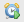
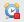
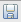
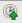

# Code Profiler

This page describes how to use the Appcelerator Studio Code Profiler to profile the performance of your applications on simulators and devices.

## Introduction

The Appcelerator Studio Code Profiler collects detailed performance data of your application. As you interact with your application, the profiler records each method called and how long it took to execute. Use this performance data to identify performance bottlenecks in your application.

The profiler works with classic mobile and Alloy projects only on the Android and iOS platforms. For Alloy projects, the profiler reports the methods from the generated Titanium files (inside the `Resources` directory), then maps them to the Alloy files (inside the `app` directory). You may see results for files not in the `app` directory.

::: warning ⚠️ Warning
Code Profiler is an Enterprise feature. See [http://www.appcelerator.com/pricing/](http://www.appcelerator.com/pricing/) for pricing details.
:::

## Profiling an Application

To use the Code Profiler, first initiate a profiler session, and once the session starts, use the profiler to collect and display performance snapshot data. You may also save performance snapshots and load them later to inspect.

### Initiate a Profiler Session

To start a profiler session on an existing project, first make sure your project is using Titanium SDK 3.1 or later. If not, update the SDK version in your `tiapp.xml`file.

1. In the **Project Explorer** view, select your project.

2. In the global tool bar, select **Profile** from the **Launch Mode** drop-down list and select an Android or iOS target (emulator, simulator or device) from the **Target** drop-down list.

3. If the **Launch Automatically** option is enabled under the **Target** drop-down list, the application will be automatically launched after the device is selected. If not, you need to click the **Launch** button to start the build process.

After the build process starts, a dialog appears asking you to change your perspective. Click the **Yes** button to change to the **Appcelerator Profiler** perspective. Select the **Remember my decision** checkbox if you do not want to be prompted to change the perspective in the future.

When profiling on device, a dialog appears showing the progress of the build. After the application is installed on device, a dialog appears prompting you to launch the application. The application must be launched in order to start profiling and your device must also be plugged into your host machine to profile.

After the application launches on the simulator or device, a connection is established between the application and Studio to start a profiler session. A dialog appears asking you to start recording a performance snapshot, which pauses the application. Click the **Yes** button to start a snapshot session and to resume the application. If you choose not to start a snapshot session, you can start one later. Select the **Do not show this message again** checkbox if you do not want to be prompted for this choice in the future.

In the **Profile** view, you should see an item called **JS Profiler** under your application profile, indicating your profiler session has been established.

### Capture a Performance Snapshot

The Code Profiler does not capture data in real time. You need to capture snapshots of application activity in order to collect performance data.

To capture a performance snapshot, select your application in the **Profile** view, then click the **Capture Performance Profile** button  to start a profiling session. Make sure before you click the **Capture Performance Profile** button to start a profiling session, there is a green play button displayed next to it. If there is a red stop button, then the profiler is already capturing data. Interact with your application and trigger any part that is potentially causing a bottleneck in performance. When you are done, click the **Capture Performance Profile** button  to stop the profiling session. A performance snapshot is created, added as an item under **JS Profile** item in the **Profile** view, and a **Performance Profile** view is automatically opened, displaying the performance data.

### Display a Performance Snapshot

Studio provides a **Performance Profile** view that allows you to inspect the data captured by a profiling session. To open the view, double-click any of the performance snapshots in the **Profile** view. Refer to the [Performance Profile View](#performance-profile-view) section below for an explanation of the displayed data.

### Save a Performance Snapshot

To save a performance snapshot, select the snapshot you want to save in the **Performance Profile** view and click the **Save Performance Snapshot** button  . A dialog appears. Navigate to the location you want to save the data to, enter a filename, then click the **Save** button.

### Load a Performance Snapshot

To open a previously saved performance snapshot, click the **Load Snapshot** button  in the **Profile** view. A dialog appears. Navigate to the the file you want to load and click the **Open** button. The performance snapshot data displays in the **Performance Profile** view.

### Terminate a Profiler Session

To stop the profiler, select it in the **Profile** view and click the **Terminate** button.

## Appcelerator Profiling Perspective

In Appcelerator Studio, switch to the **Appcelerator Profiling** perspective when you are using the Code Profiler. The **Appcelerator Profiling** perspective contains two profiler-specific views:

* **Profile View** – Used to control the Code Profiler, start and stop capturing performance data, and to load previously saved performance snapshots.

* **Performance Profile Vie** – Used to display or save performance snapshots.In addition to these specific views, the **Editor** is displayed to show source code for a particular method call as well as the **Console View** to display the log output from the debugger. 

For more details about using these views, see the sections below.

### Profile View

The **Profile** view is used to control the profiler, start and stop capturing performance data and load previously saved performance snapshots.

The main pane lists the currently active and terminated applications. In the example below, the Kitchen Sink application is running on the iOS simulator. When this item is expanded, it shows that the JS Profiler is currently running. (The other state is suspended.) When the profiler item is expanded, it lists the performance snapshots captured by the profiler. In the example below, the profiler has captured two performance snapshots. To view a snapshot, double-click the snapshot to open the **Performance Profile** view.

The **Profile** view contains a row of icon buttons in the top-right corner. From left to right, starting with the disabled button of two x's:

* **Remove All Terminated Launches** – Removes any terminated profiler sessions from the main pane.

* **Resume** – Resumes the profiler if it was previously suspended.

* **Suspend** – Suspends the profiler.

* **Terminate** – Terminates the profiler.

* **Disconnect** – Disconnects the profiler from the application.

* **Run Garbage Collector** – Runs the JavaScript garbage collector.

* **Capture Performance Profiler** – Starts (if there is a green play icon) or stops (if there is a red stop icon) capturing performance data.

* **Load Snapshot** – Loads a previously saved performance snapshot.

* **View Menu** **–** Change the layout of this view.

* **Minimize –** Minimize this view.

* **Maximize –** Maximize this view.


### Performance Profile View

The **Performance Profile** view is used to display the data captured by a profiling session. The performance profile displays the information in two different forms:

* **Call Hierarchy** \- Displays the method calls in an hierarchical form, making it easy to follow method callers and callees. It displays the calls self-time and a cumulative time where possible. You can sort this view by one of the time columns to track the most expensive methods. This form displays the following fields:

    * **Method** - Name of the method being called.

    * **Self Time** - Total amount of time, in milliseconds, that all calls to this method took to execute during the interaction period. Does not include calls to other methods inside this method.

    * **Cumulative Time** - Total amount of time, in milliseconds, that all calls to this method, and all calls to methods inside this method, took to execute during the interaction period.

    * **File** - File location and line number of the method.

* **Hotspots** - Displays a flat view of the methods that were involved in the profiling session. The self-time of the methods display in this view is aggregated to include all the occurrences of a method in the Call Hierarchy. You can also sort this view. This form displays the same fields as the Call Hierarchy form except cumulative time.

Whenever possible, double-clicking a row in this view opens up the file source in the **Editor** and scrolls to the line number that is specified for that call.

The **Performance Profile** view contains a row of icon buttons in the top-right corner. From left to right, starting with the floppy disk icon:

* **Save Performance Snapshot** – Saves a performance snapshot.

* **Show Percents** **–** Toggles showing percentage statistics.

* **Minimize –** Minimize this view.

* **Maximize –** Maximize this view.


::: warning ⚠️ Warning
On the Android platform, especially when profiling on device, you may not see all of your method calls. The profiler uses V8's built-in CPU sample profiler to monitor the stack frames over a small threshold of time. The interval for sampling is around 5 ms on Android devices, so methods that do not use too many CPU cycles may not show up in the results. However, the profiler is able to capture and identify CPU-intensive methods.

On the iOS platform, the profilers uses the instrumentation method and is able to directly intercept the calls, allowing it to log all method calls.
:::

## Improving Profiler Results

### Name Anonymous Functions

As seen in the screen shots of the Appcelerator Profiling Perspective, many of the methods are labeled as "anonymous function". To make it easier to identify functions in the profiler results, assign them with an identifier when declaring them.

For example, if you declare functions in your JavaScript code using the methods below, the profiler reports the "anonymous function" results.

```javascript
button.addEventListener('click', function(e) {
    Ti.API.info(e.source);
});

/* Or this
var doClick = function(e) {
    Ti.API.info(e.source);
}
button.addEventListener('click', doClick);
*/
```

Instead, declare your functions using the method below, which will report the results as the function name.

```javascript
function doClick (e) {
    Ti.API.info(e.source);
};
button.addEventListener('click', doClick);
```

### Missing Method Calls on Android

On the Android platform, especially when profiling on device, you may not see all of your method calls. The profiler uses V8's built-in CPU sample profiler to monitor the stack frames over a small threshold of time. The interval for sampling is around 5 ms on Android devices, so methods that do not use too many CPU cycles may not show up in the results. However, the profiler is able to capture and identify CPU-intensive methods. For example, run the following code with the profiler and hit the button several times.

```javascript
var win = Titanium.UI.createWindow({
    backgroundColor : '#fff'
});

var button = Ti.UI.createButton({
    title : 'click'
});

button.addEventListener('click', loopManyTimes);
function loopManyTimes() {
    for (var i = 0; i < 10000; i++) {
        Ti.API.info('-------------' + i);
    }
}

win.add(button);
win.open();
```
