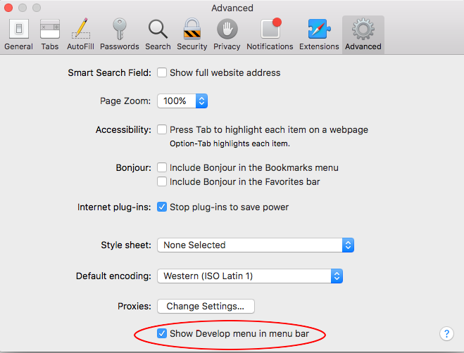

# Debugging iOS Apps with 3rd-party Tools

You can debug your Titanium App using the Safari DevTools. No matter the route you take, you must ensure that your project is using the built-in JavaScriptCore framework. For projects running Titanium SDK 7.0.0 and later, this option is enabled by default. For older projects, it can be enabled as seen below.

Searching for Android Debugging? [Here](/guide/Axway_Appcelerator_Studio/Axway_Appcelerator_Studio_Guide/Titanium_Development/Debugging_Titanium_Applications/Debugging_on_Android_Devices/Debugging_Android_Apps_with_3rd-party_Tools/) you go!

## Enable use-jscore-framework

With Titanium SDK 6.x, developers must add a tag to enable the iOS debugger in order to use Safari (or iOS-webkit-debug-proxy). With SDK 7.x and later, this value is assumed to be true unless you explicitly add the tag with `false` as the value.

The key is to enable the `use-jscore-framework` option in `tiapp.xml`:

```xml
<tiapp>
    ...
    <ios>
        ...
        <use-jscore-framework>true</use-jscore-framework>
        ...
    </ios>
    ...
</tiapp>
```

Once enabled, this will force the SDK to use the pre-packaged JSCore framework/engine as the JavaScript engine internally (rather than our older TiCore framework).

Since iOS 7, the pre-packaged JScore framework has contained a debugging agent and protocol using webinspectord. We make use of this service/protocol with our newest iOS debugger in SDK 6.0.0 as does Safari in it's tooling.

## Debugging with Safari DevTools

Be sure to turn on use-jscore-framework as listed in [Enable use-jscore-framework](#enable-use-jscore-framework).

1. Launch the app on the device or a simulator.

    ::: warning ⚠️ Warning
    If using a device, make its connected by an USB cable before debugging.
    :::
    1. Launch you application via Studio or command-line: `appc run -p ios`

2. Launch Safari and enable the **Develop** mode (**Safari** > **Preferences** > **Advanced** and enable **Show Develop menu in menu bar**).

    ::: warning ⚠️ Warning
    It is important to have the Web Inspector enabled to allow connections for debugging. Otherwise, neither Studio nor Safari's debugger will be able to connect to the device using the web-inspector based protocol.
    :::

    

3. Once the app is up and running, connecting to the debugger depends on whether you are using a simulator or device.

    1. Simulator: **Safari** > **Developer** > **Simulator** > **JSContext**

    2. Device: **Safari** > **Developer** > **<device name>** > **JSContext**

### Safari Breakpoints

Sometimes you cannot connect the debugger to the app until it's already executed the code its likely to break at. Try this workaround:

1. Launch the simulator.

2. Open **Safari** > **Develop** > **Simulator**.

3. Ensure **Automatically Show Web Inspector for JSContexts** and **Automatically Pause Connecting to JSContexts** are both enabled.

4. Launch the app/build via **Studio** or the **CLI**. You should be able to connect and control the debugger before the app fully launches.
