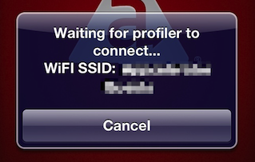

# Debugging on iOS Devices

::: warning ⚠️ Warning
When using Safari Web Inspector to debug your Titanium iOS apps, see [Debugging iOS Apps with 3rd-party Tools](/guide/Axway_Appcelerator_Studio/Axway_Appcelerator_Studio_Guide/Titanium_Development/Debugging_Titanium_Applications/Debugging_on_iOS_Devices/Debugging_iOS_Apps_with_3rd-party_Tools/) for details!
:::

## Overview

Titanium SDK enables Studio to initiate a debug session on an iOS device. Debugging on an iOS device involves the following steps:

* User selects the **Debug on iOS Device**.

* Studio builds the application.

* Application is synced to the device, either automatically or manually.

* User launches the application on device.

* Application initiates debug session with Studio over the local Wi-Fi network.

This page will guide you through the setup, and the launch, of a debug session.

::: warning ⚠️ Warning
Debugging on iOS devices is only supported on macOS. You must already be set up to run applications on your iOS device, as documented in [Deploying to iOS devices](/guide/Titanium_SDK/Titanium_SDK_Guide/Preparing_for_Distribution/Deploying_to_iOS_devices/).
:::

## Requirements

To debug on an iOS device, you must:

* Be able to to install applications on your iOS device from Studio. (If you haven't installed an application on your device yet, review the steps in [Deploying to iOS devices](/guide/Titanium_SDK/Titanium_SDK_Guide/Preparing_for_Distribution/Deploying_to_iOS_devices/).)

* Connect the macOS machine and the device to the same wireless (Wi-Fi) network. The debugger protocol runs over the network (a cable does _not_ serve as an alternative).

Each time you run the debugger, Studio builds the application and attempts to install it using iTunes. In order to install the application using iTunes, you must either:

* Connect your device using the USB cable (recommended).

* Configure your device to sync with iTunes over Wi-Fi. To sync over Wi-Fi, your device must be connected to a power source, and may require multicast and Universal Plug and Play (UPnP) to be enabled on the router. Wi-Fi sync is slower and less reliable than syncing using the USB cable.

For convenience, if you use iTunes for syncing applications to device, it is recommended that you configure iTunes to sync applications automatically.

As an alternative to the iTunes sync process, you may use Xcode or the _iPhone Configuration Utility_ in order to install the application on the device once the Titanium build and deploy is done.

## Network Setup

In order to debug on an iOS device, the device and computer running Studio must be attached to the same wireless (Wi-Fi) network, and the network must allow connections between two clients.

Some public Wi-Fi networks are configured so clients can only communicate with the internet, not with each other. These networks are not compatible with on-device debugging for iOS.

If you do not have a suitable Wi-Fi network available, you can create an ad-hoc network on your computer and connect to it using your device. See
[macOS: Create a computer-to-computer network](http://support.apple.com/kb/PH10666) on the Apple Support site for directions on creating an ad-hoc network.

## Launching a Debug Session

Before debugging, you must have created a Titanium project with an iPhone/iPad deploy target. There are three basic steps:

1. Initiate the debug session in Studio.

2. Wait while application builds and installs.

3. Launch the application from the device and start debugging

### Initiate the Debug Session

1. Make sure your project is selected in the **Project Explorer** view.

2. In the global tool bar, select **Debug** from the **Launch Mode** drop-down list.

3. Select the iOS device you want to launch your project on or **iTunes Sync** to install the application to iTunes from the **Target** drop-down list.

4. Click the **Launch** button.

5. Complete the wizard to initiate a debug session. Studio prompts you to pick the certificate, provisioning profile, and SDK version to use for the debug build.

::: warning ⚠️ Warning
After you complete the wizard once, Studio creates a launch configuration for you, named **Titanium iOS Device - _AppName_**. You can select this launch configuration, after launching the **Debug Configuration** wizard by select **Debug Configurations** from the **Target** drop-down list, to skip the wizard and start a new debug session using the same parameters.
:::

### iTunes Deployment

If you chose to deploy your application to iTune first, you need to perform a few extra steps to install it to your device. After Studio builds your project, the built application is deployed into iTunes. If you have already deployed this application to device, iTunes prompts you to replace the older application with the new version. iTunes syncs the new application to the connected device(s).

### Launch the Application and Debug

After the application finishes installing:

1. Run the application on the device.

2. A dialog appears on the device indicating it's waiting for the debug session to start on the indicated WiFi network. Both the host computer and target iOS device must be on the same WiFi network in order to debug. If they differ, you need to change either host computer's or target iOS device's WiFi settings to match the other's WiFi network. You may need to cancel the debug session and restart the debug process.

    
3. The device connects to Studio, and a debug session begins (and is visible in Studio's **Debug** perspective).

::: warning ⚠️ Warning
In the unlikely case that you have the same debug version of the application installed on two devices at the same time, and you launch them at the same time, Studio prompts you to select which version to debug.
:::

## Troubleshooting iOS On-Device Debugging Problems

### iTunes Fails to Sync the Application to the Device After First Launch

* Check the _Apps_ tab in your iTunes. Make sure it's set to sync automatically, and that the new app appears with a checkmark next to it. If it doesn't, check the app and hit Apply.

### Debugger Fails to Connect

* Make sure both the iOS device and the computer are connected to the same Wi-Fi network.

* Initiate a new debug session from Studio. You cannot restart a debug session by restarting the application on the device.

### Wi-Fi Sync Problems

You should be able to see the device in iTunes when it is not connected using the USB cable. If you can't, try the following:

* Check that the Wi-Fi network has multicast or broadcast addressing enabled. This is enabled by default on most home Wi-Fi routers, but may not be true on corporate or public Wi-Fi networks. Multicast or broadcast addressing is required for Wi-Fi sync – it is not required for debugging if you are using a USB cable for sync.

* Follow the steps described in [iTunes 10.5 and later: Troubleshooting iTunes Wi-Fi Syncing](http://support.apple.com/kb/TS4062) on the Apple Support site.

### Testing Network Connection

If you need to test whether your device and computer are on the same network, you can create a test web site in Studio to test the connection.

* Find the IP address of your phone. (See instructions here: [http://www.iclarified.com/entry/index.php?enid=496](http://www.iclarified.com/entry/index.php?enid=496).)

* Inside Studio, create a new web project:

    * Click **File** > **New** > **Project**.

    * Select **Web Project** and click **Next**.

    * Select **Default Template** and click **Next**.

    * Enter a project name and click **Finish**.

* Create a HTML file inside that web project:

    * In the **Project Explorer** view, select the project folder and click **File** > **New**.

    * Enter `test.html` for the filename.

    * Edit the new file and add some basic HTML.

* Open the **Preferences** dialog and navigate to **Studio** > **Web Servers** > **Built-in**.

* Pick an IP address that is in the same range as the phone's IP address.

* Restart Studio.

* In the **Project Explorer** view, click on the HTML file you created.

* Click Run > Run.
    A browser opens, directed to the web page.

* Open up a web browser on your iOS device.

* Navigate to the URL shown in the URL bar in the browser on your machine.

    * If you can see the page on the iOS device, networking is set up correctly.

    * If you cannot see the page, you have a networking problem.

## Related Topics

* [Debugging Titanium Applications](/guide/Axway_Appcelerator_Studio/Axway_Appcelerator_Studio_Guide/Titanium_Development/Debugging_Titanium_Applications/)

    * [Debugging on the Emulator or Simulator](/guide/Axway_Appcelerator_Studio/Axway_Appcelerator_Studio_Guide/Titanium_Development/Debugging_Titanium_Applications/Debugging_on_the_Emulator_or_Simulator/)

    * [Debugging on Android Devices](/guide/Axway_Appcelerator_Studio/Axway_Appcelerator_Studio_Guide/Titanium_Development/Debugging_Titanium_Applications/Debugging_on_Android_Devices/)

* [About the Debug perspective](/guide/Axway_Appcelerator_Studio/Axway_Appcelerator_Studio_Guide/Web_Development/JavaScript_Development/Debugging_JavaScript/About_the_Debug_perspective/)

    * [Using the Debug View](/guide/Axway_Appcelerator_Studio/Axway_Appcelerator_Studio_Guide/Web_Development/JavaScript_Development/Debugging_JavaScript/About_the_Debug_perspective/Using_the_Debug_View/)

    * [Using the Variables View](/guide/Axway_Appcelerator_Studio/Axway_Appcelerator_Studio_Guide/Web_Development/JavaScript_Development/Debugging_JavaScript/About_the_Debug_perspective/Using_the_Variables_View/)

    * [Using the Console View](/guide/Axway_Appcelerator_Studio/Axway_Appcelerator_Studio_Guide/Web_Development/JavaScript_Development/Debugging_JavaScript/Using_the_Console_View/)

    * [Using the Breakpoints View](/guide/Axway_Appcelerator_Studio/Axway_Appcelerator_Studio_Guide/Web_Development/JavaScript_Development/Debugging_JavaScript/About_the_Debug_perspective/Using_the_Breakpoints_View/)

    * [Using the Expressions View](/guide/Axway_Appcelerator_Studio/Axway_Appcelerator_Studio_Guide/Web_Development/JavaScript_Development/Debugging_JavaScript/About_the_Debug_perspective/Using_the_Expressions_View/)

* [Stepping into and over functions](/guide/Axway_Appcelerator_Studio/Axway_Appcelerator_Studio_Guide/Web_Development/JavaScript_Development/Debugging_JavaScript/Stepping_into_and_over_functions/)

* [Adding a breakpoint](/guide/Axway_Appcelerator_Studio/Axway_Appcelerator_Studio_Guide/Web_Development/JavaScript_Development/Debugging_JavaScript/Adding_a_breakpoint/)
