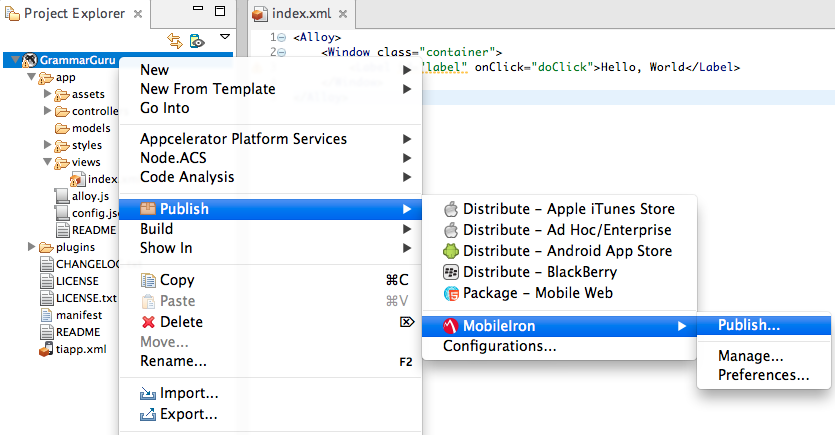
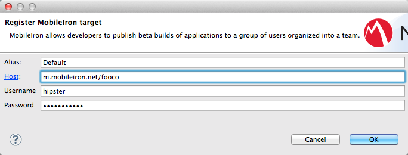

# Distributing to Enterprise App Stores

::: danger ❗️ Enterprise Subscription Required!
This AMPLIFY Appcelerator Services feature requires an Enterprise Subscription.
:::

## Introduction

Enterprise app stores are private app stores where access to applications is controlled by the company. Employees must be authenticated to download and install internally developed applications. Appcelerator Studio allows you to package Android and iOS applications and upload them to a Mobile Application Management platform that can be published to an enterprise app store. You can publish your application to AirWatch's or MobileIron's platform.

## AirWatch Platform

Before publishing to AirWatch, you need install the AirWatch plugin on Appcelerator Studio. After the plugin is installed, start the publishing process from the right-click context menu. You need to create an AirWatch publish target. A publish target consists of a host URL, username, password and API key associated with an alias. You can create one during the **Target** step of the **Publish to AirWatch** wizard.

You also need the following items to package an application:

* For Android applications, generate a keypair and certificate to sign your applications. For help, see [Distributing Android apps: Generate keypair and certificate](/guide/Titanium_SDK/Titanium_SDK_Guide/Preparing_for_Distribution/Distributing_Android_apps/#generate-a-keypair-and-certificate).

* For iOS applications, create a distribution certificate and provisioning profile to sign your application. For help, see [Distributing iOS apps](/guide/Titanium_SDK/Titanium_SDK_Guide/Preparing_for_Distribution/Distributing_iOS_apps/).

### Install the AirWatch Plugin

Appcelerator Studio requires AirWatch integration to be installed as a separate plugin. To install the plugin:

1. Launch Appcelerator Studio.

2. From the menu bar, select **Help** \> **Install New Software...** The **Install** wizard appears.

3. Click **Add**. A dialog appears asking for the name and location of the update site.

    1. For **Name**, enter 'AirWatch' or something similar.

    2. For **Location**, copy and paste one of the the following URLs:

        1. Release Candidate Build: [http://preview.appcelerator.com/appcelerator/studio/airwatch/update/rc/](http://preview.appcelerator.com/appcelerator/studio/airwatch/update/rc/)

    3. Click **OK**.

4. An item called **AirWatch Integration** should appear. Select to install it, that is, make sure the box is checked, then click **Finish****.**

5. Follow the rest of the wizard directions to install it. When prompted, restart Studio.

### Obtain the Host URL and API Key

In order to publish to AirWatch, you need to obtain a REST API key and endpoint. Retrieve both pieces of information from the AirWatch Web Console.

1. Login to the [AirWatch Web Console](https://apidev.awmdm.com/AirWatch).

2. In the left navigation bar, click **Groups & Settings** and select **All Settings** to open the **Settings** dialog**.**

3. Under the **System** section, click **Advanced**, then select **API** \> **REST**.

4. Make sure **Enable API Access** is checked if it is not already enabled. Copy the API Key field. You need to paste the value to the API Key field when registering an AirWatch target.

5. Click **Site URLs** in the left navigation bar under the **System** section.

6. Copy the host name of the REST URL field (without the protocol and any paths). You need to paste the value to the Host URL field when registering an AirWatch target. By default, the hostname is `apidev-as.awmdm.com`.

### Publish to AirWatch

To publish an application to **AirWatch**:

1. In the **Project Explorer** view, right-click the project to package.

2. Select **Publish** > **AirWatch** > **Publish...**. to open the **Publish to AirWatch** wizard.

3. In the **Target** step:

    1. Select the platform to deploy to, either Android or iOS.

    2. Select a Publish Target. If you have not created a publish target, click **Register Existing****...** to open the **Register AirWatch target** dialog to enter your AirWatch information. Click **OK** when you are finished.

        
    3. Click **Next**.

4. In the **Configuration** step, enter a name, version number and description for your application, then click **Next**. Some of these fields will be auto-populated by existing information from the `tiapp.xml` file.

5. In the **Platform** step:

    1. For Android applications, enter the following information:

        1. **Android SDK Version**: Select the version of the tools to build your application.

        2. **Distribution Location****:** Path where the Android application package (APK) file will be copied to.

        3. **Keystore Location**: Path to your keystore file that is used to sign your application. Click the **New** button to create a new keystore.

        4. **Keystore Password****:** Password to your keystore.

        5. **Keypair password**: Password for the keystore private key.

        6. **Key Alias**: Alias associated with your application's certificate.

    2. For iOS applications, select the Distribution Certificate, Keychain, Provision Profile and SDK Version to use.

    3. Click **Next**.

6. In the **Summary** step, review the information you entered. To restart the wizard after you start the publishing process, check **Restart**.

7. Click **Publish**.

After Appcelerator Studio finishes uploading your application, Studio opens the AirWatch Web Console in your default browser. Use the web console to manage the distribution of your application, then users can use the AirWatch application to download it.

## MobileIron Platform

Before publishing to MobileIron, you need install the MobileIron plugin on Appcelerator Studio. After the plugin is installed, start the publishing process from the right-click context menu. You need to create an MobileIron publish target. A publish target consists of a host URL, username and password with an alias. You can create one during the **Target** step of the **Publish to MobileIron** wizard.

You also need the following items to package an application:

* For Android applications, generate a keypair and certificate to sign your applications. For help, see [Distributing Android apps: Generate keypair and certificate](/guide/Titanium_SDK/Titanium_SDK_Guide/Preparing_for_Distribution/Distributing_Android_apps/#generate-a-keypair-and-certificate).

* For iOS applications, create a distribution certificate and provisioning profile to sign your application. For help, see [Distributing iOS apps](/guide/Titanium_SDK/Titanium_SDK_Guide/Preparing_for_Distribution/Distributing_iOS_apps/).

### Install the MobileIron Plugin

Appcelerator Studio requires MobileIron integration to be installed as a separate plugin. To install the plugin:

1. Launch Appcelerator Studio.

2. From the menu bar, select **Help** > **Install New Software...** The **Install** wizard appears.

3. Click **Add**. A dialog appears asking for the name and location of the update site.

    1. For **Name**, enter 'MobileIron' or something similar.

    2. For **Location**, copy and paste one of the the following URLs:

        1. Release Candidate Build: [http://preview.appcelerator.com/appcelerator/studio/mobileiron/update/rc/](http://preview.appcelerator.com/appcelerator/studio/mobileiron/update/rc/)

    3. Click **OK**.

4. An item called **MobileIron Integration** should appear. Select to install it, that is, make sure the box is checkmarked, then click **Finish****.**

5. Follow the rest of the wizard directions to install it. When prompted, restart Studio.

### Publish to MobileIron

To publish an application to **MobileIron's Enterprise App Storefront**:

1. In the **Project Explorer** view, right-click the project to package.

2. Select **Publish** > **Mobile****Iron** > **Publish...**. to open the **Publish to Mobile Iron** wizard.

    
3. In the **Target** step:

    1. Select the platform to deploy to, either Android or iOS.

    2. Select a Publish Target. If you have not created a publish target, click **Register Existing****...** to open the **Register MobileIron target** dialog to enter your MobileIron information. Click **OK** when you are finished.

        
    3. Click **Next**.

4. In the **Configuration** step:

    1. Enter a name, version number and description for your application. Some of these fields will be auto-populated by existing information from the `tiapp.xml` file.

    2. To remove the application if a policy is broken or a device is signed out in multi-user mode, check **Quarantinable**.

    3. To highlight the app in the featured list, check **Featured**.

    4. Click **Next**.

        
5. In the **Platform** step:

    1. For Android applications, enter the following information:

        1. **Android SDK Version**: Select the version of the tools to build your application.

        2. **Distribution Location****:** Path where the Android application package (APK) file will be copied to.

        3. **Keystore Location**: Path to your keystore file that is used to sign your application. Click the **New** button to create a new keystore.

        4. **Keystore Password****:** Password to your keystore.

        5. **Keypair password**: Password for the keystore private key.

        6. **Key Alias**: Alias associated with your application's certificate.

    2. For iOS applications, select the Distribution Certificate, Keychain, Provision Profile and SDK Version to use.

    3. Click **Next**.

6. In the **Summary** step, review the information you entered. To restart the wizard after you start the publishing process, check **Restart**.

7. Click **Publish**.

After Appcelerator Studio finishes uploading your application, Studio opens the MobileIron Admin portal in your default browser. Use the portal to manage the distribution of your application, then users can use the MobileIron application to download it.
