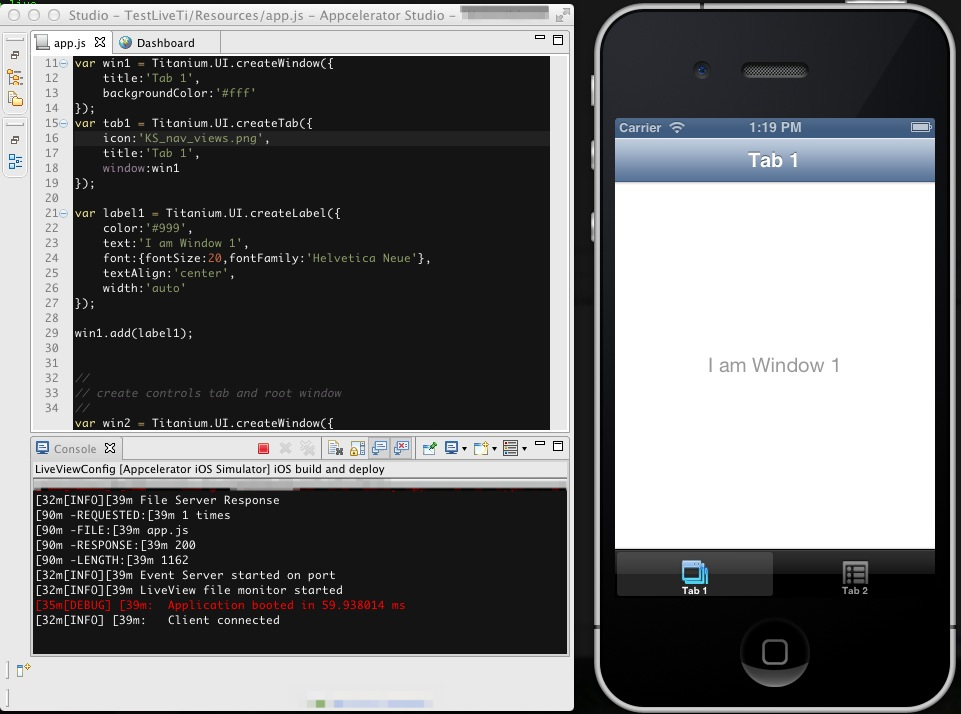
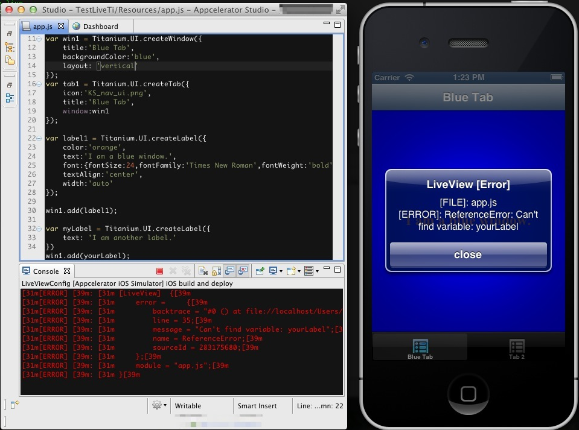

# LiveView

This page describes how to use the Appcelerator Studio LiveView tool to preview changes you actively make in your application on a device or simulator.

## Introduction

The Appcelerator Studio LiveView tool displays updates of your application as you actively add, modify or replace the files in the project, such as changing your code in the Editor. LiveView should be used to quickly preview changes in your application's UI, not for code intensive modifications.

LiveView works for classic mobile and Alloy projects on the Android, iOS, and Windows platforms. LiveView works for the last run of a platform. If you have previous launches of the same or different project on another platform, you may experience unexpected behavior.

## Using LiveView

To use LiveView, make sure the LiveView option is enabled before running your application. After Studio builds your application, Studio launches the LiveView tool to monitor your project for changes, then communicates them with the device or simulator. Make changes to your project and as soon as you commit them, the device or simulator updates with your changes.

### Launch LiveView

Before launching your application, make sure the LiveView option is enabled:

1. In the **Project Explorer** view, select your project and verify that the LiveView icon  is toggled on. If not, click the icon to toggle it on.

2. In the global toolbar, select **Run** from the **Launch Mode** drop-down list and select an Android or iOS target (emulator, simulator or device) from the **Target** drop-down list.

3. If the **Launch Automatically** option is enabled under the **Target** drop-down list, the application will be automatically launched after the device is selected. If not, you need to click the **Launch** button to start the build process.

Studio starts the LiveView tool, which monitors changes to your project to update the application in the simulator or on device. In the example below, the default mobile project is launched with LiveView enabled.

### Trigger LiveView Updates

Once the application launches, you can make modifications to your project. LiveView waits for you to commit changes to your project before triggering an update.

The following actions trigger LiveView to update the application:

* Modifying a file in the `Resources` directory of the project. Graphic assets may not update automatically; you may need to rebuild your application.

* Adding a file to the `Resources` directory of the project. The application may not be able to resolve the path to the new asset while its running; you may need to rebuild your application if you are adding files.

After you save or add your changes, LiveView restarts your application from the initial UI state. This includes changing or adding JavaScript files, non-graphical assets (text, HTML, etc.) and graphic assets.

For example, in the default mobile application, the tab group starts with Tab 1. If you were on Tab 2 when you commit your changes, the application restarts (but not relaunches) and displays Tab 1.

In the example below, the win1, tab1 and label1 objects have been modified. The changes are committed when saving `app.js` and displayed to the iOS simulator.

If there is a coding error in the changes, LiveView displays an error message in the simulator, device and in the **Console** view. In the example below, the code contains a typo related to the name of a Label object and reports an error stating that it cannot find a reference to the variable. In the code, a `myLabel` object is created but is trying to add the `yourLabel` object, which is not defined, to the window.

## Configuring LiveView

It may be necessary to set the LiveView IP or ports so that the device or emulator/simulator can access the LiveView server. This may be useful in the following situations:

* If your PC has multiple network interfaces.

* When using LiveView with Windows Mobile Emulators or Genymotion Emulators

* If the ports used by LiveView are already in use on your PC

### Configuring the LiveView IP

1. Open Preferences

    * MacOS: Appcelerator Studio > Preferences

    * Windows: Windows > Preferences

2. Expand the Studio section.

3. Click LiveView.

4. Set the LiveView Host field as the IP you wish to use.

### Configuring the LiveView ports

1. Open Preferences

    * MacOS: Appcelerator Studio > Preferences

    * Windows: Windows > Preferences

2. Expand the Studio section.

3. Click LiveView.

4. Set the File Server or Event Server port as necessary.

## Troubleshooting

### After adding a file and rebuilding, project fails to run

To resolve this issue, clean the project and terminate all node instances :

1. From the menu bar, select **Project** \> **Clean...**. Make sure your project is selected and click **OK**.

2. From a terminal, run `killall node`.

3. Rerun the project.

### File Server unavailable

If you receive the following error message while running LiveView: "File Server unavailable. Host Unreachable @ <IP\_ADDRESS>:<PORT\_NUMBER>. Please ensure your device and computer are on the same network and the port is not blocked:"

1. Check to make sure your computer and device are on the same wireless network.

2. LiveView requires the following ports to be open: 8323 and 8324.

3. Try accessing the socket address stated in the error message using a browser on your device. It should return something similar to

    {"pid":13792,"path":"C:\\\\Users\\\\demo\\\\Documents\\\\Appcelerator\_Studio\_Workspace\\\\demoProject\\\\","uptime":1900.319,"alloy":false}

### Prevent Android devices from sleeping

If your Android device keeps turning off (entering into sleep mode), you can toggle the "Stay Awake" feature in the developer options.
