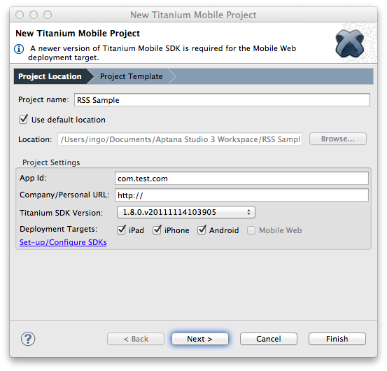
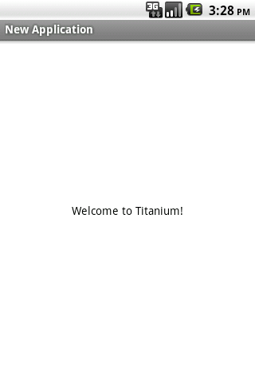

# Titanium Templates

Studio includes several templates to be used as jumping-off points for Titanium development

## Importing a Sample

Click on the "develop" tab on the dashboard and click the "New Project" button, following the wizard steps. Alternately, create a new Titanium project, and choose the "Next" button after filling out the default project information.

## Single Window Application

A single window application with a single view - a mostly blank canvas.

### Screenshots

|  |
| --- |

## Master/Detail Application

A master detail view, utilizing a native table view component and platform-specific UI and navigation. A starting point for a navigation-based application with hierarchical data, or a stack of windows.

### Screenshots

<table class="confluenceTable"><thead class=" "></thead><tfoot class=" "></tfoot><tbody class=" "><tr><td class="confluenceTh" rowspan="1" colspan="1">

</td><td class="confluenceTd" rowspan="1" colspan="1">

</td></tr></tbody></table>

## Tabbed Application

A tabbed application, consisting of multiple stacks of windows associated with tabs in a tab group. A starting point for tab-based application with multiple top-level windows.

### Screenshots

<table class="confluenceTable"><thead class=" "></thead><tfoot class=" "></tfoot><tbody class=" "><tr><td class="confluenceTh" rowspan="1" colspan="1">

</td><td class="confluenceTd" rowspan="1" colspan="1">

</td></tr></tbody></table>
