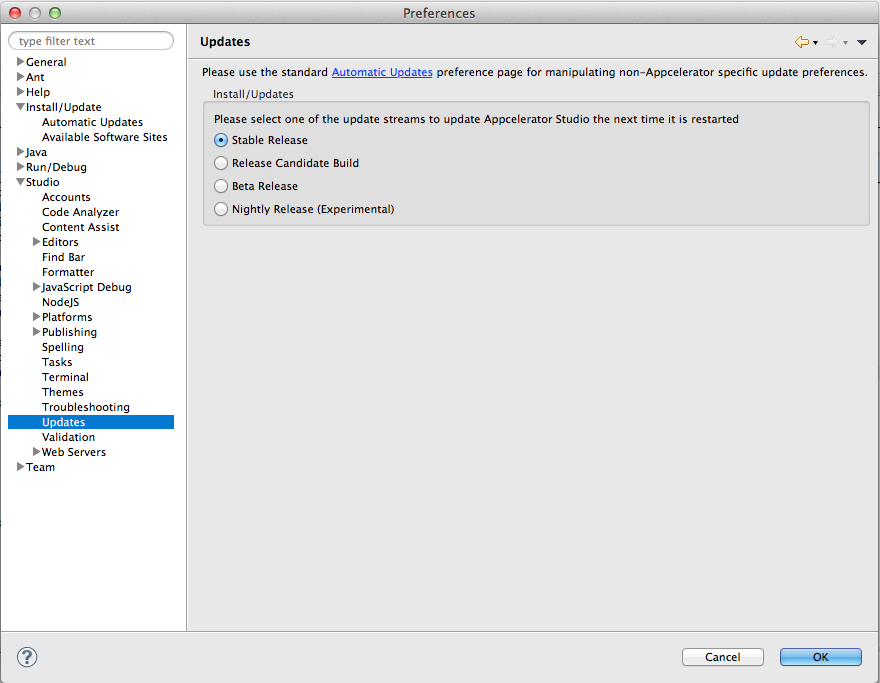

# Changing the Update Type

To change the update type, open Studio Preferences, select the **Studio > Updates** item, then select the update type you want to use.

1. Select **Preferences**:

    * On Windows, Preferences is found under the **Window** menu.

    * On OS X, Preferences is found under the **Appcelerator Studio** (or **Eclipse** on Eclipse) menu.

2. In **Preferences**, expand the **Studio** item and select the **Updates** item.

3. Select the update type to use, then click **OK**.

