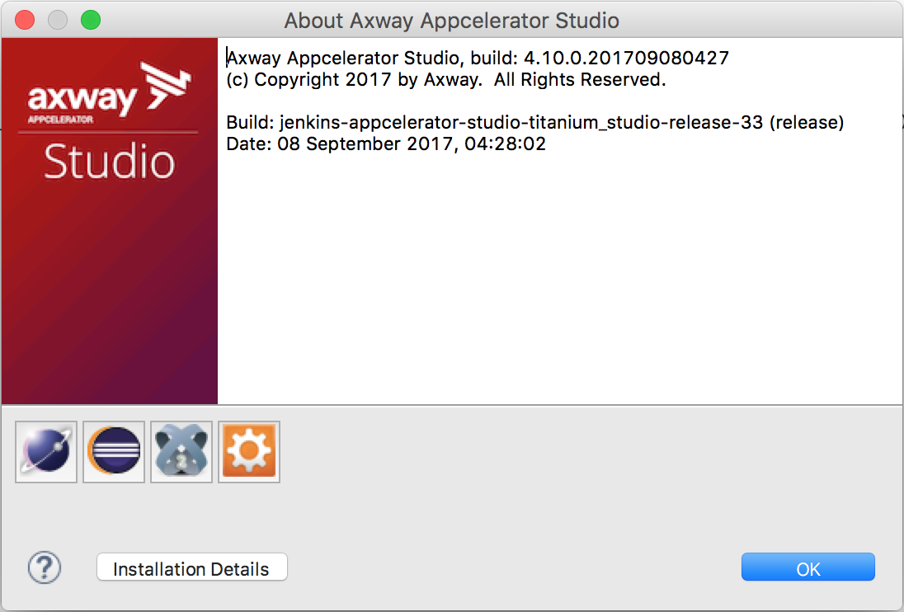
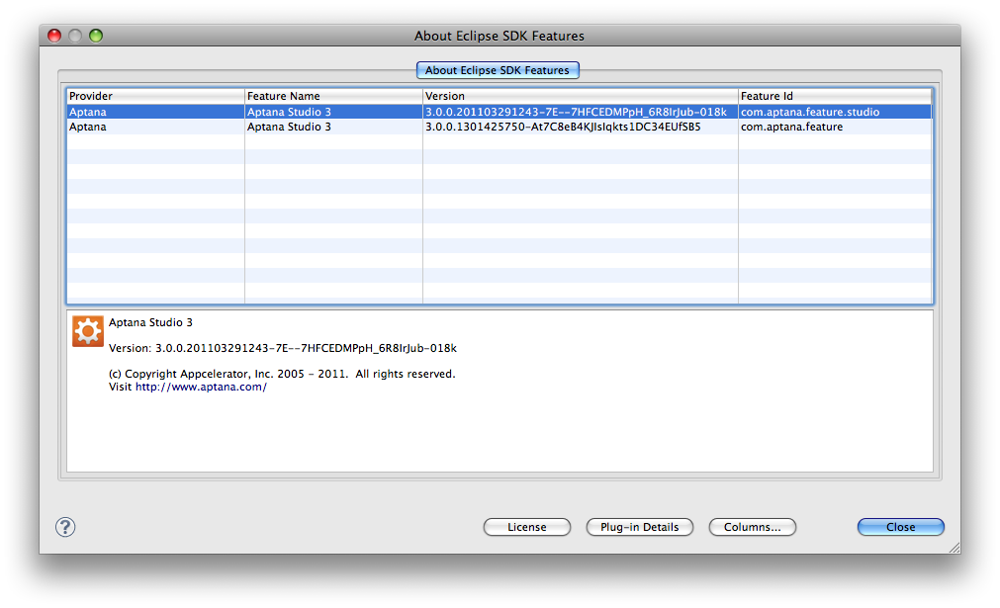

# Determining the Installed Version

This documentation has information on how to determine which version of Aptana Studio is installed.

## Studio Standalone

1\. In Studio, go to **About Aptana Studio 3** (or **About Titanium Studio**).

* on Windows, from the **Help** menu, select **About Aptana Studio 3**

* on Mac, from the **Aptana Studio 3** menu, select **About Aptana Studio 3**

2\. Check the first line of text for the version number (as shown below).

## Studio Plugin in Eclipse

1\. In Eclipse

* On Windows, from the **Help** menu, select **About Eclipse SDK**.

* On Mac, from the **Eclipse** menu, select **About Eclipse SDK**.

2\. Click on the Studio logo. A comprehensive list of all features associated with Studio will be listed with corresponding version numbers.

## Studio Firebug Extension

1\. Start Firefox.
2\. From the **Tools** menu, select **Add-ons**.
3\. Click the **Extensions** tab.
4\. Scroll down until you see Aptana Debugger. The version is displayed to the right.

## Studio IE Debugger Extension

1\. Start Internet Explorer.
2\. On the toolbar, click the Aptana button dropdown and select **About Aptana Studio**.
3\. The screen displays your IE Debugger's version number.
