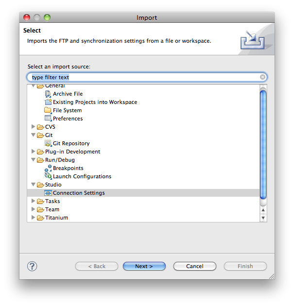

# Migrating from Aptana Studio 2 to Aptana Studio 3

This document contains information on how to migrate Aptana Studio 2 to version 3.

## Migrating Projects

Aptana Studio 2 and Aptana Studio 3 have different workspaces so that you can use the two products simultaneously. To work with a project in Aptana Studio 3, you will want to import your project from one workspace to the other.

::: warning ⚠️ Warning
It is not recommended to edit a project in both Studio 2 and Studio 3. Once you import a project, it is suggested you stick with Studio 3 for editing.
:::

### To migrate your projects from Studio 2 to Studio 3

1. From the **File** menu, select **Import** to open an "Import" pop-up window.

2. Select **General > Existing Projects into Workspace**

3. Browse to your Aptana Studio 2 workspace folder by clicking on the top **Browse...** button. Click **Open**

4. The "Projects" list will contain a list of all of the projects it has found. Uncheck the ones you do not wish to import.

5. A checkbox will ask you if you wish to copy the projects into your workspace. Generally, the answer is "yes," but note that that leaves a copy in the Aptana Studio 2 workspace and a separate copy in Aptana Studio 3.

6. Click the **Finish** button.

### Migrating Web, PHP and Rails projects

Studio 3 changed a few things underneath the hood regarding how projects are processed. We've attempted to automate the migration process for you as you move from one environment to the other, but it's possible this process may not work in every possible circumstance. You would notice it most specifically with regards to missing content assist. To fix this, you'll need to reset the "Natures" on a project.

As a first step, you can try just restarting Aptana Studio. If that doesn't work, try modifying the project natures (bottom of the page here): [Importing an Existing Project](/guide/Axway_Appcelerator_Studio/Axway_Appcelerator_Studio_Guide/Basic_Concepts/Working_with_Projects/Importing_an_Existing_Project/)

Importing connections is a separate step:

1. Select **File > Import > Studio/Connections**

2. Make sure the "Workspace" radio button is selected, and browse to your Aptana Studio 2 workspace

3. Click Finish. Your connections will show up in the Remote Connections view, and attached to projects.

You can repeat this process multiple times, and it will not re-import duplicates.

## File View/Remote Connections

File View has been replaced by a "Local Filesystem" node in the Project Explorer view. The "Connections" note is now visible from the "Remote" view, available in **Window > Show View > Remote**

Another change is that "Untitled Files" of various types (for example, Untitled HTML File, Untitled CSS File) are no longer supported in the new file wizard. While a useful feature, it led to a great deal of hacked-together workarounds in the underlying codebase. We are looking at how we may be able to bring this feature back in a future release.

## Content Assist

Studio 3 simplified the concept of adding JavaScript content assist greatly. Rather than a reference view that needed to be constantly updated, we've instead allowed the user to drop content assist files into an existing project to get good code assist that way. We've ported over all of the libraries we can from Studio 2, but some work needs to be done in getting content assist files for additional libraries like MootTools and Node.js. If you are interested in helping, please let us know.

* [Using JavaScript Libraries](/guide/Axway_Appcelerator_Studio/Axway_Appcelerator_Studio_Guide/Web_Development/JavaScript_Development/Using_JavaScript_Libraries/)

* [JavaScript Library Support](/guide/Axway_Appcelerator_Studio/Axway_Appcelerator_Studio_Guide/Web_Development/JavaScript_Development/Using_JavaScript_Libraries/JavaScript_Library_Support/)

## PHP

Studio 2 utilized the Eclipse PHP Development Tools for PHP support. Studio 3 introduces a separate PHP plugin so that we better integrate PHP support throughout the product, and to reduce the overall install footprint. For those who prefer the PDT editors, you can either install the existing PDT all-in-one distro, and add Aptana Studio, or install PDT into Aptana Studio 3.

## Rails

Aptana Studio 3 includes RadRails, so no separate download is required. We've removed some of the helper views from before, as most rails developers are familiar with how to do many of the tasks on the command line that those views facilitated. For more information, see [Rails Development](/guide/Axway_Appcelerator_Studio/Axway_Appcelerator_Studio_Guide/Web_Development/Rails_Development/).

## Customization/Preferences

Formatting preferences are the most notable change, but in general, the defaults should be relatively similar. See below for more details.

### Scripting

Aptana Studio 3 introduced the concept of Rubles, Ruby-based scripting bundles based on Textmate bundles. A number of these bundles have been ported already, and a [rich SDK](/guide/Axway_Appcelerator_Studio/Axway_Appcelerator_Studio_Guide/Customizing_Studio/Rubles/) exists for users who want to create or extend existing bundles. If you were using Eclipse Monkey, we are investigating adding JavaScript scripting support as another mechanism for Scripting Studio, but there is no firm ETA on that yet. However, everything that could be done in Eclipse Monkey can be done with Rubles, and the documentation and existing Rubles should give plenty of examples.

### Previewing Files/Run/Launch Configurations

Studio 2 relied on an internal browser preview utilizing the native platform browser. Studio 3 instead relies on Chromium for previewing, a WebKit-based browser. You can find out more about previewing files here: [Previewing](/guide/Axway_Appcelerator_Studio/Axway_Appcelerator_Studio_Guide/Web_Development/Previewing/).

Launch configurations may be exported and imported using the standard Eclipse export/import mechanism. See here: [Exporting and importing preferences](/guide/Axway_Appcelerator_Studio/Axway_Appcelerator_Studio_Guide/Customizing_Studio/Exporting_and_importing_preferences/).

### Colorization/Themes

Aptana Studio 3 uses a different mechanism for colorizing files than Aptana Studio 2 did. There is no converter yet, but you can use any existing Textmate theme you like. If you'd like to create your theme, you can [read more about it](/guide/Axway_Appcelerator_Studio/Axway_Appcelerator_Studio_Guide/Customizing_Studio/Themes/).

## Differences between Aptana Studio 2 and 3

Aptana Studio 3 is a complete rewrite of the Aptana code base, and as such, there are some differences in implementations between the two versions. Notable differences are highlighted below.

### Code Formatter

There are no PHP, Ruby, ERB, and JSON formatters in Studio 2, so Studio 3 formatters can are brand new for these languages. In all of our formatters, we now set the ‘Tab Policy’ to be whatever is set for the editor. In Studio2, the defaults were always set to ‘Spaces Only’ with an indentation and tab size of 4 characters.

#### New Features

* A single page for accessing, importing and exporting formatter preferences

* PHP, JS, Ruby, CSS, and HTML all support wrapping comments to a specified length

The remaining differences are a result of us simplifying and removing code that appeared little used. If a beloved option has disappeared from the preferences, please let us know by filing a Lighthouse ticket.

#### HTML

* The HTML elements list that "should not take new lines" is a bit different in Studio 3. Studio 3 adds the 'TD' and 'TH' elements to that list.

* The 'Force Wrap' section no longer exists in Studio 3. Instead, we have only a 'Comments' tab that allows wrapping settings for comments only.

* The indentation settings were changed as well. Studio 2 did not have any item in its exclusion list, while Studio 3 defines 22 elements that will not cause an increase of indentation.

#### XML

* The 'Spaces before attributes on multi-line tags' setting was removed.

* Force wrap was removed.

* 'Preserve whitespace in CDATA sections' was removed – We do not change the spacing for the moment.

* 'Preserve extra carriage returns' was substituted with a set of 'Blank Lines' settings.

#### JavaScript

* "Insert new line before 'if' statement" was removed – We always insert one now.

* "Insert new line before 'return' statement" was removed – We always insert one now.

* The 'if-else' group settings in the 'Control Statement' is not supported in Studio 3. Many of those settings are controlled by the 'New Lines' general settings.

The two items that are removed from the Studio 3 formatter are: "Keep 'then' statement on the same line" and "Keep 'return' or 'throw' clause on one line".

* "'break' statements" indentation control was removed.

* "Preserve extra carriage returns" was substituted with a set of 'Blank Lines' settings.

* "Add space after closing paren in function declaration" was removed.

* "Object initializer" braces location is now controlled by the "Blocks" braces location.
