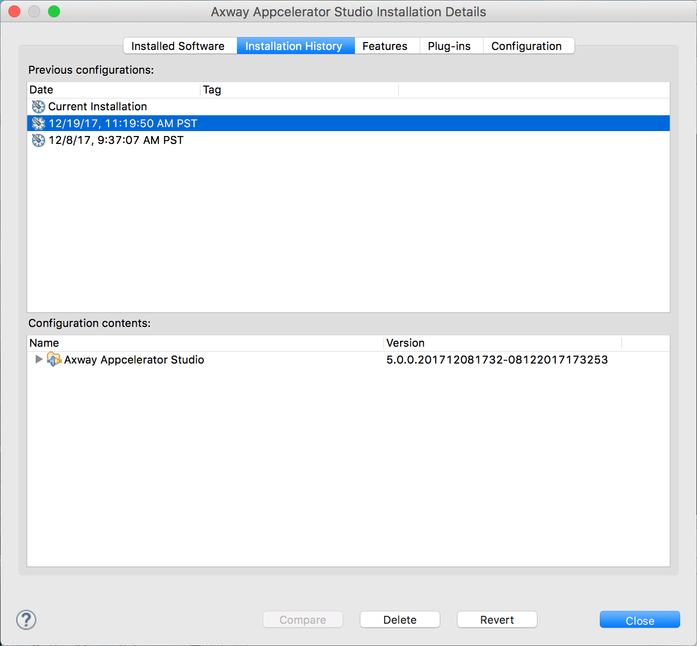

# Revert to a Previous Configuration of Studio

Although Axway Appcelerator Studio does provide this feature, it is not generally recommended and can leave your Studio in an unstable state.

## Reverting a Studio configuration

As you install, upgrade, and uninstall software into your system, configuration snapshots are kept in a history. Reverting to a previous configuration allows you to back out of the results of an unsuccessful install, upgrade, or uninstall. To revert to a saved configuration:

1. Open Studio.

2. Navigate to **Help** > **Installation Details**.

3. From the **Axway Appcelerator Studio Install Details** window, click on the **Installation History** tab.

4. Review the list of previously installed configurations and select the one that best fits your needs.

5. Click the **Revert** button.

6. Click the **Yes** button in the Revert Software Configuration window to revert to a previous configuration of Studio.

7. **Restart** Studio.

## Deleting a Studio configuration

1. Navigate back to the **Axway Appcelerator Studio Install Details** window.

2. Click on the I**nstallation History** tab.

3. Select the previous build you wish to remove.

4. Click the **Delete** button.

5. Click **OK** in the Delete Configuration window.

6. **Restart** Studio.

## Installing older versions of Studio

### Versions prior to 5.1.0

If you have a previous version of Studio installed, you can use the Revert feature found within Studio, as mentioned above.

If you don't have the version you are looking for, you can download the Studio package directly (see [below](#Directpackagedownloads)).

### Versions 5.1.0 and later

With Studio 5.1.0, as mentioned in [Cannot update from Studio 5.0.0 to Studio 5.1.0](/guide/Axway_Appcelerator_Studio/Axway_Appcelerator_Studio_Release_Notes/Studio_Release_Notes_5.x/Studio_5.1.0.RC_Release_Note/Studio_5.1.0_Changes/#cannot-update-from-studio-5.0.0-to-studio-5.1.0), you cannot revert to previous versions of Studio as 5.1.0 and later requires removal of the older version and a fresh install.

## Direct Studio package downloads

If you wish to download a specific version of Studio directly, point your web browser to `http://titanium-studio.s3.amazonaws.com/#.#.#/Appcelerator_Studio.dmg` replacing #.#.# with the version you wish to obtain.

For example, if you wish to download 5.0.0, use this URL: [http://titanium-studio.s3.amazonaws.com/5.0.0/Appcelerator\_Studio.dmg](http://titanium-studio.s3.amazonaws.com/5.0.0/Appcelerator_Studio.dmg)
