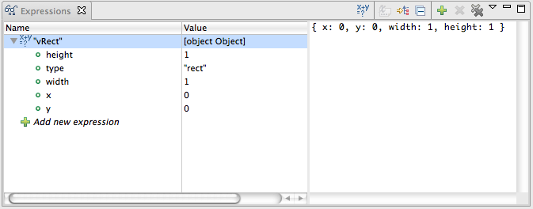

# Using the Expressions View

This page describes how to use the Expressions View that is part of the Debug perspective.

## Introduction

The Expressions View (shown below) lists the current value for the expressions that you add to the view. This view lets you inspect your JavaScript code in closer detail.

## Instructions

This section describes how to perform common tasks for the Expressions View.

### Adding an Expression

To add an expression to the Expressions View:

1. Start the debugger and switch to the Debug perspective. (See [Running the debugger](/guide/Axway_Appcelerator_Studio/Axway_Appcelerator_Studio_Guide/Web_Development/JavaScript_Development/Debugging_JavaScript/Running_the_debugger/) if you need help.)

2. Suspend the current JavaScript thread.

    1. In the Debug View, select the thread that you want to suspend.

    2. Click the **Suspend** button  to suspend the JavaScript code on the first executed line. While the thread is suspended, your web browser user interface will be completely disabled.

3. In the Debug View, select the thread to which you want to add an expression.

4. Click the Expressions View tab.

5. Right-click inside the Expressions View and select **Add Watch Expression** from the context menu to open an **Add Watch Expression** pop-up window.

6. In the **Add Watch Expression** pop-up window, type the expression that you would like to watch (for example, "window", "document", and so forth).

7. Make sure that the **Enable** box is checked.

8. Click **OK** to close the pop-up window and add the new expression to the View.

## Related Topics

* [About the Debug perspective](/guide/Axway_Appcelerator_Studio/Axway_Appcelerator_Studio_Guide/Web_Development/JavaScript_Development/Debugging_JavaScript/About_the_Debug_perspective/)

* [Using the Debug View](/guide/Axway_Appcelerator_Studio/Axway_Appcelerator_Studio_Guide/Web_Development/JavaScript_Development/Debugging_JavaScript/About_the_Debug_perspective/Using_the_Debug_View/)

* [Using the Variables View](/guide/Axway_Appcelerator_Studio/Axway_Appcelerator_Studio_Guide/Web_Development/JavaScript_Development/Debugging_JavaScript/About_the_Debug_perspective/Using_the_Variables_View/)

* [Using the Breakpoints View](/guide/Axway_Appcelerator_Studio/Axway_Appcelerator_Studio_Guide/Web_Development/JavaScript_Development/Debugging_JavaScript/About_the_Debug_perspective/Using_the_Breakpoints_View/)
