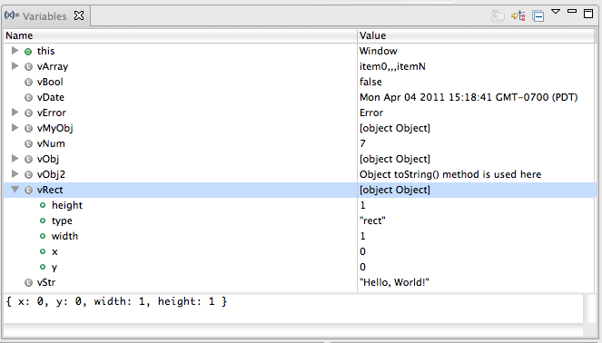

# Using the Variables View

This page describes how to use the Variables view that is part of the Debug perspective.

## Introduction

Use the Variables view (shown below) to display current stack frame variables and their values.

## Instructions

This section explains how to perform common tasks for working with the Variables View.

### Displaying the variables for a stack frame

To display the variables for a stack frame:

1. Start the debugger and switch to the Debug perspective. (See [Running the debugger](/guide/Axway_Appcelerator_Studio/Axway_Appcelerator_Studio_Guide/Web_Development/JavaScript_Development/Debugging_JavaScript/Running_the_debugger/) if you need help.)

2. Suspend the current JavaScript thread.

    1. In the Debug View, select the thread that you want to suspend.

    2. Click the **Suspend** button  to suspend the JavaScript code on the first executed line. While the thread is suspended, your web browser user interface will be completely disabled.

3. In the Debug View, expand **Thread** and select the stack frame that you want to view the variables for.

4. Click the Variables View tab to display the variables for the stack frame that you selected.

Studio displays the variables for the stack frame in the Variables View.

### Displaying variable types

To display variable types for the variables displayed in the Variables View, click the **Show Type Names** button  .

Aptana displays the type names for the variables in the current stack.

### Changing the value of a variable

To change the value of a variable:

1. Follow the instructions above for displaying the variables for a stack frame to display the variable that you want to change the value for.

2. On the Variables View, right-click the variable that you want to change, and select **Change Value...** from the context menu to open a **Set Value** pop-up window.

3. On the **Set Value** pop-up window, type the new value for your variable.

4. Click **OK** to set the new value of the variable.

## Related Topics

* [About the Debug perspective](/guide/Axway_Appcelerator_Studio/Axway_Appcelerator_Studio_Guide/Web_Development/JavaScript_Development/Debugging_JavaScript/About_the_Debug_perspective/)

* [Using the Debug View](/guide/Axway_Appcelerator_Studio/Axway_Appcelerator_Studio_Guide/Web_Development/JavaScript_Development/Debugging_JavaScript/About_the_Debug_perspective/Using_the_Debug_View/)

* [Using the Breakpoints View](/guide/Axway_Appcelerator_Studio/Axway_Appcelerator_Studio_Guide/Web_Development/JavaScript_Development/Debugging_JavaScript/About_the_Debug_perspective/Using_the_Breakpoints_View/)

* [Using the Expressions View](/guide/Axway_Appcelerator_Studio/Axway_Appcelerator_Studio_Guide/Web_Development/JavaScript_Development/Debugging_JavaScript/About_the_Debug_perspective/Using_the_Expressions_View/)
