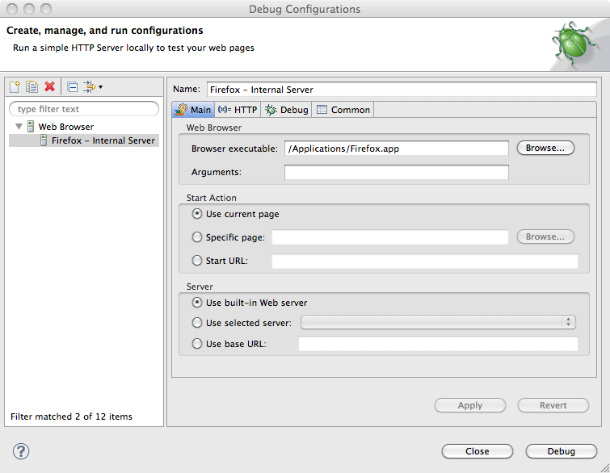
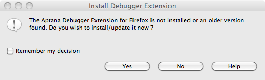

# Installing the JavaScript debugger

## Introduction

Before you can debug your JavaScript code in Studio, you will need to install the Debugger extension into your web browser. (Currently, the debugger is only available for Firefox and Internet Explorer. In the future, it will be available for other web browsers.)

::: warning ⚠️ Warning
If you are having trouble updating or installing the debugger and have an old version of the Aptana debugger installed, try uninstalling your old debugger before installing the new version. See [Uninstalling the debugger](/guide/Axway_Appcelerator_Studio/Axway_Appcelerator_Studio_Guide/Web_Development/JavaScript_Development/Debugging_JavaScript/Uninstalling_the_debugger/) for instructions.
:::

## Instructions for Firefox

To install the Firefox debugger:

1. Create a new Debug configuration for your Firefox browser unless it is already created by Studio.

    1. From the **Debug** toolbar drop-down item  , select **Debug...** to open a **Debug** window (shown below).

        
    2. In the upper-left corner of the **Debug** window, in the toolbar, click the **New Launch Configuration** button  to create a new configuration.

    3. In the **Name** field, type a name for your new configuration (e.g. "Firefox").

    4. Under **Start Action**, choose the option for the start page for the debugger. You can either use the currently open page, browse to a specific file, or specify a URL.

    5. Under **Server**, unless you want to use an external web server, use the default choice of the **Built-in web server**.

2. Install the debugger into your web browser.

    1. On the **Debug** window with your configuration set up, click the **Debug** button.

    2. A browser window opens, checks for the Debugger extension, and then closes. Aptana displays a prompt asking if you would like to install the Debugger Extension.

        
    3. Follow the instructions in the prompts to install the debugger into your browser.

The debugger is now installed in your browser. To start debugging, return to the Aptana IDE and switch to the Debug perspective. See [Running the debugger](/guide/Axway_Appcelerator_Studio/Axway_Appcelerator_Studio_Guide/Web_Development/JavaScript_Development/Debugging_JavaScript/Running_the_debugger/) for more information.

### Troubleshooting tips

If you have trouble installing the Firefox debugger through Aptana, you can try installing it into Firefox through this URL: [https://github.com/aptana/studio3/blob/development/bundles/com.aptana.js.debug.core/res/firefox/aptanadebugger.xpi](https://github.com/aptana/studio3/blob/development/bundles/com.aptana.js.debug.core/res/firefox/aptanadebugger.xpi).

## Instructions for Internet Explorer

See [Installing the Internet Explorer debugger](/guide/Axway_Appcelerator_Studio/Axway_Appcelerator_Studio_Guide/Web_Development/JavaScript_Development/Debugging_JavaScript/Installing_the_Internet_Explorer_debugger/)

## Related Topics

* [About the Debug perspective](/guide/Axway_Appcelerator_Studio/Axway_Appcelerator_Studio_Guide/Web_Development/JavaScript_Development/Debugging_JavaScript/About_the_Debug_perspective/)

* [Uninstalling the debugger](/guide/Axway_Appcelerator_Studio/Axway_Appcelerator_Studio_Guide/Web_Development/JavaScript_Development/Debugging_JavaScript/Uninstalling_the_debugger/)

* [Running the debugger](/guide/Axway_Appcelerator_Studio/Axway_Appcelerator_Studio_Guide/Web_Development/JavaScript_Development/Debugging_JavaScript/Running_the_debugger/)

* [Stepping into and over functions](/guide/Axway_Appcelerator_Studio/Axway_Appcelerator_Studio_Guide/Web_Development/JavaScript_Development/Debugging_JavaScript/Stepping_into_and_over_functions/)

* [Adding a breakpoint](/guide/Axway_Appcelerator_Studio/Axway_Appcelerator_Studio_Guide/Web_Development/JavaScript_Development/Debugging_JavaScript/Adding_a_breakpoint/)

* [Using the Console View](/guide/Axway_Appcelerator_Studio/Axway_Appcelerator_Studio_Guide/Web_Development/JavaScript_Development/Debugging_JavaScript/Using_the_Console_View/)
