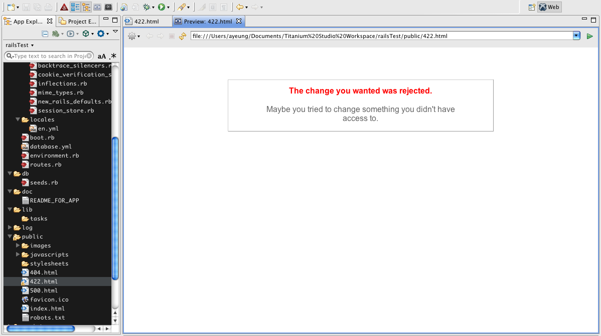

# Previewing a project in a web browser

This page describes how to preview your project in a web browser.

## Introduction

You can preview a project either in a new web browser window or in the Preview pane of the Aptana HTML Editor. The instructions below describe both options for previewing a project.

## Previewing in a separate web browser window

To preview your project in a web browser, click the **Run** button  in the toolbar. This launches a preview of the current web page in the Aptana editor.

By default, the current web page opens in Internet Explorer on Windows or Safari on OS X. To change which web page opens in the browser or to switch the default browser to Firefox or another browser, you can change your browser configuration. See [Setting up your web browser configuration](/guide/Axway_Appcelerator_Studio/Axway_Appcelerator_Studio_Guide/Web_Development/Previewing/Setting_up_your_web_browser_configuration/) for information on changing your configuration.

To preview a project in a web browser:

::: tip
* To use the default configuration or the last configuration that you used to view the project, click the **Run** button  .

* To switch configurations, click the downward-pointing arrow just to the right of the **Run** button  , and select a configuration from the menu.

* If the default behavior opens the wrong URL, you will need to create a new configuration. To learn how to set up additional configurations, see [Setting up your web browser configuration](/guide/Axway_Appcelerator_Studio/Axway_Appcelerator_Studio_Guide/Web_Development/Previewing/Setting_up_your_web_browser_configuration/).
:::

Studio opens your project in a new web browser window.

## Previewing in the Preview pane

You can also quickly preview a web page for an open file by clicking the preview icon  at the top of the editor. This displays your page in the embedded web browser. If you need to customize preview settings, you can do so by [creating a custom preview server](/guide/Axway_Appcelerator_Studio/Axway_Appcelerator_Studio_Guide/Web_Development/Previewing/Creating_a_Custom_Preview_Server/).

The preview of the file should look something like:

## Previewing your project from another computer or device

By default, Studio only serves content accessible via localhost or 127.0.0.1. If you wish to have the content available to another computer, you need to update a preference.

1. Open **Preferences > Studio > Web Servers > Built-in**

2. Switch the IP address to one of the external interfaces (not 127.0.0.1)

3. Restart Studio

4. Launch a preview in a separate browser window

5. Copy or type in that URL to the remote device
