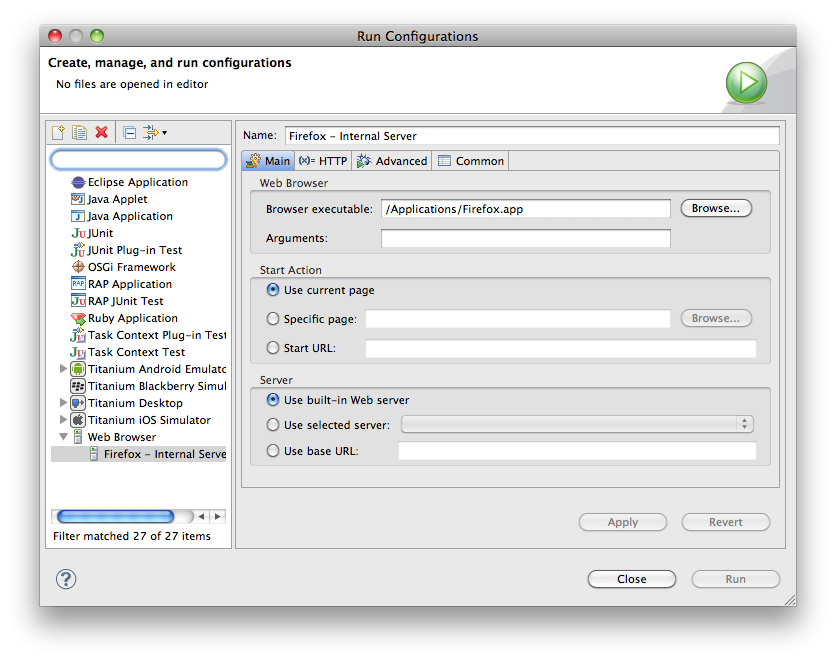

# Setting up your web browser configuration

This page explains how to set up the different web browser configuration options to preview a project in a web browser.

## Introduction

To view a web page in a browser using anything other than the default configuration, you can set up additional web browser configurations. Other web browser configurations are helpful if you want to view a page in a different browser, or if you want the browser to open a specific page while you are working on a different page in the HTML editor.

After you set up your configurations, you can click the **Run** button  to automatically preview your project with the last configuration that used, or use the arrow to the right of the **Run** button  to select a different configuration.

## Instructions

This section describes how to set the various options to create a new browser configuration. Create new browser configurations from the **Run Configuration** window.

To create a new browser configuration:

1. To access the **Run Configuration** window, click the arrow to the right of the **Run** button  .

    Studio opens the **Run Configuration** window (shown below).

    
    1. In the upper left of the **Run Configuration** window, click the **New launch configuration** button  .
        The new configuration appears with a placeholder name of "New\_configuration" on the **Configurations** tree.

    2. On the **Configurations** list, select the new configuration.

    3. In the **Name** text box, type a name for the new configuration (e.g. "Firefox").

2. Specify which web browser window should launch for the new configuration:

    ::: tip
    * In the Browser executable field, specify or browse to the location where the web browser that you want to add is installed (for example, "C:\\Program Files\\Mozilla Firefox\\firefox.exe", or "/Applications/Safari.app").
        The default value for this field is the default location where Firefox is installed on most users' systems. If your Firefox installation is in a different location, you will need to browse to that location, or to the location of a different web browser.

    * Click the **Apply** button to save your changes.
    :::

The instructions above set up a basic new configuration to launch a page preview in a new web browser window. To learn about additional options for your configuration, read through the optional instructions below.

## Setting which page to preview

By default, Aptana will launch the currently open page in your Editor as the "preview" page in a new browser. You can change this to specify a specific page or even a URL on a remote web site.

To specify which page to preview by default for this configuration:

1. In the Start Action box, choose one of the following options:

    ::: tip
    * **Use the current page** - Opens the page currently open in the HMTL editor in the browser window.

    * **Specific page** - Opens the specified page in the browser window. (You can also set a specific page by right-clicking on an HTML file in the Project View and selecting **Set as Start Page** from the context menu.)

    * **Start URL** - Opens the specified URL in the browser window.
    :::

2. Click the **Apply** button to save your changes.

## Specifying the default or an external webserver

Aptana has a built-in webserver to make it easy for you to preview a web site that is saved locally. However, if you want to view a site on an external web server, you can change the server configuration.

To change the server configuration:

1. In the **Server** box, choose one of the following options:

    ::: tip
    * **Use built-in Web server** - Use the web server built into Studio.

    * **Use selected server** - Use a server configuration created in [project preferences](/guide/Axway_Appcelerator_Studio/Axway_Appcelerator_Studio_Guide/Web_Development/Previewing/Creating_a_Custom_Preview_Server/).

    * **Use an external server** - Use the specified external web server.
    :::

2. Click the **Apply** button to save your changes.

To preview a project after you have set up your configuration, click the **Run** button  to open the preview in a new browser window.
