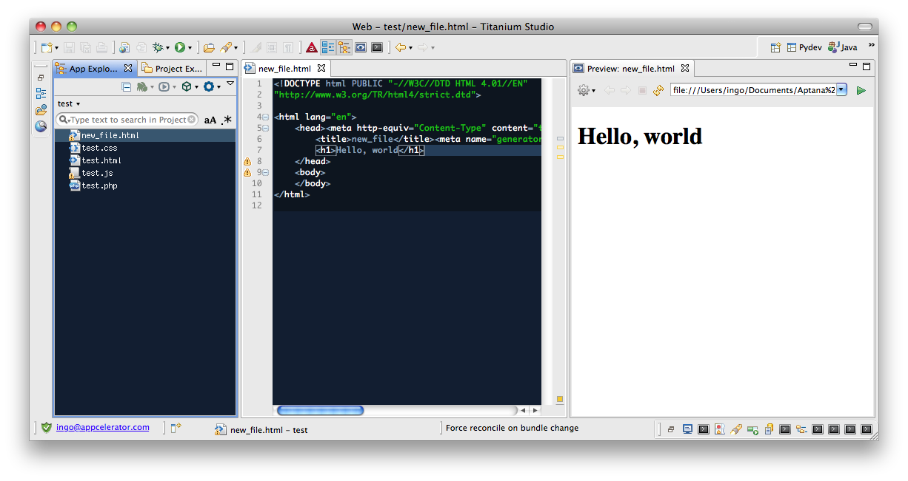

# Side-by-Side Previewing

By default, previewing opens in a new tab. You can modify this to see your source and your preview side-by-side.

## Setting Previews

If you wish, you can have your source and preview side-by-side.

1. Press the Preview button in the toolbar.
    The preview window launches.

2. Drag the preview window by the top tab to the left, right, bottom, or top of the editor area, depending on how you wish to split the screen.

3. Saving the source file updates the preview.

