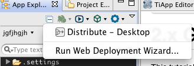

# Capistrano Deployment

## Introduction

if you're unfamiliar with Capistrano, it's best to take a look at their documentation first to become familiar with it as a tool: [https://github.com/capistrano/capistrano/wiki](https://github.com/capistrano/capistrano/wiki)

## Capistrano Integration

::: warning ⚠️ Pre-requisites
We assume that you have installed the 'capistrano' gem on your own before running the wizard.
:::

Our Capistrano integration is bare-bones. We run you through a Web Deployment wizard, which will run "capacity ." in the project root. This process generates a "config/deploy.rb" inside the project, which you can then edit and to which you can add tasks. To access the Wizard, click the App Explorer's publish drop-down toolbar menu and select "Run Web Deployment Wizard..."

