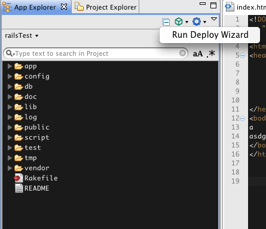
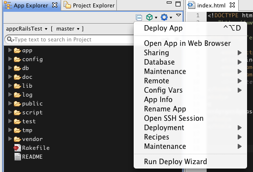

# Engine Yard Deployment

## Pre-requisites

Before deploying to Engine, you will need to have the Engine Yard gem installed. If you don't have that already installed, Studio will prompt you to install it before deploying it to Engine Yard. You will also need a Ruby on Rails project opened in Studio before you can proceed with the deployment.

## Deploying to Engine Yard

Once you have a Ruby on Rails project opened in Studio, you should be able to deploy the project using the deployment wizard. Click on the box icon in the App Explorer and select "Run Deploy Wizard" (Shown below).

In the deployment wizard, select the Engine Yard option and follow the steps to login and deploy your project.

::: warning ⚠️ Warning
After you have created an account/sign in, you will also need to log into the Engine Yard dashboard at [https://cloud.engineyard.com/dashboard](https://cloud.engineyard.com/dashboard) to set up an instance for your application. Then you should be able to proceed and run the 'deploy app' command from studio.
:::

After you have finished running through the wizard, the "ey deploy" command will run in the Studio terminal, which deploys your project to Engine Yard. After you have done the initial deployment to Engine Yard, clicking on the box icon again will allow you to select several Engine Yard commands.

