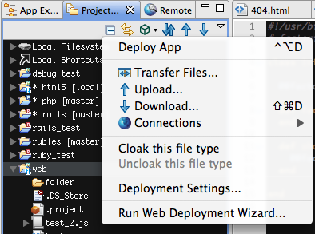

# FTP SFTP and FTPS Deployment

You can set up a connection between a local project and a remote site to transfer files between them in both directions.

## Initial set-up

1\. In **App Explorer**, click on the toolbar icon on the left and select **Run Web Deployment Wizard...**. You could also right-click in the project, and select **Publish** \> **Run Web Deployment Wizard...** from the context menu.

2\. A Deploy My Application wizard will open. Select **Deploy using FTP** and click **Next**.

3\. Define the information for the new FTP site. See the [Create an FTP Connection](/guide/Axway_Appcelerator_Studio/Axway_Appcelerator_Studio_Guide/Web_Development/Publishing/FTP_SFTP_and_FTPS_Deployment/Create_a_FTP_Connection/) page for more detail.

* If you want the change to be automatically uploaded or downloaded on save after you modify a file in the editor, check the **Automatically sync my changes with the remote site** box and choose the appropriate option.

4\. Click **Finish**.

The connection is now established. If you click on the deploy toolbar icon again, you will see options for uploading, downloading, and synchronizing the files between the local project and the remote site.

And the same Deploy menu will appear when right-clicking on the project or its resources.

## Associate an FTP connection with a project using Project Explorer

1\. In Project Explorer View, expand the project you would like to associate a remote connection with.

2\. Right-click on the **Connections** node and select **Add New Connection...**.

3\. In the Connection Manager window, select from the existing remote connections or add a new one using **New...**.

4\. Click **OK**.

## Select the default FTP site for deployment

1\. Right-click on the project and select **Properties**.

2\. Select **File Transfer** on the left, then choose from the list of existing connections and check **Use the connection as default**.

## Related topics

* [Create a FTP Connection](/guide/Axway_Appcelerator_Studio/Axway_Appcelerator_Studio_Guide/Web_Development/Publishing/FTP_SFTP_and_FTPS_Deployment/Create_a_FTP_Connection/)

* [Managing FTP Connections](/guide/Axway_Appcelerator_Studio/Axway_Appcelerator_Studio_Guide/Web_Development/Publishing/FTP_SFTP_and_FTPS_Deployment/Managing_FTP_Connections/)
