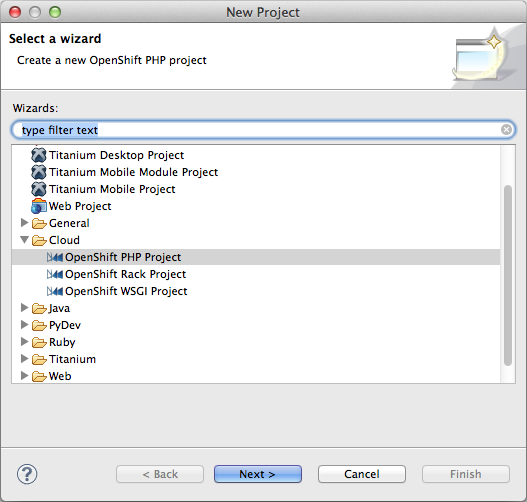
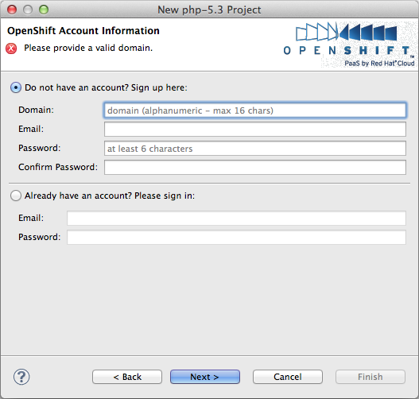
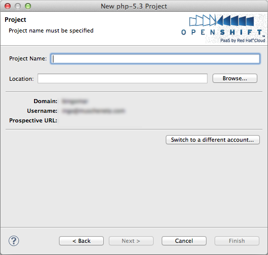

# OpenShift Deployment

## Overview

OpenShift integration allows Studio users the ability to push their projects onto the Red Hat cloud with ease. See the instructions below for instructions on setting up your environment, and deploying your applications.

## Installation

OpenShift Integration is available via the [Appcelerator Marketplace](http://marketplace.appcelerator.com).

## Create a new Red Hat OpenShift Project

1. Select **File > New > Project...**

2. Expand the **Cloud** category

3. Select the wizard in question. Press **Next >**

    
4. If you do not have an OpenShift account yet, you can sign up by entering a domain name, your email, and a password.

    1. Domain: The name of your "company". This must be globally unique across all namespaces, and it will let you know if the name is already in use.

    2. Email: your login email.

    3. Password/Confirm Password: Any value with at least six characters is accepted.

    4. Once you have completed this step, you will be directed to watch for an activation email. Once you receive this email and log in to OpenShift once, you can continue with the process.

5. If you already have an account, you can switch the radio button below and enter your email/password to sign in. You will only need to sign in once.

    
6. Press **Next >.**

7. Create your project. The name of the project must be unique within your namespace.

    
8. You can switch to use a different account by clicking on **Switch to a different account...** button.

9. Press **Finish.**

The project is created. Depending on the type of project, the root file structure will be different.

### Deploy an OpenShift Project

To deploy an OpenShift project after modification, right-click on the project and select **Publish > Deploy App**.

### Preview Remote Site

To preview the remote site associated with an OpenShift project in a browser, right-click on the project and select **Publish > Preview Remote Site**.

## Deploy an existing project to OpenShift

1. Right-click on a project. Select **Publish > Run Web Deployment Wizard...**

2. Select **OpenShift by Red Hat** and Click on **Next.**

3. If you have not previously signed in, the sign-up/sign-in page will appear, and you could reference the steps No. 3 - 5 above to sign in.

4. On the next page, provide a name to your application (default to the project name) and select the type of application it is, then click **Finish**.

    

All the files in the selected project will be pushed to the OpenShift remote git repository. Be careful not to overwrite any configuration files in the new project, and merge the values as appropriate.

You could deploy new local file changes by right-clicking on the project and selecting **Deploy > Deploy App**.

## Removing your password

* Delete **Preferences > General > Security > Secure Storage > Contents** or use **Switch to a different account...** button in the OpenShift project creation wizard.

## Deleting an OpenShift application

OpenShift has a limit on the number of applications one can create in a domain, and there are a couple of ways to delete a remote application if you have hit the limit or want to remove one.

1. Right-click on the OpenShift project and select **Publish > Delete Remote App**.

2. Go to the main menu and use **Commands > OpenShift > Delete Remote App...**; there, you would need to type in the name of the application to be deleted.

## Viewing OpenShift application information

To check the information on your existing OpenShift applications, run **Help > Titanium Studio > Run Diagnostic Test...**.

## Related Topics

* [Errors Logging into OpenShift](/guide/Axway_Appcelerator_Studio/Axway_Appcelerator_Studio_Guide/Web_Development/Publishing/OpenShift_Deployment/Errors_Logging_into_OpenShift/)
