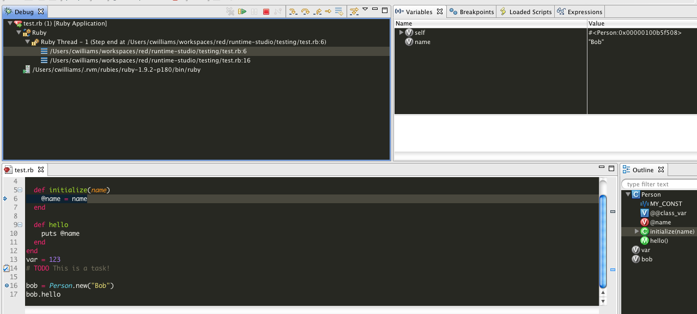

# Ruby Debugger

This page gives an overview of how to use the Ruby debugger.

## Pre-requisites

Studio can integrate with ruby-debug.

Ruby-debug is a faster-debugging gem that has become a standard for Ruby. There is a command-line interface for the library, but the shared core is re-used with the IDE version of the gem.

### Using ruby-debug

We have worked with the author of the ruby-debug gem to provide ruby-debug as a backend debugger. To use ruby-debug as your debugger, you'll need to install the **ruby-debug-ide** gem, and it's dependencies. There are specific versions for Ruby 1.8 versus Ruby 1.9. To install for Ruby 1.9, be sure to install the **ruby-debug-ide19** gem. You can install the gems inside our Terminal view or editor using the standard **\[sudo\] gem install ruby-debug-ide** or **\[sudo\] gem install ruby-debug-ide19** command.

## Installing ruby-debug-ide on Windows

### Ruby 1.8

Use the installer from [railsinstaller.org](http://railsinstaller.org/en). It uses Ruby 1.8.7 and also installs a git environment compatible with Studio, DevKit, and the rails gems.

Once installed, you should be able to run "gem install ruby-debug-ide" from a Command prompt or our Terminal view. During the install, it will print out a message informing you that it's temporarily altering PATH for DevKit. If it does not, you may want to re-install.

### Ruby 1.9

Install a build from [rubyinstaller.org](http://railsinstaller.org/en).

Here are the steps I followed:
1\. Download Ruby 1.9.2 and DevKit execute installs from [http://rubyinstaller.org/downloads/](http://rubyinstaller.org/downloads/)
2\. Install Ruby to c:/Ruby192/, make sure it's added to your PATH.
3\. Install DevKit to c:/DevKit
4\. Open the Command Line

```
cd c:/DevKit
ruby dk.rb init
ruby dk.rb install
gem install ruby-debug-ide19 --platform=ruby
gem install sqlite3       # follow the post-install instructions to grab a sqlite3.dll and copy it into C:\Ruby192\bin
gem install rails
```

The steps for installing DevKit, setting it up, and installing the gems came from the rubyinstaller.org docs at [https://github.com/oneclick/rubyinstaller/wiki/Development-Kit](https://github.com/oneclick/rubyinstaller/wiki/Development-Kit). You should be sure to check those docs for the latest instructions in case they have changed.

#### Troubleshooting

A few users have reported issues with the debugger spitting out an error on starting the process, looking like:

```
Fast Debugger (ruby-debug-ide 0.4.16, ruby-debug-base 0.11) listens on 127.0.0.1:55585
Fatal exception in DebugThread loop: The requested service provider could not be loaded or initialized. - socket(2)
Backtrace:
c:/Ruby192/lib/ruby/gems/1.9.1/gems/ruby-debug-ide-0.4.16/lib/ruby-debug-ide.rb:135:in 'initialize' from:
c:/Ruby192/lib/ruby/gems/1.9.1/gems/ruby-debug-ide-0.4.16/lib/ruby-debug-ide.rb:135:in 'new' from:
c:/Ruby192/lib/ruby/gems/1.9.1/gems/ruby-debug-ide-0.4.16/lib/ruby-debug-ide.rb:135:in 'block in start_control'
...
```

A couple of things have been found to cause the issue:
1\. Using RadRails/RDT 2.x versions along with Studio 3.x. Those old versions of the IDE try to install the 1.8 versions of the ruby-debug gems, which do not work with Ruby 1.8.
2\. An old/bad lib being found. Explicitly set an environment variable of RUBYLIB to C:\\Ruby192\\lib\\ruby\\1.9.1 on the debug launch configuration or in your system.

## Starting a Debug Session

To start a Ruby debug session:

1. Open your ruby file and set a breakpoint like you would set a breakpoint in a java file. (Typically double-clicking or right-clicking on the left-hand gutter/ruler of the editor on the line where you'd like the breakpoint toggled).

2. Select **Run > Debug As > Ruby Application**. The Debug perspective will open.

3. In the launch view, use step into, step over, step return to step through the code. Use the **Resume** button to resume the application.



## Debug Views

The debug perspective contains the following views per default:

* Debug

* Variables

* Breakpoints

* Editor

* Outline

* Console

* Tasks

In addition to these, there are two more views for the debug perspective: the Expression and Display view. The Expression view will be opened for displaying the results of inspect commands (runtime evaluation). The Display view allows entering arbitrary ruby commands for evaluation.

### Variables View

The Variables View shows the variables available in the stack trace, which is selected in the Debug view.

#### Show Constants and Classes

Check Show Constants to display constants, check Show Class Variables to display class variables.


If you compare the default variable view with the screenshot above, you will notice that there are a lot more menu commands available. They are for java debug targets. You can customize the variable view to show ruby-debug commands only: Go to **Window > Preferences > General > Capabilities** and deselect **Development**. It is a little bewildering to switch off **Development** here, but it means only to disable Java development and not Ruby development.


In the above screenshot, there is a variable barney of type person. The object is represented by the return value of the to\_s method, in this case, "#<Person:0x2ae7d20>". There is one instance variable @name of type String and value "Barney".

#### Arrays

Assume the following code:

```
class Person
  def initialize(name)
   @name = name
  end

  def to_s()
    return @name.to_s
  end
end

persons = []
persons &lt;&lt; Person.new('Barney')
persons &lt;&lt; Person.new('Moe')
```

After the last assignment, the variable view shows the content of the array. Note that the name appears as the description for the object, because to\_s is overridden.


#### Hashes

To show how hashes are presented in the variables view, a hash is created:

```
persons = Hash[ Person.new('Lisa') =&gt; Person.new('Marge'),
                            Person.new('Maggie') =&gt; Person.new('Marge')]
```

The view shows the name of the hash with the number of elements in the first place. If you expand the item, there will be a line for every key/value pair in the hash. Expanding a key/value pair will show the content of the value. If you want to know more about the key, select "Inspect key" from the context menu:


### Breakpoints View

Use the Breakpoints view to remove ruby breakpoints.

### Expressions View

**TODO** Need to re-implement the Expressions View first!

Results of ruby expression evaluation are displayed here. The evaluation takes place:

* If you select text in the editor, open the context menu, and run "Inspect" or a quickly inspect expression with "Inspect..."

* If you use the display view to enter ruby expressions

* If you select "inspect key" in the context menu of a hash value in the variable view


### Display View

The following example shows an expression which creates a hash with all global variables mapped to their values (the "Content Assist" menu entry is only valid in the context of a java program):


The Expressions view shows the re-itemized list:


## Automatic Code Reloading

If there is a debug session, every file you edit and save will be reloaded from the interpreter. This allows you to debug and change a ruby application without restarting. While this is a convenient feature, there are some drawbacks to consider:

* The code reload does not affect the current stack trace. The current stack frame will not be reentered and will be finished with the old code. So, if you change the code of a method, this method will be finished with old code, and the next call to this method will use the new code. That means that Drop to Frame functionality is not available.

* The interpreter reloads the file with the updated content and, therefore, also executes the code at the main level. That might turn the application in an undesirable state.

* You cannot delete methods by reloading.

## Debugging in Ruby gems/libraries

To add a breakpoint to a file, not inside the workspace (under the project), you'll need to choose File > Open File... and then navigate to the external file. At that point, you can toggle breakpoints in the left-hand gutter as with a file inside the workspace.
