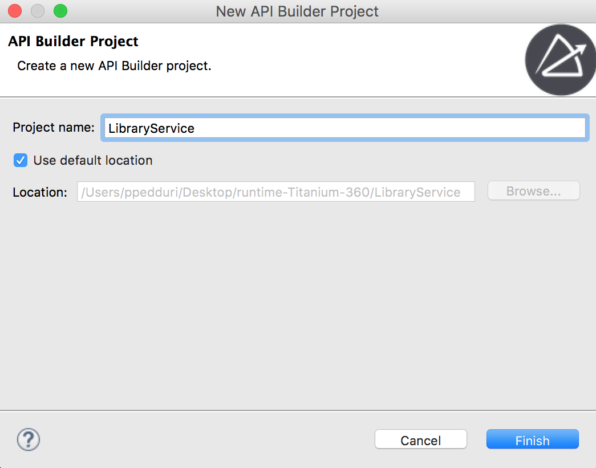
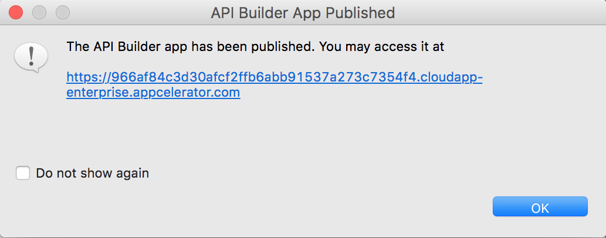
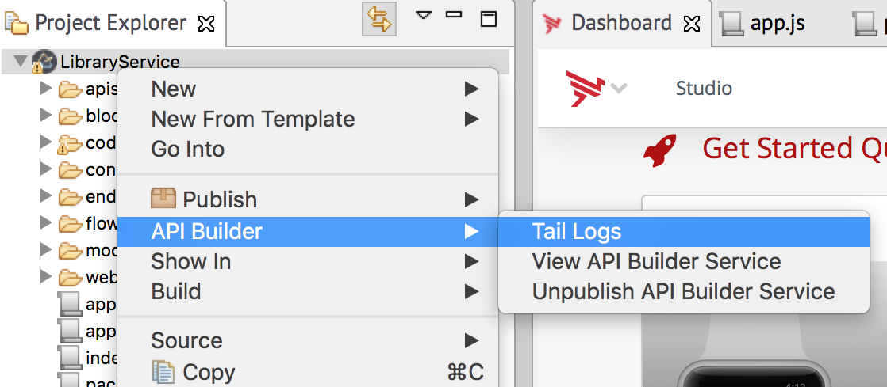

# API Builder Development

You can use Appcelerator Studio to manage your API Builder projects. In Studio, you can create a new project, code your service and API endpoints, then test your project locally. Once you are done testing your project, you can publish it to the cloud, where it can be accessed by multiple client applications. For all other tasks, you will need to use the Appcelerator CLI (see [API Builder Project](/guide/Axway_API_Builder/API_Builder/API_Builder_Developer_Guide/API_Builder_Project/)).

## Create a New Project

1. In the menu bar, select **File > New > API Builder Project**, which opens the _New API Builder Project_ dialog.

2. Enter a name for your application, then click **Finish**.
    

Studio will generate a new skeleton API Builder project. This may take a few minutes.

## Import an Existing Project

To import an existing API Builder project, see [Importing an Existing Project](/guide/Axway_Appcelerator_Studio/Axway_Appcelerator_Studio_Guide/Basic_Concepts/Working_with_Projects/Importing_an_Existing_Project/).

## Test the Application Locally

Once you have developed your API Builder project, you can test it locally from Studio.

1. Select your project in the **Project Explorer** view.

2. Select **Run** from the **Launch Modes** drop-down list.

3. Make sure **Local API Builder Server** is selected in the **Target** drop-down list.

4. Click the **Launch** button.

5. Once the server starts, Studio will launch the Admin console in a new view.

    

The local port number assigned to the server is displayed in the **Console** view. Use your computer's IP address or `http://localhost/`, with the port number to access the running application with a browser or console command, such as `curl` or `wget`.

## Publish the Application

Once you are done testing your project, you can publish to AMPLIFY Runtime Services using Studio.

1. Select your project in the **Project Explorer** view.

2. Select **Package** from the **Launch Modes** drop-down list.

3. Make sure API Builder **App** is selected in the **Target** drop-down list.

4. Click the **Launch** button.

    

Once your application is deployed, a dialog appears providing you information about the endpoint URL for the application.

By default, the service URL will be `http://<SUBDOMAIN_TOKEN>``.cloudapp-enterprise.appcelerator.com`. It may take a few minutes for the application to be available.

To retrieve the service URL later, in the **Project Explorer** view, right-click your project and select **API Builder > View API Builder Service**, which opens the application in your default web browser.

## Unpublish the Application

To unpublish a specific version of the application, right-click the project in the **Project Explorer** view, then select **API Builder > Unpublish API Builder Service**.

This process may take a few minutes. Once the operation completes, a toast notification appears.

## View Application Runtime Logs

Once your application is published, you can access the runtime logs.

In the **Project Explorer** view, right-click on the project and choose **API Builder** **\> Tail Logs**.

A new console view opens with your runtime logs, which will be continuously updated.
