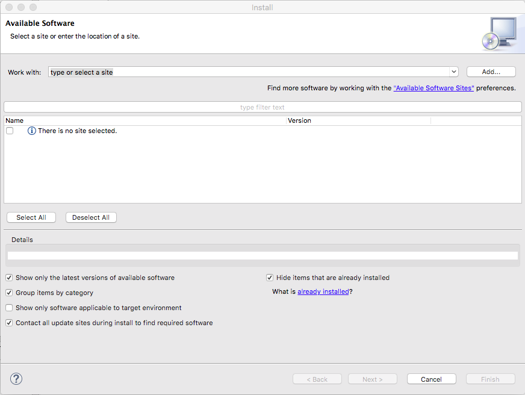

# Installing App Designer

## Installing App Designer

### Studio prior to 4.6.0

1. Open Appcelerator Studio

2. From the MenuBar, click **Help** > **Install New Software...** option from the dropdown. This will open up the **Available Softwar_e_** window.
    

3. Click the **Add...** button in the upper right corner. This will bring up a new window for adding a software resource.

4. Enter **App Designer** in the **name** field.

5. In the **Location** field, enter this URL: [http://preview.appcelerator.com/appcelerator/labs/appdesigner/update/beta/](http://preview.appcelerator.com/appcelerator/labs/appdesigner/update/beta/)

6. Click **OK** so Studio can fetch the plugin. Wait a moment or two while Studio fetches the plugin.

7. Click on the dropdown list in the **Work with** field and select the **App Designer** option.

8. With this plugin selected, you should see the **Appcelerator Designer** plugin in the installed software field. Click the **checkbox** next to the Appcelerator Designer plugin and click **Next**.

    
9. Review the **license agreements** and hit **Next**.

10. To finish up the install, click the **Finish** button.

11. In order for the plugin to take effect, you will need to **restart Studio**.

### Studio 4.6.0 and beyond

There is no need to install App Designer on Studio version 4.6.0 and later as it ships with Studio 4.6.0+.
