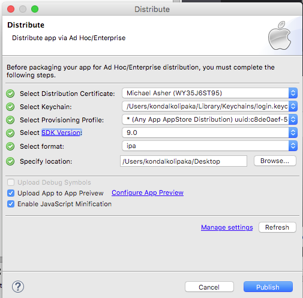
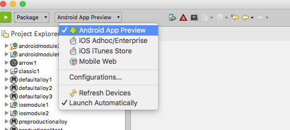

# App Preview

## Overview

**App Preview** is a new Appcelerator Studio feature that allows you to distribute beta versions of your apps to testers and stakeholders. Users should be able to upload their beta apps to App Preview.

App Preview supports the Android and iOS platforms and comes along with CLI hook installed with the App core.

### Plan availability

App Preview is available for Enterprise and Pro plans only. App Preview is included as part of the 45-day trial period (limited to 1 app and 3 devices). It is not currently included in the Indie plan.

## iOS App Preview

App Preview configuration is available while packaging an app to **iOS Adhoc/Enterprise** build.

1. Change the execute button from Run to Package.

2. Next to the Package option, select iOS Adhoc/Enterprise for the package build.

    * 
3. In the distribute wizard window, select the **Upload app to App Preview** option.

4. Select the **Upload app to App Preview** check-box. This will enable **Configure App Preview** link next to it.

5. Clicking on the **Configure App Preview** will open the App Preview configuration details window.

6. Write up some **release notes** and **invite testers**. See [Release notes and inviting users](#release-notes-and-inviting-users) for more details on release notes and inviting users.

7. Follow through the rest of the iOS build process.

8. Verify that the app appears on [http://appbeta.appcelerator.com](http://appbeta.appcelerator.com/).

## Android App Preview

1. Change the execute button from Run to Package.

2. Next to the Package option, select **Android App Preview** from package build.

3. Write up some **release notes** and **invite testers** from within the App Preview configuration details window. See [Release notes and inviting users](#release-notes-and-inviting-users) for more details on release notes and inviting users.

4. Click **OK**.

5. At this point, the app build should build, complete, and publish the APK file to App Preview dashboard.

6. Verify that the app appears on [http://appbeta.appcelerator.com](http://appbeta.appcelerator.com/).

## App Preview configuration for previously published apps

App Preview configuration will be different if you have previously published the application to App Preview.

Following the steps above for [iOS](#ios-app-preview) and [Android](#android-app-preview) App Preview should be the same. What is slightly different is the App Preview Configuration window will include options for notification. Those notification options include:

* **None**: This option will not add any previous testers to a new build.

* **Notify All**: Adds all previous testers to a new build and send them an email.

* **Add All**: Adds all previous testers to a new build but it won't send an email.

* **Add/Notify selective teams**: This option will allow the user add or notify only selective teams. It will accept the team names separated by commas.

## Release notes and inviting users

**Release Notes_:_** Release notes for the current build has a maximum of 15,000 characters supports markdown.

**Invite Users_:_** This field allows you to invite \[new\] testers. This field accepts a single or multiple email address. Use commas to separate each email address if you are inviting more than one user.
