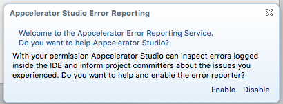
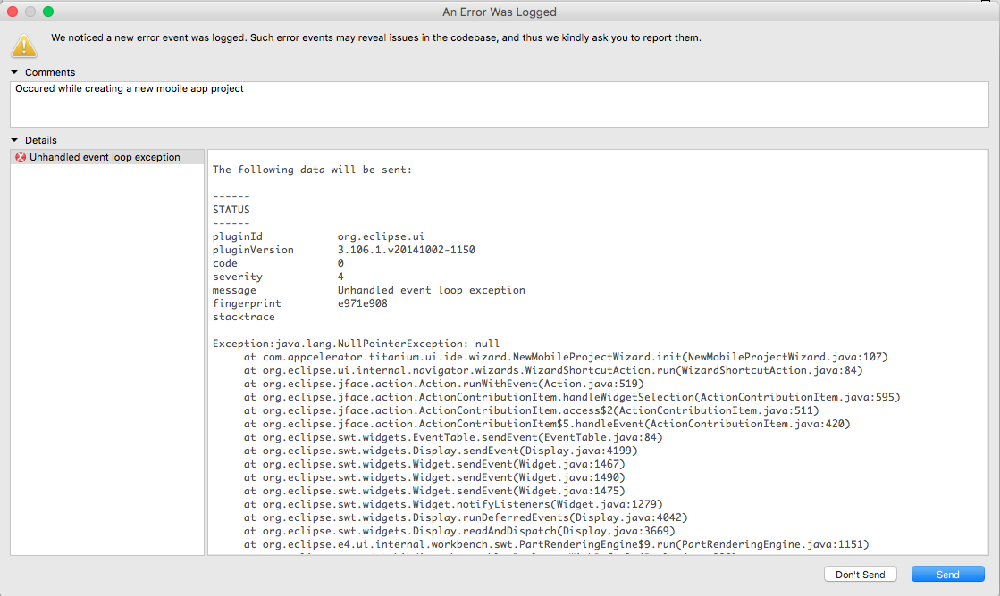
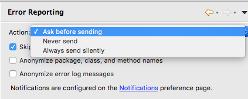
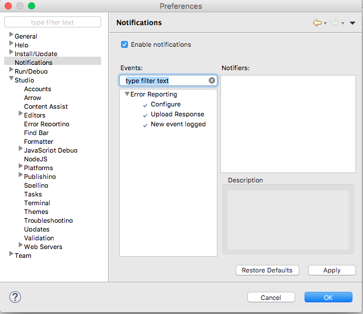

# Studio Error Reporting

Appcelerator Studio comes with a built-in error reporting tool that can be used to identify problems within Studio and automatically upload problems to the Appcelerator analytics server which will provide key insights as to where problems may exist in Studio and how they can be improved. At present, errors identified in Studio are often shown with a dialog to the end user or simply written to a log (visible with Help > Studio > View Log File). Often these problems go ignored or unreported.

To improve the end user experience, the Error Reporting Tool can now automatically upload error reports for committers so that they can be able to identify and fix. This often solves the problem of users not having appropriate credentials for Appcelerator's bug reporting site ([https://jira.appcelerator.org](https://jira.appcelerator.org/)) as well as inclination to do so.

When the first error is logged, a dialog window will appear asking the user whether they want to take part in improving the code base, in much the same way that mobile phones have an opt-in for sending reports to the server:

Here, the user can choose to enable or disable the error reporting service from the notification dialog.

If enabled, Studio will send errors as they occur by asking permission from the user.

## Error reporting configuration

Even the error messages hidden in the stack trace can be anonymized if needed. The Automated Error Reporting Configuration gives you the options to anonymize various report data. This dialog window will only appear once but it can be changed later from Studio's preferences.

::: warning ⚠️ Warning
It is not required to anonymize the error report unless until it has some valuable information.
:::

User can view the error report and stack trace before studio send it to the server.

To view the error details, click on the **View Details** from the notification dialog. Here the user can provide the comments/reproducible steps in the comments section.

Click **Send** to submit the error to Appcelerator.

## Disabling error reporting

1. Go to Appcelerator Studio **Preferences**.

2. Navigate to **Studio** \> **Error Reporting**.

3. From the **Action** list, select **Never Send**. This will turn off the error reporting service in Studio.

4. Click on **Apply** and **OK**.

## Send error reports silently from Appcelerator Studio

1. Go to Appcelerator Studio **Preferences**

2. Navigate to **Studio** > **Error Reporting**.

3. From the **Action** list, select **Always send silently**. This will avoid asking the permission from the user.

4. Click on **Apply** and **OK**.

## Controlling error reporting actions

## Error reporting action options

## Error reporting notification configuration

