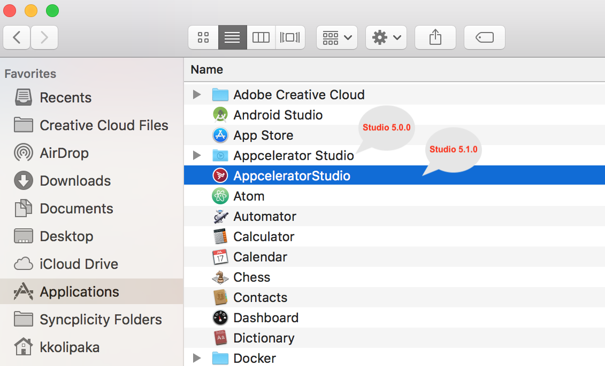

# Studio 5.1.0 Changes

## Cannot update from Studio 5.0.0 to Studio 5.1.0

* With Appcelerator Studio 5.1.0 release, we have upgraded the Eclipse core from 4.4 to 4.7. This update brings a different directory structure to Studio for MacOS users.

* Due to several internal changes, it is not possible to update from Studio 5.0.0 to 5.1.0. Users are advised to download and install a fresh copy of Studio 5.1.0 installer directly for both Windows and MacOS. Please review [Uninstalling Studio](/guide/Axway_Appcelerator_Studio/Axway_Appcelerator_Studio_Guide/Updating_Studio/Uninstalling_Studio/) for removing Studio (as necessary for your setup).

* You are advised to use the existing workspace directory when launching Studio 5.1.0 to get your old studio projects

## Noteworthy changes

* Added support for Java 9 and 10

* Upgraded Eclipse from 4.4 to 4.7

* Upgraded GIT to 2.16.2

* Added Windows 64-bit Studio builds (which requires 64-bit Java installers)

* Studio installs Java 1.8.162 if there are not supported Java versions installed (by default)

* Updated JRuby and Ruby to versions 9.1.16 and 2.5 respectively to be compatible with Java 9 (useful for loading templates like HTML, JSON, Ruby, and so)

## Installers

### For MacOS

The Studio 5.1.0 installer creates **AppceleratorStudio** application launcher package under `/Applications` directory. Previously, it used to be under `Appcelerator Studio` directory.

To launch the studio 5.1.0, double click on the **AppceleratorStudio** package launcher file.

To view the contents of “AppceleratorStudio” file,

1. Right-click on **AppceleratorStudio**.

2. Select **Show Package Contents**.

#### Studio configuration file

Studio configuration file (`AppceleratorStudio.ini`) is now located in `/Applications/AppceleratorStudio.app/Contents/Eclipse/AppceleratorStudio.ini`.

### Windows

The 64-bit Windows OS Studio 5.1.0 RC builds are not updated in the [Appcelerator Studio preview](http://preview.appcelerator.com/appc-studio/) page. You can download it directly from [https://s3.amazonaws.com/titanium-studio/5.1.0/Appcelerator\_Studio-x64.exe](https://s3.amazonaws.com/titanium-studio/5.1.0/Appcelerator_Studio-x64.exe).

The installer uses the same location as previous versions of Studio. There is no change in the folder structure for Windows.

By default, Studio is installed to `%USERPROFILE%\AppData\Roaming\Appcelerator\Appcelerator Studio\` folder.

With Studio 5.1.0, we introduce support for 64-bit Studio builds so that we can leverage the features of [Java 9](https://www.oracle.com/java/java9.html).

## Java support matrix

### Studio 5.0.0 and earlier installers

| Studio 5.0.0 and earlier | Java Version | Status |
| --- | --- | --- |
| Windows installer (32-bit) | Java 8 (32-bit) | Functional |
| Windows installer (32-bit) | Java 8 (64-bit) | Not compatible |
| MacOS installer (64-bit) | Java 8 (64-bit) | Functional |

### Studio 5.1.0+ installers

| Studio 5.1.0 installer | Java Version | Status |
| --- | --- | --- |
| Windows installer (32-bit) | Java 8 (32-bit) | Functional |
| Windows installer (32-bit) | Java 8 (64-bit) | Not compatible |
| Windows installer (32-bit) | Java 9 (32-bit) | 32-bit Java 9 is not available |
| Windows installer (32-bit) | Java 9 (64-bit) | Incompatible (32-bit installer requires 32-bit Java) |
| Windows installer (64-bit) | Java 8 (64-bit) | Functional |
| Windows installer (64-bit) | Java 8 (32-bit) | Incompatible (64-bit installer requires 64-bit Java) |
| Windows installer (64-bit) | Java 9 (64-bit) | Functional |
| Windows installer (64-bit) | Java 9 (32-bit) | 32-bit Java 9 is not available |
| MacOS installer (64-bit) | Java 8 (64-bit) | Functional |
| MacOS installer (64-bit) | Java 9 (64-bit) | Functional |
