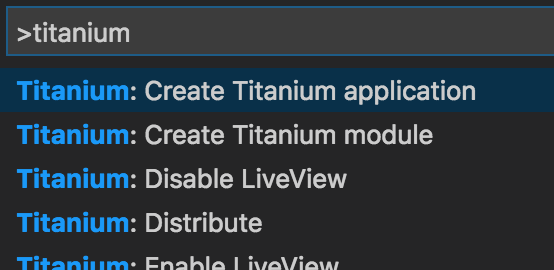
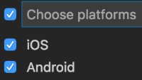
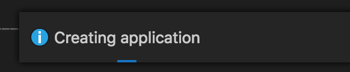

# Hello World Tutorial for VS Code Extension For Titanium

This document provides the necessary information to build the "Hello World" app using the VS Code extension for Titanium.

## Requirements

This tutorial assumes that the user has some basic familiarity with VS Code, has an Appcelerator [account](https://www.appcelerator.com/pricing/), and has the necessary [emulators](/guide/Editor_IDE/VSCode_Extension/Setting_Up_Emulators_and_Simulators_For_Titanium/#installing-android-studio,-android-sdk,-and-android-virtual-device) and/or [simulators](/guide/Editor_IDE/VSCode_Extension/Setting_Up_Emulators_and_Simulators_For_Titanium/#install-ios-simulator) set up on your machine.

### Android emulators

After completing [emulators](/guide/Editor_IDE/VSCode_Extension/Setting_Up_Emulators_and_Simulators_For_Titanium/#installing-android-studio,-android-sdk,-and-android-virtual-device) guide, you'll need to go back into **VC Code**, click on the **Titanium Explorer** icon  and click the **Refresh Devices** icon  . You should now see the installed emulators for Android.

### iOS simulators

After completing [simulators](/guide/Editor_IDE/VSCode_Extension/Setting_Up_Emulators_and_Simulators_For_Titanium/#install-ios-simulator) guide, go back to **VS Code** and click on the **Titanium Explorer** icon  and click the **Refresh Devices** icon  . You should now see the installed iOS simulators.

## Set up the project

1. Create a **new workspace**.

2. Add a **folder** (create a new one just for this project).

3. Create a **new project** (**cmd/ctrl + shift + p** and type in "**Titanium: Create Titanium Application**" (or just "Titanium") in the command palette). Note: If you're not logged into Appcelerator, the wizard will ask you to log in. A terminal will be opened and you can provide your Appcelerator credentials to log in.

    
4. Enter the **name of the app** of **`Hello World`**.

5. Enter the name of the **application ID**: **`com.appcelerator.helloworld`**

6. **Choose which platform(s)** you wish to build for and click **Ok**. Note: if you pick one or more platforms (Android and iOS), you'll need to ensure that you have all the necessary components installed on your machine to continue with developing and test on those platforms.

    
7. **Skip enable services** for this tutorial as we won't be using it.

8. **Set the directory** for the project.

9. Wait a moment while VS Code extension creates the project. You can see the extension working in the bottom right corner.

    
10. Once the project has been created, VS Code will ask you if you want to open the project. Click **Open Project** and it will open in another window.

## Modify the app

1. Open the **`../Hello World/app/`****`views/index.xml`** file by clicking on it in the **Explorer** panel.

2. Let's modify this file to say something custom like "Greetings and salutations". In line 3, you should see something like this:

    ```xml
    <Label id="label" onClick="doClick">Hello, World</Label>
    ```

    Replace it with this:

    ```xml
    <Label id="label" onClick="doClick">Greetings and salutations</Label>
    ```

3. **Save** your changes.

## Build and test the app

The last steps involve building and testing the app.

1. Click the **Titanium Explorer** icon  in the **Activity Bar**.

2. For this tutorial, we'll focus on using an Android emulator (the process for using an iOS simulator is the same). Select Android and pick an emulator. If you don't see any Android emulators, you'll need to ensure that you have Android Studio installed, a recent Android SDK, and Android Virtual Device.

3. Click the **Run** icon next to the virtual device and wait for a moment while the app builds and installs on the virtual device.

4. Once the app has launched in the virtual device, tap on the text to see your customized app in action.

You may notice that LiveView is enabled by default (eye icon in the toolbar:  ). LiveView displays updates of your application as you actively add, modify or replace the files in the project. To read more about LiveView, visit the [LiveView](/guide/Axway_Appcelerator_Studio/Axway_Appcelerator_Studio_Guide/Titanium_Development/LiveView/) document (this document specifically focuses on Studio but the general concept applies here as well).


