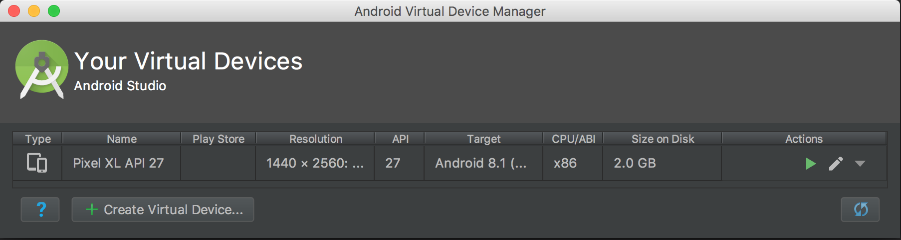
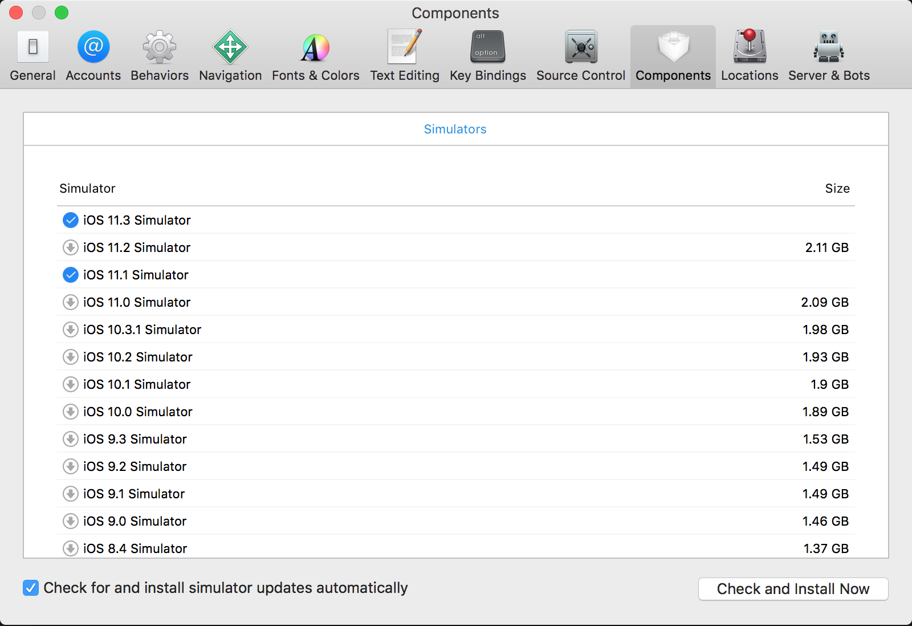

# Setting Up Emulators and Simulators For Titanium

## Installing Android Studio, Android SDK, and Android Virtual Device

If you don't see any devices to build on, it's likely you don't have any Android SDKs and/or Android Virtual Devices set up. This section will walk you through the basic steps to install these required components.

### Install Android SDK

The Android SDK can be downloaded from within [Android Studio](https://developer.android.com/studio).

With Android Studio installed, follow these steps to set up a recent SDK:

1. Launch **Android Studio**.

2. Click on **Tools** > **SDK Manager**.

3. Place a **checkmark** next to the **SDK** you wish to install and click **OK** to begin the download and installation.

### Install Android Virtual Device

To test your app, you need either a device connected to your machine or a virtual device. This section covers how to set up a virtual device via Android Studio so that the device will appear in VS Code.

1. Launch **Android Studio**.

2. Click on **Tools** > **AVD Manager**.

3. Click on **Create Virtual Device...**.

4. Select **Phone** from the **Category** panel.

5. At the time of writing this document, Pixel XL is a popular device. So, we'll pick that one from the list and click on Next.

6. For the system image, Oreo (API level 27) should work for this virtual device. Click **Next**.

7. There's no real need to change any of the settings in **Verify Configuration** window. Click **Finish** to build the virtual device.

8. Load your IDE and confirm that the Android emulator shows up.

## Install iOS simulator

If you need to build apps for iOS devices, you will need Xcode to install the necessary iOS simulators for testing.

1. Launch **Xcode**.

2. Click **Xcode** \> **Preferences** \> **Components**.

3. Click on the **simulator version** you wish to download and use. Note: these are pretty large files (2+ GB).

4. Wait for the download to complete before checking in with your IDE of choice to confirm that the simulator now shows up.

