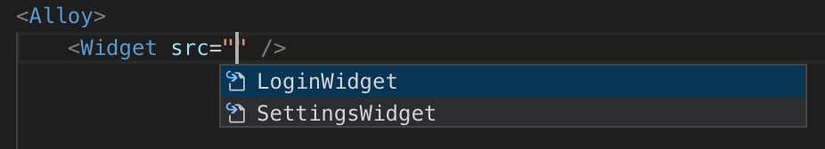
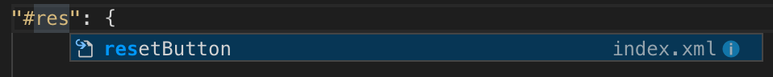
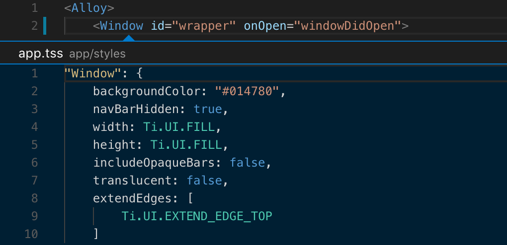
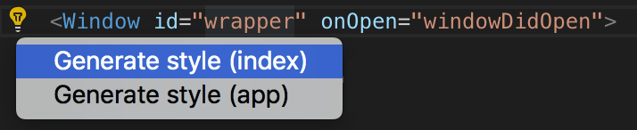

# Visual Studio Code - Titanium Extension Features

## Commands

VS Code include several base and extension keymap bindings.

The following table contains a list of keymap bindings that ships with the Titanium extension. If you wish to modify the keymap, you can go to **Code** > **Preferences** > **Keymaps** (command K, command M). Please review [Key Bindings for Visual Studio Code](https://code.visualstudio.com/docs/getstarted/keybindings) for more details.

| Command | Keymap binding | Description |
| --- | --- | --- |
| `Titanium: Create application` |  | Create a new Titanium application project |
| `Titanium: Create module` |  | Create a new Titanium module project |
| `Titanium: Enable LiveView` |  | Enable LiveView |
| `Titanium: Disable LiveView` |  | Disable LiveView |
| `Titanium: Build` | cmd/ctrl + alt + enter | Build a Titanium project |
| `Titanium: Package` |  | Package a Titanium project |
| `Titanium: Stop` | cmd/ctrl + alt + . | Stop a running build or package process |
| `Titanium: Set log level` |  | Set log level |
| `Titanium: Generate Alloy controller` |  | Generate Alloy controller |
| `Titanium: Generate Alloy migration` |  | Generate Alloy migration |
| `Titanium: Generate Alloy model` |  | Generate Alloy model |
| `Titanium: Generate Alloy style` |  | Generate Alloy style |
| `Titanium: Generate Alloy view` |  | Generate Alloy view |
| `Titanium: Generate Alloy widget` |  | Generate Alloy widget |
| `Titanium: Open related view` | cmd/ctrl + alt + v | Open related view |
| `Titanium: Open related style` | cmd/ctrl + alt + s | Open related style |
| `Titanium: Open related controller` | cmd/ctrl + alt + x | Open related controller |
| `Titanium: Open related files` | cmd/ctrl + alt + a | Open related files |
| `Titanium: Generate autocomplete list` |  | Generate autocomplete list |

## Titanium View

This extension provides a `Titanium` view to the Activity Bar in VS Code. With this view, you can view your available build platform and their targets.

Access to the same commands provided by the Command Palette are available inline on device and platform targets, as well as in the right click context menu.

## Build tools

Use the command palette and commands listed above to build and run your Appcelerator project. Follow instructions to select platform, target, and (if appropriate) code signing. The last build destination is saved for quick recall.

By default, the integrated terminal is used to execute the build command.

## Autocompletion

Autocompletion support is provided to help speed up development by providing quick references to Titanium APIs and Alloy markup as well as references to modules, widgets, and assets within your project.

### Generation

On initial launch, autocomplete suggestions are generated for the active Titanium SDK in your project and the Alloy version in your active CLI.

Autocomplete suggestions can be regenerated by running the `Generate autocomplete suggestions` command from the command palette.

### Titanium and Alloy

Titanium APIs and Alloy markup suggestions are provided in Titanium JavaScript and Alloy XML and TSS files. This includes classes, properties, methods, and events.

### Project references

Suggestions for other controllers, modules ,and widgets are presented when referencing through a Titanium function or Alloy markup.

### Class and ID references

Suggestions for classes and IDs declared or defined in related Alloy XML and TSS files are presented.

### Images

Image suggestions are presented where appropriate.

## Open related files

Opening related Alloy files is supported (see above commands list). This can also be by right clicking in an active editor.

* From View, open related Style and/or Controller

* From Style, open related View and/or Controller

* From Controller, open related View and/or Style

## Jump-to-definition

Jump-to-definition support is provided for quickly accessing the definition or usage of Alloy markup and to easily generate new definitions. Images can be previewed inline.

### Alloy

From Views, click through to style definitions for tags, classes and IDs, in related or global TSS. Click through to event definitions in the related controller. Definitions can also be presented inline.

A prompt is displayed to generate undefined styles or functions.

### Strings

Click on localized string references to jump to their definition. The option to generate undefined strings is provided.

### Images

Click on an image path to open a preview. For iOS, where multiple scaled images exist with the same name the first is opened (e.g. @2x).

## Snippets

Code snippets for common Alloy and Titanium APIs are provided for use in Alloy controllers and modules. A description of the snippet and link to documentation are provided where appropriate. Type the prefix and the autocomplete overlay will be displayed with matching snippets.

### Snippets for Titanium development

| Prefix | Description |
| --- | --- |
| `tidebug` | Debug log function |
| `tiinfo` | Info log function |
| `titrace` | Trace log function |
| `tiwarn` | Warn log function |
| `tierror` | Error log function |
| `tiaddevent` | Add event listener function |
| `tiremevent` | Remove event listener function |
| `tifireevent` | Fire event function |
| `tialert` | Create alert dialog |
| `tiopt` | Create option dialog |
| `tianim` | Create animation |
| `tifile` | Get file |
| `tisound` | Create sound |
| `tiaudio` | Create audio player |
| `tivideo` | Create video player |
| `ticamera` | Show camera |

### Snippets for Alloy development

| Prefix | Description |
| --- | --- |
| `alglo` | Alloy Globals object |
| `alcfg` | Alloy CFG object |
| `alargs` | Arguments available in an Alloy controller |
| `alcon` | Alloy create controller function |
| `alcol` | Alloy create collection function |
| `almod` | Alloy create model function |
| `alwid` | Alloy create widget function |
| `ifios` | Alloy iOS conditional statement |
| `ifand` | Alloy Android conditional statement |
| `ifwin` | Alloy Windows conditional statement |
