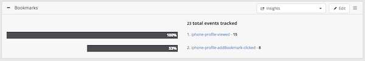

# Quick Start

## Overview

Welcome to the Appcelerator Platform! The Appcelerator Platform helps you develop cross-platform mobile applications using the Titanium SDK, Alloy, Axway Appcelerator Studio and the Appcelerator CLI, then lets you manage the entire lifecycle of the application with debugging, testing, deploying, crash monitoring and analytic data collection.

This guide introduces the Appcelerator Platform and walks through the steps of setting up Appcelerator Studio, downloading and installing the necessary Titanium and third-party SDKs and tools, and creating a simple project.

If you are developing native Android application with Java or native iOS application with Objective-C, see the [AMPLIFY Appcelerator Services Native SDKs](/guide/AMPLIFY_Appcelerator_Services/AMPLIFY_Appcelerator_Platform_Services_How-tos/AMPLIFY_Appcelerator_Services_Native_SDKs/) to get started with integrating Appcelerator Platform services with your application.

::: warning ⚠️ Warning
Appcelerator Platform is available as a service referred as App Builder through the AMPLIFY platform.
:::

## Appcelerator Platform

The Appcelerator Platform consists of several components:

* **[Axway Appcelerator Studio](/guide/Axway_Appcelerator_Studio/) and [Appcelerator CLI](/guide/Appcelerator_CLI/)**: tools to create and develop your mobile and cloud applications.

* **[Alloy Framework](/guide/Alloy_Framework/) and the [Titanium SDK](/guide/Titanium_SDK/)**: an MVC framework and cross-platform SDK to help you rapidly develop mobile applications from a single code base.

* **[Axway API Builder](/guide/Axway_API_Builder/)**: an opinionated framework to build and deploy APIs to the cloud that can be consumed by multiple clients.

* **[Axway Appcelerator Dashboard](/guide/AMPLIFY_Dashboard/)**: a web portal used to monitor your application's heath and usage. This dashboard is aimed for technical users.

* **[AMPLIFY Appcelerator Services](/guide/AMPLIFY_Appcelerator_Services/)**: set of features that includes free analytics services, and the performance management and automated testing services, which require an Enterprise subscription.

To start using the Appcelerator Platform, you need an account to log in to the Appcelerator Dashboard and Axway Appcelerator Studio.

* If you want to try the Appcelerator Platform for free, [sign up for an Appcelerator Platform account](http://www.appcelerator.com/signup/).

* If you are part of an Appcelerator Organization, your organization's Appcelerator Platform administrator sends an invitation to you to log in to the Axway Appcelerator Dashboard and create an account.

* If you are an administrator, see [Managing Organizations](/guide/AMPLIFY_Dashboard/AMPLIFY_Dashboard_Guide/Managing_Organizations/) for more information about adding users to your organization's Appcelerator Platform and provisioning them either Dashboard access.

## Axway Appcelerator Dashboard

The Axway Appcelerator Dashboard lets you view and diagnose your mobile application's health and usage statistics. The Dashboard provides a lot of technical data about your application.

To use the dashboard, log in to [https://platform.axway.com/](https://platform.axway.com/) with your Appcelerator Platform credentials. The first time you use the Axway Appcelerator Dashboard, you will be prompted to enter an authorization code. This code is emailed to the account associated with your Appcelerator Platform credentials. Copy and paste this code in the authorization page and click **Authorize**.

Once the dashboard is displayed, select your application from the **Apps** list in the top-left corner and click on the different Appcelerator Service tabs on the top to view difference usage statistics and reports. To manage your account, click on the **Profile** drop-down menu (your name) in the top-right corner and select an option.

For more information about the dashboard, see [Axway Appcelerator Dashboard](/guide/AMPLIFY_Dashboard/).

## Axway Appcelerator Studio

This section guides you through the steps of setting up Axway Appcelerator Studio. Axway Appcelerator Studio is an Eclipse-based integrated development environment (IDE) used to develop your mobile projects and enable Appcelerator Services, which are monitored through the Axway Appcelerator Dashboard. Studio requires the Titanium SDK and additional third-party SDKs to develop mobile applications.

### System requirements

In order to run Axway Appcelerator Studio and the Titanium SDK, your system environment must meet the following requirements:

* **Operating System:** a recent version of Windows, Mac OS X or Ubuntu

* **Memory:** 2 GB RAM (available memory, rather than total memory)

* **Java Runtime:** Oracle JDK (no other brand of Java is suitable)

* **Node.js:** required for the Titanium command-line tools like the CLI, Alloy and AMPLIFY Runtime Services

For Mac OS X and Windows systems, Studio guides your through the process of installing the Oracle JDK and Node.js. For more details, see [Prerequisites](/guide/Titanium_SDK/Titanium_SDK_Getting_Started/Prerequisites/).

### Download and install Studio

1. Go to [https://platform.axway.com/#/product/studio](https://platform.axway.com/#/product/studio).

2. Download the installation file for the version of your operating system.

3. Once downloaded, install Axway Appcelerator Studio (App Builder):

    * For Mac OS X and Windows systems, run the installer program.

### Launch and update Studio

When you launch Axway Appcelerator Studio for the first time, login with your Appcelerator Platform username and password. Studio prompts you to select a workspace, which is simply a folder where Studio places all of the project files and IDE preferences data. If you are behind a proxy, you will need to configure your proxy settings in Studio before logging in (see [Using Studio From Behind a Proxy](/guide/Axway_Appcelerator_Studio/Axway_Appcelerator_Studio_Getting_Started/Using_Studio_From_Behind_a_Proxy/)).

When Studio launches for the first time, it automatically starts installing the latest Titanium SDK, Appcelerator Service modules and additional Appcelerator command-line tools. Once this is completed, confirm that no further updates are pending and that Studio is at the latest version.

From the menu bar, select **Help >** **Check for Axway Appcelerator SDK Updates** to verify that all the official Appcelerator components are installed and repeat this step until there are no more updates available.

### Configure Studio

To develop native applications with Titanium you need the SDKs and tools for those native platforms installed on your system. For example, to develop Android applications you need the Android SDK and toolchain installed.

The first time you launch Studio the **Platform Configuration** dialog opens. This dialog indicates which platform SDKs are installed and which are not, and lets you easily install individual SDKs. In the following screenshot, the system has none of the native SDKs installed.

**To install the platform SDKs**:

1. Select the platforms you want to install.

2. Optionally click **Settings** next to each platform to customize the installation configuration. For more details, see [Installing Platform SDKs](/guide/Titanium_SDK/Titanium_SDK_Getting_Started/Installation_and_Configuration/Installing_Platform_SDKs/).

3. Click **Configure** to start the installation process.

Studio begins downloading and installing each SDK you selected, according to the settings you specified. In the case of iOS, Studio launches the App Store application installed on your Mac to the XCode download page.

**Please ask your Confluence administrator to update the license for the [MultiExcerpt Plugin for Confluence 4+](https://plugins.atlassian.com/plugins/biz.artemissoftware.confluence.multiexcerpt.MultiExcerptMacro) .**
**Admin Info: The error is: license VERSION\_MISMATCH**

## Creating your first mobile app

The following directions guide you through the steps of importing the **Employee Directory** sample project, which demonstrates some components of the Appcelerator Platform.

### Import the sample project

To import the **Employee Directory** sample project:

1. In the global tool bar, click the **Show Studio Dashboard** icon  to open the Axway Appcelerator Studio Dashboard if it is not already open.

2. In the Axway Appcelerator Studio Dashboard, locate the **Employee Directory** project.

3. Click the **Import Project** button.

4. The **New Sample Project** wizard appears. Use the default settings and click the **Finish** button to start importing the sample project.

### Run and test the client application

After the project is imported, run it.

1. In the **Project Explorer** view, verify your project is selected.

2. In the global toolbar, select **Run** from the **Launch Mode** drop-down and select a target to deploy to from the **Target** drop-down.
    

    ::: warning ⚠️ Warning
    The application will not run on a Genymotion emulator because it does not include the Google Play SDK required by the `ti.map` module.
    :::

3. Once the application launches, click on profiles to view the detailed information about the contact. Click on the Add to Bookmarks links and the icons below it.
    

If you open and look at the `app/controllers/profile.js` and `app/controllers/directory.js` files, you will notice there are several calls to `Ti.Analytics` methods. Your interaction with the application triggers calls to these methods, which sends data to the Appcelerator servers.

### View application statistics in Dashboard

To view the data sent by the client application to the server:

1. Go to the Axway Appcelerator Dashboard. To get to the Appcelerator Dashboard, either:

    * Go back to Axway Appcelerator Studio. click the **Show Studio Dashboard** icon  to open the Axway Appcelerator Studio Dashboard, Login with your Appcelerator Platform credentials. Select dashboard and find the imported **Directory app**.

    * Go to [https://platform.axway.com/](https://platform.axway.com/). Login with your Appcelerator Platform credentials. Select **Directory** with the mobile phone next to it from **Apps** drop-down list in the top-left corner.

2. In the **Overview** tab, view information and statistics about your application.

3. Click the **Analytics** tab to see current real-time usage of the client application. Click on **Users** , **Sessions** and **Events** to view different data sets.

Let's create an event funnel to track the user flow. To create an event funnel:

1. While the **Analytics** tab is selected, click **Event Funnels**.

2. In the **Enter a Name for your funnel** text box, enter "Bookmarks".

3. Drag the `<platform>-profile-viewed` event to the Funnel.

4. Drag the `<platform>-profile-addtofavorites-clicked` event below the previous event.

5. Click **Save**.

    

The dashboard will display your new event funnel displaying the percentage of users that click the bookmark link when they viewed a profile.

Interact with the client application and return to the Dashboard to see updated statistics.

## Next steps

Congratulations! You've just created and ran your first mobile application.

To try out the features of the Appcelerator Platform:

* See [AMPLIFY Appcelerator Services](/guide/AMPLIFY_Appcelerator_Services/) for information about Appcelerator Analytics, Performance and Test services.

* See [AMPLIFY Dashboard](/guide/AMPLIFY_Dashboard/) for more information about using the Appcelerator Dashboard.

* See [Titanium Development](/guide/Axway_Appcelerator_Studio/Axway_Appcelerator_Studio_Guide/Titanium_Development/) for more information about the developing Titanium applications with Appcelerator Studio, such as code profiling or analysis.

To integrate Appcelerator Platform Services with native applications, see [AMPLIFY Appcelerator Services Native SDKs](/guide/AMPLIFY_Appcelerator_Services/AMPLIFY_Appcelerator_Platform_Services_How-tos/AMPLIFY_Appcelerator_Services_Native_SDKs/).

For more information about the Titanium SDK, review the videos in the Appcelerator Studio Dashboard, or try importing one of the other sample projects as explained in [Example Applications](/guide/Titanium_SDK/Titanium_SDK_Guide/Example_Applications/) or follow [Creating Your First Titanium App](/guide/Titanium_SDK/Titanium_SDK_Getting_Started/Creating_Your_First_Titanium_App/) to build your first Alloy application.
