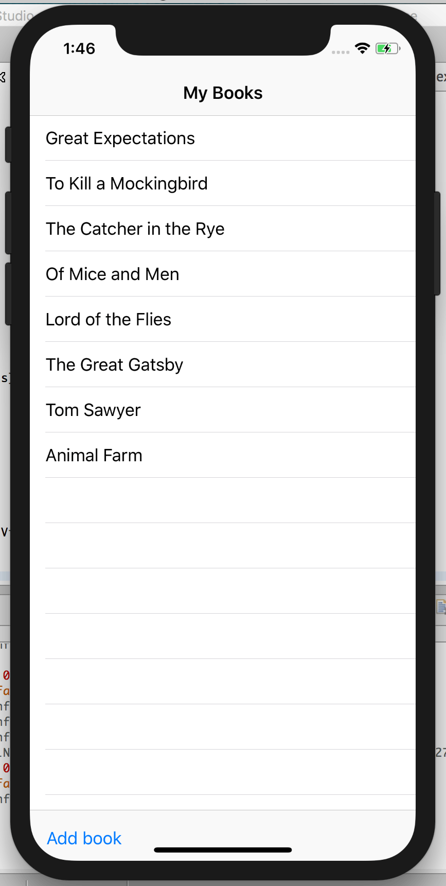
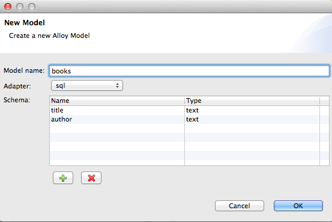
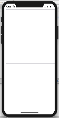
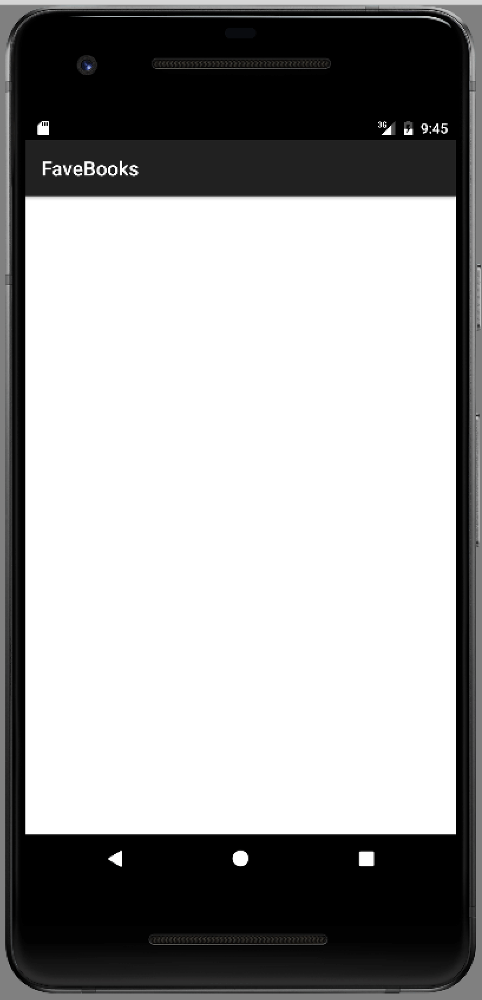
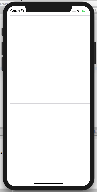
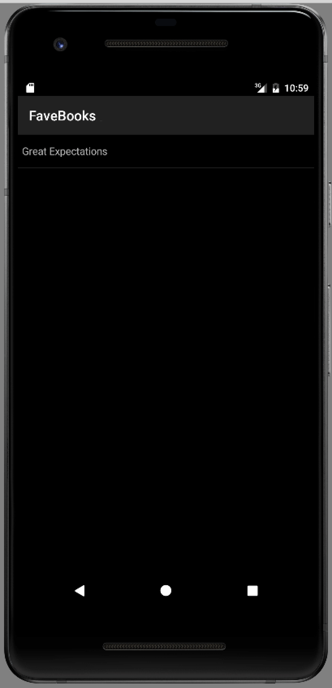
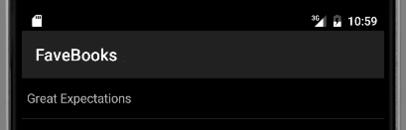
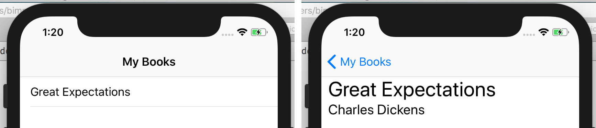

# Creating Your First Titanium App

## Introduction

This tutorial walks you through the process of building a simple Titanium application for iPhone and Android that lets users enter and view their favorite books. It touches on the following topics:

* Alloy framework

* Working with Backbone models and collections

* Displaying data in a TableView

* Using platform-specific resources and styles

* Handling events

You can **[download](https://github.com/appcelerator-developer-relations/FaveBooks)** a completed version of the project.

 

## Create a new project

To start, you'll create a new Alloy project in Studio.

**To create a new Alloy project:**

1. In Studio, select **File** > **New** \> **Mobile App Project**.

2. Select the **Default Alloy Project** type and click Next.

3. On the **Project Location** screen, enter **FaveBooks** for the Project name and **com._your- domain_.favebooks.** Replace _your-domain_ with your personal or organization's domain. Leave the other fields at their default values.

4. Click **OK**.

The new project opens in Studio.

## Create the data model

The heart of the FaveBooks app is the data containing the user’s books, so we’ll start by defining our data model. Alloy uses Backbone to provide its [data modeling and collection features](/guide/Alloy_Framework/Alloy_Guide/Alloy_Models/).

**To create the data model:**

1. Right-click or Control-click on the top-level project folder and select **New** \> **Alloy Model**, or press Cmd+Shift+M (Mac) or Ctrl+Shift+M (Windows).

2. In the New Model dialog, make the following entries:

    * For **Model name**, enter **books**.

    * Select **sql** from the **Adapter** menu.

    * In the **Schema** table, add two fields named **title** and **author** and set their types to **text**.

        
3. Click OK.

This creates a new file in the **app/models** directory called **books.js**. This file describes the data model you just created. The `config` section, in particular, defines the data columns, adapter type, and collection name.

```
exports.definition = {
    config: {
        columns: {
            "title": "text",
            "author": "text"
        },
        adapter: {
            type: "sql",
            collection_name: "books"
        }
    ...
}
```

## Initialize the book collection

Next you'll write code that creates a Collection from the model definition, creates a single book, and saves it to device storage. Eventually you will add features to let users add books, but for now this will give us some data to work with.

**To initialize the book collection:**

1. Open **controllers/index.js** and delete the `doClick()` function definition added by the project wizard.

2. Get a reference to our collection:

    ```javascript
    var myBooks = Alloy.Collections.books;
    ```

3. Create a new model object (book) and assign it a title and author:

    ```javascript
    var book = Alloy.createModel('books', {
       title : 'Great Expectations',
       author: 'Charles Dickens'
    });
    ```

4. Add the book to the collection and persist it to the database.

    ```
    myBooks.add(book);
    book.save();
    ```

5. Save your changes to `index`.js.

Now that our application has some data, let’s display it in a table.

## Add a TableView

In Alloy, collection data can be [synchronized](/guide/Alloy_Framework/Alloy_Guide/Alloy_Models/Alloy_Data_Binding.html) to a view object, or a single model can be bound to a view component. At runtime, Alloy monitors your application's collections for changes and updates any synchronized view objects with the new data. Specifically, the Backbone add, change, destroy, fetch, remove, and reset events are monitored for changes. In this case, each time we call the `add()` method on the myBooks collection the view is synchronized with the new data.

1. Open **views/index.xml**.

2. Delete the **`<Label>`** element that was generated by the project wizard and add a **`<TableView>`** element in its place.

3. Insert a **`<TableViewRow>`** element inside the `<TableView>` element, as shown below:

    ```xml
    <Alloy>
        <Window class="container">
            <!-- Add TableView and  TableViewRow -->
            <TableView>
                <TableViewRow></TableViewRow>
            </TableView>
        </Window>
    </Alloy>
    ```

    The `<TableViewRow>` element will be repeated for each element in our data set.

4. Add a **`<Collection>`** element to the top-level `<Alloy>` element and set its **`src`** property to **books**. This corresponds to the name of the collection we created before.

    ```xml
    <Alloy>
          <Collection src="books"/>
          <Window class="container">
          ...
          </Window>
    </Alloy>
    ```

5. To synchronize the collection with the view, assign **`books`** to the `TableView` element's **`dataCollection`** attribute.

    ```xml
    <Alloy>
        <Collection src="books"/>
        <Window class="container">
            <!-- Asssign the collection to the TableView -->
            <TableView dataCollection="books">
                <TableViewRow></TableViewRow>
            </TableView>
        </Window>
    </Alloy>
    ```

6. Using curly-bracket syntax, assign the title from each book (that is, each model in the collection) to the `title` attribute of the `<TableViewRow>`. The final contents of `index.xml` should look like the following:

    ```xml
    <Alloy>
        <Collection src="books"/>
        <Window class="container">
            <TableView dataCollection="books">
                <TableViewRow title="{title}" author="{author}"></TableViewRow>
            </TableView>
        </Window>
    </Alloy>
    ```

7. Open **styles/index.tss**.

8. By default, Android applications built with Titanium use the AppCompat theme, which uses a dark background with light text, while iOS defaults to black text and a black background. In order to see text, change the background to white for iOS only by adding the platform attribute to the container rule.

    ```
    ".container[platform=ios]": {
      backgroundColor: 'white'
    }
    ```

At this point we’re now ready to test our app. For comparison, we’ll run the app in both an iPhone simulator and an Android emulator.

**To launch the app in the iPhone simulator**:

* From the Target menu in the top-right corner of Studio, select **iOS Simulator** > **iPhone**. By default, Studio is configured to automatically launch when you select a target platform. Wait for the app to complete launching in the simulator.

    

**To launch the app in an Android emulator**

* When the application has finished launching in the iPhone simulator, select **Android Emulator** \> **titanium\_1\_WVGA800** to launch the app.

The **titanium\_1\_WVGA800** string corresponds to the name of the Android virtual device that Studio creates by default. If you have installed other AVDs, you can select one of those.

The screenshots below show the app running on an iPhone simulator and an Android emulator. As you can see, the table is populated with the book from the collection.

 

Note the following:

* On iPhone the top of the `TableView` is partly obscured by the iOS status bar. We’ll fix this later in this tutorial.

* On the Android, the book is hidden under the app label. We'll fix this later in this tutorial.

* The table length increases by a row each time you launch the app, since we are saving the (same) book to each time.

**Android troubleshooting**

The initial launch of the Android emulator can be quite slow and Studio may timeout before it can install and launch the application. If this happens just click **Run** in Studio again. Subsequent launches should not time out on the same virtual device.

## Create a book detail view

Next you’ll add functionality to let the user select a book and view its details (title and author). To do this you’ll create a new Alloy controller. An Alloy controller is actually a logical collection of three parts:

* A view (an XML file)

* A JavaScript controller

* A style file (a Titanium Style Sheet file)

**To create the book detail view** :

1. Right-click or Control-click on the project folder and select **New** \> **Alloy Controller**, or press Cmd + Shift + C (Mac) or Ctrl + Shift + C (Windows).

2. In the New Controller dialog, enter **bookdetails** in the Controller name text field, and click OK. This creates the following new files:

    * `controllers/bookdetails.js` – The controller’s JavaScript controller.

    * `views/bookdetails.xml` – The controller’s view

    * `styles/bookdetails.tss` – Styles for the controller

3. Open **views/bookdetails.xml** in the editor.

4. Replace the `<View>` element with a `<Window>` element:

    ```xml
    <Alloy>
       <Window class="container">
       </Window>
    </Alloy>
    ```

5. Add two `<Label>` elements to the `<Window>` element. Give the first one an ID of **titleLabel** and the other an ID of **authorLabel**, as shown below.

    ```xml
    <Alloy>
       <Window class="container">
          <Label id="titleLabel"></Label>
          <Label id="authorLabel"></Label>
       </Window>
    </Alloy>
    ```

6. Open **styles/bookdetails.tss** and a background color for iOS to the `.container` rule:

    ```
    ".container[platform=ios]" : {
       backgroundColor: 'white'
    }
    ```

Next we’ll add an event handler to the `<TableView>` that opens this new window and displays the book's information.

### Display book details view on selection

To respond to user selection, you add an `onClick` attribute to the `<TableView>` element, and assign it the name of the function to invoke. The function creates a new instance of the **bookdetails** Alloy controller, passing it the title and author of the selected book, so it can display those values in the `<Label>` elements you defined there.

**To display the book details screen on selection**:

1. In the Project Navigator, open **views/index.xml**.

2. Add an **`onClick`** attribute to the `<TableView>` element and set its value to **`showBook`** .

    ```xml
    <TableViewRow title="{title}" author="{author}" onClick="showBook"></TableViewRow>
    ```

3. Open **controllers/index.js** and add a function named **`showBook()`** that takes a single argument called **`event`** . This is the event object passed to the function that contains information about the selected item.

    ```javascript
    function showBook (event) {
    }
    ```

4. First, let’s add code to extract the title and author of the selected book from the `event.source` object.

    ```javascript
    function showBook(event) {
        var selectedBook = event.source;
        var args = {
            title: selectedBook.title,
            author: selectedBook.author
        };
    }
    ```

5. Lastly, we create a new instance of the Alloy bookdetails controller, passing it the `args` object containing the title and author data, and open the view.

    ```javascript
    function showBook(event) {
        var selectedBook = event.source;
        var args = {
            title: selectedBook.title,
            author: selectedBook.author
        };
        var bookview = Alloy.createController("bookdetails", args).getView();
        bookview.open();
    }
    ```

6. Lastly, we need to update **bookdetails.js** to display the title and author values passed to the `createController()` method, or display a default title and author if none were provided:

    ```javascript
    var args = arguments[0] || {};
    $.titleLabel.text = args.title || 'Default Title';
    $.authorLabel.text = args.author || 'Default author';
    ```

7. Save your changes.

Launch the app in the iPhone simulator or Android emulator. Select a book from the list to open the detail screen. You should see something like the following:

 

Clearly, this isn’t what we want – the two labels are occupying at the same space on screen. Next we'll modify the layout and styles of the book detail screen to fix this.

### Modify the book detail layout

Titanium supports three [layout modes](/guide/Titanium_SDK/Titanium_SDK_How-tos/User_Interface_Fundamentals/Layouts_Positioning_and_the_View_Hierarchy/#layout-modes): composite (or absolute), vertical, and horizontal. In composite mode, you specify a child view's coordinates on a grid relative to its parent container's top/left or bottom/right corner. If not specified, a child view is centered on the display. In this section you'll apply a vertical layout to the book details view, and then tweak the style.

1. Open **views/bookdetails.xml**.

2. Wrap the two `<Label>` elements within a `<View>` element, as shown below.

    ```xml
    <View>
       <Label id="titleLabel"></Label>
       <Label id="authorLabel"></Label>
    </View>
    ```

3. Add a **`layout`** attribute to the `<View>` element and set its value to **`vertical`** .

    ```xml
    <View layout='vertical'>
      <Label id="titleLabel"></Label>
      <Label id="authorLabel"></Label>
    </View>
    ```

4. Open **styles/bookdetails.tss** and add the following style rules to align the labels along the left side of the screen, and to set their font sizes. We also add some padding between the two labels by 10.

    ```
    "#titleLabel": {
        font: {
            fontSize: '30'
        },
        left: '10'
    },
    "#authorLabel": {
        font: {
            fontSize: '20'
        },
        left: '10'
    }
    ```

5. Also, we want to ensure that the labels aren't overlapped by the app's name and that the background of the main view doesn't use a white background with white text by adding the following to **styles/index.tss**:

    ```
    ".container[platform=android]" : {
       backgroundColor:"black",
       top: '100'
    }
    ```

Save your changes and build again for iPhone or Android. The title and author should now be positioned vertically within the view, and aligned to the left side of the screen. To get back to the original table, you can click the **Back** button on Android.

 

On iOS, the application is stuck here. Instructions on adding an iOS navigation controller is detailed in a [later section](#AddaNavigationWindowforiOS) of this tutorial.

## Add platform-specific styles to the TableView

If you test the app on an Android device with a high-resolution display, you’ll notice that the default height of each table row is a bit small to comfortably read or select with a finger. For instance, the screenshot below was taken with a Pixel 2 emulator.

To fix this we will apply a [platform-specific style](/guide/Alloy_Framework/Alloy_Guide/Alloy_Views/Alloy_Styles_and_Themes.html#platform-specific-styles) to the `<TableViewRow>` element. During the build process, platform-specific styles are applied only to builds on the target platform. The following is an example of a platform-specific style that makes all Labels blue in iOS builds.



```
"Label[platform=ios]": {
  color: 'blue'
}
```

In this case we’ll increase the font size used by each `<TableViewRow>` element, and set the height of each row to provide some space around the text.

**To increase the table row height on Android**:

1. Open **views/index.tss** and add the following style rule to the end of the document:

    ```
    "TableViewRow[platform=android]": {
        font: {
           fontSize: '24'
        },
        height: '40'
    }
    ```

2. Save your changes and build the application for Android. The TableView should look like the following screenshot:

    

## Add a NavigationWindow

Unlike Android, iOS devices do not provide a physical back button for navigation. The [`NavigationWindow`](#!/api/Titanium.UI.iOS.NavigationWindow) is an UI control that provides an easy way to display and navigate hierarchical content. (In native iOS terms, the control is an implementation of the iOS [navigation controller interface](https://developer.apple.com/library/ios/documentation/WindowsViews/Conceptual/ViewControllerCatalog/Chapters/NavigationControllers.html).) On Android, you get this type of navigation for "free". The `NavigationWindow` will wrap the original `<Window>` element and provide a title bar above the `<TableView>` control, solving this layout issue.

To do this we'll take advantage of an Alloy feature called [platform-specific resources](/guide/Alloy_Framework/Alloy_Guide/Alloy_Concepts.html#platform-specific-resources) that lets you define platform-specific view, controller, and style files. At build time, only those resources specific to the target platform are included. There are two parts to this:

* Creating a new iOS-specific entry point (a new version of `index`.xml) that includes the `NavigationWindow` element

* Updating the controller code to handle the difference between the iOS and Android implementations. In this case we'll use [platform-conditional code](/guide/Alloy_Framework/Alloy_Guide/Alloy_Controllers/#conditional-code) to handle the cross-platform code differences.

**To create the iOS-specific view with a NavigationController:**

1. In Project Explorer, create a new folder named **ios** in the `app/views` folder. Right-click on the FaveBooks project in the Project Explorer and select **New** > **Folder**. The New Folder wizard will allow you to navigate the project directories, select the parent folder, and name the new folder. Once you've done this, click **Finish**.

2. Create a new file named **index.xml** in the new folder.
    

3. Copy the contents of **`views/index.xml`** to **`views/ios/index.xml`** .

4. Wrap the existing `<Window>` element with a **`<NavigationWindow>`** element:

    ```xml
    <Alloy>
        <Collection src="books"/>
        <NavigationWindow>
            <Window class="container" title="My Books">
                <TableView dataCollection="books" id="bookTable">
                    <TableViewRow title="{title}" author="{author}" onClick="showBook"></TableViewRow>
                </TableView>
            </Window>
        </NavigationWindow>
    </Alloy>
    ```

5. Save your changes.

The `NavigationWindow` control has a different API than `Window`, so our code now needs to account for those differences. We could create a platform specific controller folder for iOS (`controllers/ios/index`.js), but the code differences are small enough that we’ll use [platform-conditional code](/guide/Alloy_Framework/Alloy_Guide/Alloy_Controllers.html#conditional-code) to include the proper code for each platform.

**To update the controller code for platform differences:**

1. Open **controllers/index.js**.

2. Modify the `showBook()` method to account for the platform differences when opening the details view. On iOS, you now need to open the book details view using the `NavigationWindow` object's `openWindow()` method:

    ```javascript
    function showBook(event) {
        var selectedBook = event.source;
        var args = {
            title: selectedBook.title,
            author: selectedBook.author
        };
        var bookview = Alloy.createController("bookdetails", args).getView();
        if (OS_IOS) {
            $.index.openWindow(bookview);
        }
        if (OS_ANDROID) {
            bookview.open();
        }
    }
    ```

    As you can see, in the iOS case the handler now opens the window inside the NavigationGroup; the Android code branch uses the same code to open the window (`addview.open()`).

3. Save your changes and test again on an iPhone device or simulator.

The first screen should now display the `TableView` within the `NavigationWindow`.



## Allow user to add books

Of course, we need a way for users to add their own books. Like we did for the book details view, we will create a new Alloy controller composed of three files: the XML view, the JavaScript controller, and the TSS styles file.

The UI will contain two input text fields where the user enters the book title and author, and a "Add" button to update the books collection with the new data. To take advantage of native UI components familiar to iOS and Android users, we'll use a [Toolbar](#!/api/Titanium.UI.Toolbar) component on iOS and a [Menu](#!/api/Titanium.Android.Menu) component on Android to contain the "Add" button.

**To create the add book feature**:

1. In the Project Explorer, right-click on the project folder and select **New** > **Alloy Controller**.

2. In the New Controller dialog, give the controller the name **addbook.** Click **OK**.

3. Open **views/addbook.xml** and add the following markup:

    ```xml
    <Alloy>
        <Window class="container">
            <View layout="vertical">
                <TextField id="titleInput" hintText="Title..."></TextField>
                <TextField id="authorInput" hintText="Author..."></TextField>
                <Button id="insertBookButton" onClick="addBook">Add</Button>
            </View>
        </Window>
    </Alloy>
    ```

    This creates input text fields where the user will enter the book title and author, and a button to add the new book to the collection. The button’s `onClick` handler will call the `insertBook()` function, which you’ll create next.

4. Open **styles/addbook.tss** and add the following styling:

    ```
    ".container[platform=ios]" : {
      backgroundColor: 'white'
    }
    "TextField" : {
      borderStyle: Ti.UI.INPUT_BORDERSTYLE_ROUNDED,
      top: 10,
      left: 20,
      right: 20,
      height: 40
    }
    ```

5. Open **controllers/addbook.js**, remove the existing code in that file and add the following:

    ```javascript
    var myBooks = Alloy.Collections.books;
    ```

6. Define a new function named `addBook()` with the following code:

    ```javascript
    function addBook() {
        var book = Alloy.createModel('books', {
            title : $.titleInput.value,
            author : $.authorInput.value
        });
        myBooks.add(book);
        book.save();

        $.addbook.close(); // Close the window
    }
    ```

7. For iOS, open **views/ios/index.xml** and insert a **`<Toolbar>`** inside the `<Window>` element below the `<TableView>` element:

    ```xml
    <Toolbar bottom="0">
        <Items>
            <Button id="add" title="Add book" onClick="addBook"/>
        </Items>
    </Toolbar>
    ```

8. For Android, open **views/index.xml** and add the following **`<Menu>`** and **`<MenuItem>`** elements below the `<TableView>` element. Note: we cannot add specific node text to the menu item. Instead, we'll use attributes of **`<MenuItem>`** element to accomplish this:

    ```xml
    <Menu id="menu" platform="android">
        <MenuItem id="addBook" title="Add book" onClick="addBook" showAsAction="Ti.Android.SHOW_AS_ACTION_IF_ROOM" />
    </Menu>
    ```

9. Open **controllers/index.js** and add the following code to open the addbook controller when the appropriate native control is used. For Android, depending on the device, the **Add** button can either be accessed from the Action Bar at the top of the display or by using the Menu button. For iOS, use the toolbar at the bottom of the screen.

    ```javascript
    function addBook(){
        var myAddBook = Alloy.createController("addbook",{}).getView();
        if (OS_IOS) {
            $.index.openWindow(myAddBook);
        }
        if (OS_ANDROID) {
            myAddBook.open();
        }
    }
    ```

10. Save your changes and test on a device or emulator.

You should now be able to click 'Add' and add new books to the collection which persist between sessions.

## Next steps

Review the guides in [Alloy Framework](/guide/Alloy_Framework/) to learn more about using Alloy to build your application; specifically, see the [Alloy Views](/guide/Alloy_Framework/Alloy_Guide/Alloy_Views/) section to learn about creating the UI for your application. Also, review the [Titanium SDK](/guide/Titanium_SDK/) guides to learn more about specific categories of APIs, such as UI, media, geolocation, and so on.
