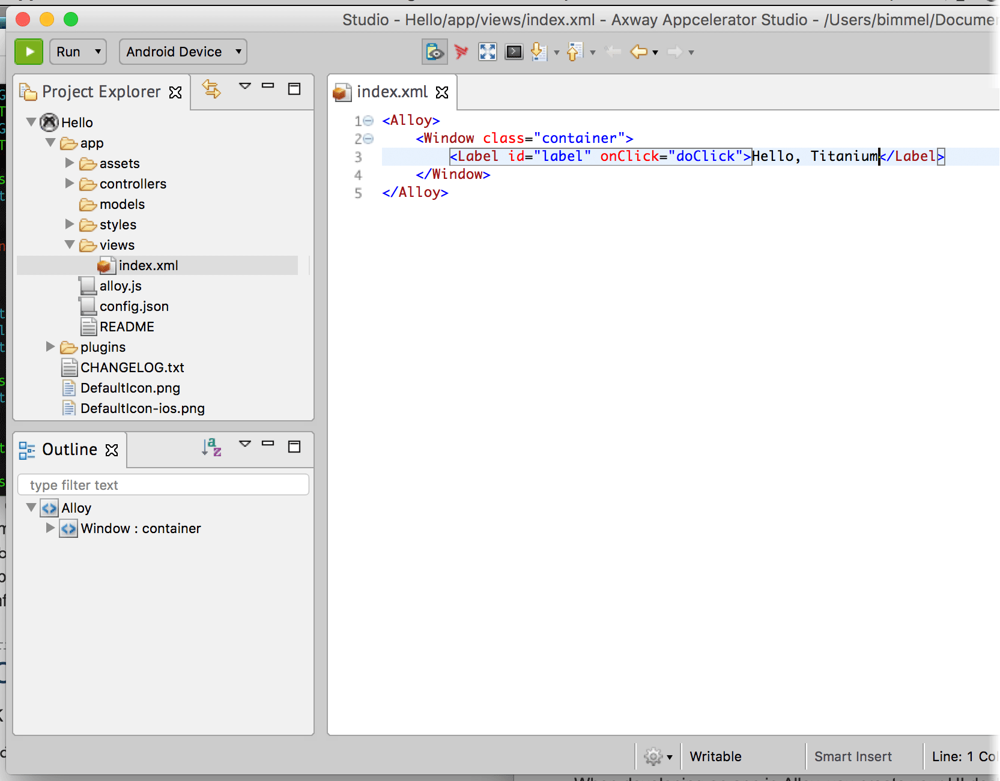
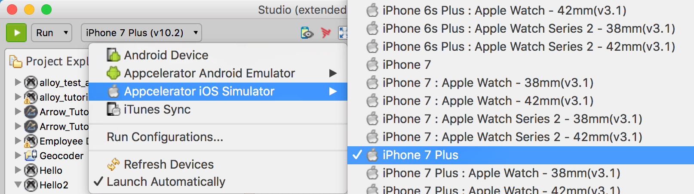
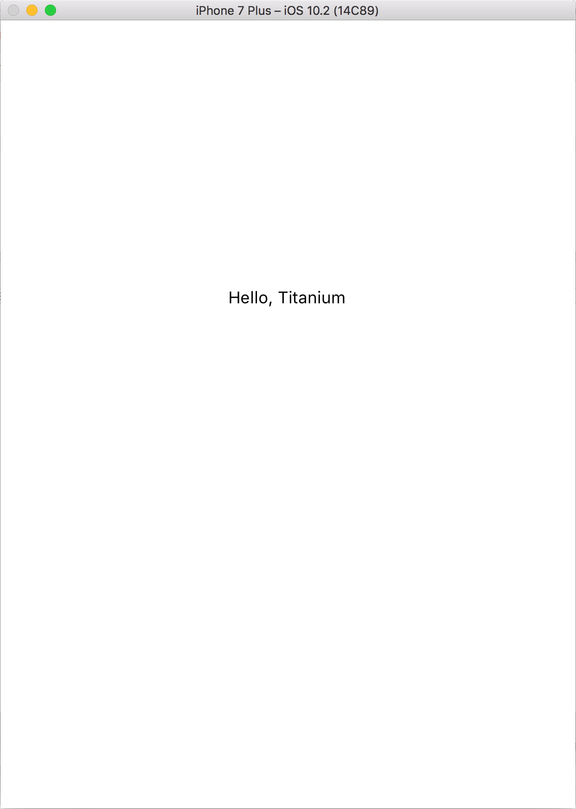
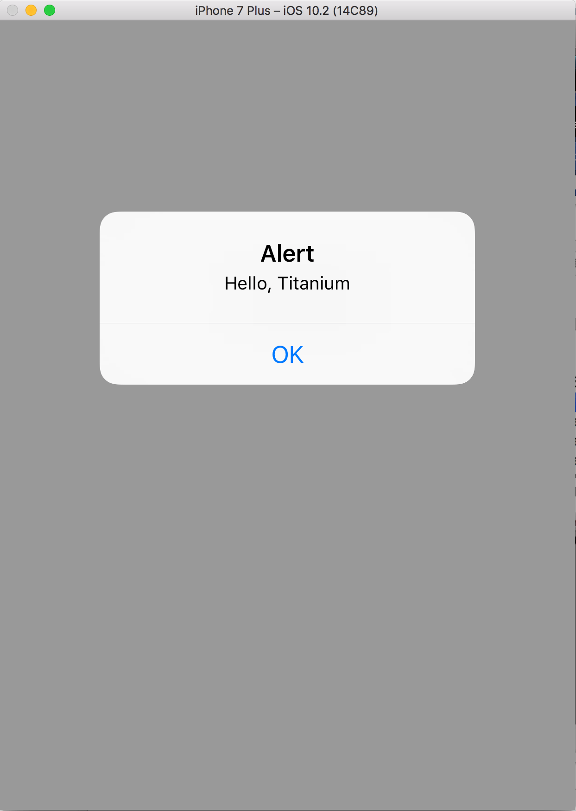

# Hello Titanium App Tutorial

Now that you've installed Studio and at least one of the native platform SDKs, you're ready to create and run an application on a device or simulator.

## Create a project

The first step is to create a new Mobile App Project and select a starting template. The Titanium SDK supports two project types: Alloy and Classic. [Alloy](/guide/Alloy_Framework/) is an MVC framework that lets you develop applications in less time and with less code than is possible in a Classic project. In general, it's recommended you use Alloy for your projects.

**To create a new project:**

1. In Studio, either:

    1. Press **⌘+N** (Mac) or **Ctrl+N** (Windows) to open the project wizard dialog.

    2. Or from the menu bar, select **File** > **New** > **Mobile App Project**.

2. Select **Mobile App Project** as the wizard type and click **Next**.

    
3. On the **Project Template** page, select **Default Alloy Project** as the template type. Click **Next**.

    
4. On the **Project Location** page, enter the following information:

    * In the **Project Name** field, enter **Hello**.

    * In the **App ID** field, enter **com.example.hello**. This format is called reverse domain notation. You must use your own domain before publishing your application to market, but for testing purposes a temporary domain is fine.

    * Select one or more **Deployment Targets**. By default, Studio selects all available targets platforms that you have installed.

    * Disable enable Axway Appcelerator Platform Services (defaults to enabled) as we won't use this service for this app.

        
5. Click **Finish** to create the project. By default, the application's configuration file called `tiapp.xml` opens up in the TiApp Editor. You can close that file.

6. In the **Project Explorer** view, open **index.xml** located in the **app/views** folder.

    

    When developing an app in Alloy, you create your UI declaratively using XML elements that, during compilations, are mapped to standard Titanium SDK objects. For instance, the default Alloy template includes a `<Label>` element that corresponds to a [Label](#!/api/Titanium.UI.Label) object.

7. In `index.xml`, change the text inside the `<Label>` element from `Hello, World` to `Hello, Titanium`.

8. Save your changes. Now we're ready to run the application.

## Running the application

To run the application you select a target simulator, emulator, or device, and click **Run**. The targets available for you to test with depends on which native SDKs you previously installed. For this example, it's assumed you've installed XCode and are targeting an iOS simulator. If you are targeting Android, select an appropriate simulator, emulator or device from the **Target** menu.

1. Select the project in Project Explorer.

2. Make sure **Run** is selected in the **Launch Mode** drop-down.

3. From the **Target** drop-down, select an iOS simulator.
    

4. Click **Run**. Your application will compile and launch in the iOS Simulator. Click the **Hello, Titanium** label text. An alert dialog appears.
     

If you run into problems running your application, see [Studio Troubleshooting](/guide/Axway_Appcelerator_Studio/Axway_Appcelerator_Studio_Guide/Studio_Troubleshooting/).
