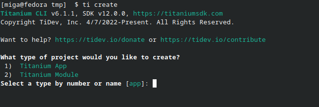
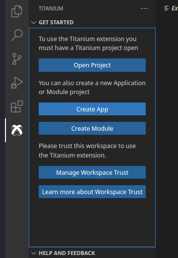
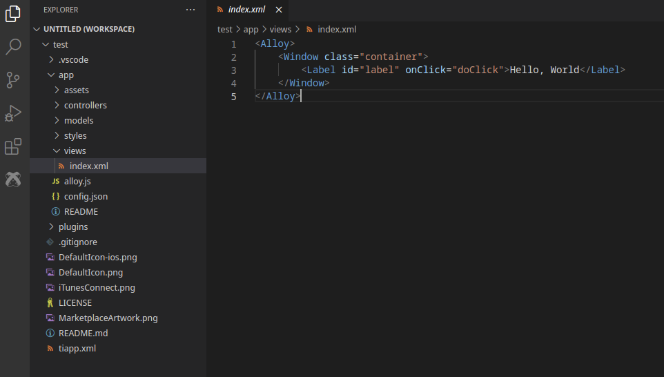
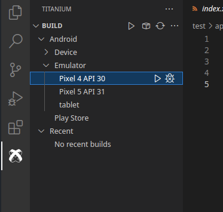

# Hello Titanium App Tutorial

Now that you've installed an IDE and at least one of the native platform SDKs, you're ready to create and run an application on a device or simulator.

## Create a project

The first step is to create a new Mobile App Project and select a starting template. The Titanium SDK supports two project types: Alloy and Classic. [Alloy](/guide/Alloy_Framework/) is an MVC framework that lets you develop applications in less time and with less code than is possible in a Classic project. In general, it's recommended you use Alloy for your projects.

**To create a new project:**

1. Using the CLI you can run

    1. `ti create` and continue with the menu
    
    2. After that you go into the folder and run `alloy new` to create an Alloy project.
    3. starting with Titanium SDK 12 you can use `ti create --alloy`.

2. If you use VSCode you can click on the `Create App` button
    

3. In the **Explorer** view, open **index.xml** located in the **app/views** folder.

    

    When developing an app in Alloy, you create your UI declaratively using XML elements that, during compilations, are mapped to standard Titanium SDK objects. For instance, the default Alloy template includes a `<Label>` element that corresponds to a [Label](#!/api/Titanium.UI.Label) object.

7. In `index.xml`, change the text inside the `<Label>` element from `Hello, World` to `Hello, Titanium`.

8. Save your changes. Now we're ready to run the application.

## Running the application

To run the application you select a target simulator, emulator, or device, and click **Run**. The targets available for you to test with depends on which native SDKs you previously installed. For this example, it's assumed you've installed Xcode and are targeting an iOS simulator. If you are targeting Android, select an appropriate simulator, emulator or device from the **Target** menu.

1. From the **Build** menu, select an iOS or Android simulator.
    

2. You can also use the CLI and run `ti build -p ios` or `ti build -p android`.

3. Click **Play** button. Your application will compile and launch in the iOS Simulator. Click the **Hello, Titanium** label text. An alert dialog appears.
     

## Next steps

As a next step have a look at [Creating_Your_First_Titanium_App](./Creating_Your_First_Titanium_App/), other examples, tutorials or the [API documentation](./api/) to extend your project.

You can find tutorials more basic tutorials at [from zero to app](https://fromzerotoapp.com) and a whole demo app where you can see all UI elements in the [Kitchensink repo](https://github.com/tidev/kitchensink-v2).
