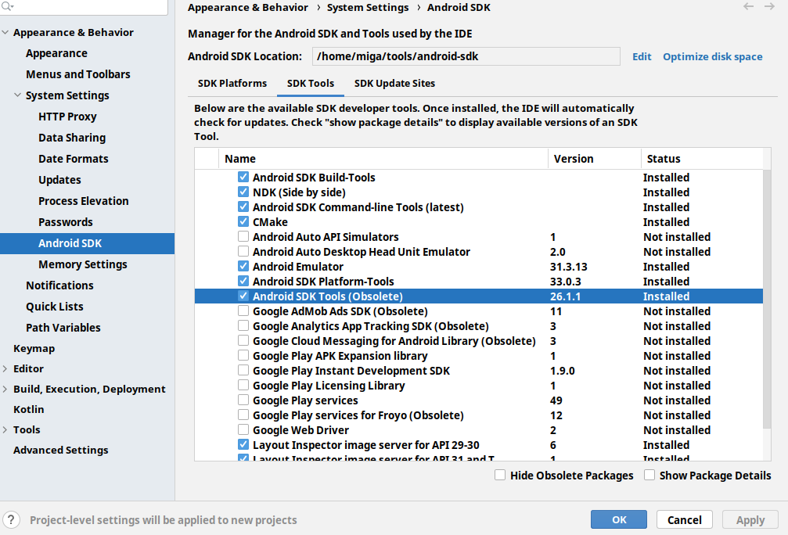

# Installing the Android SDK

## Overview

This guide describes where to obtain and how to install the Google Android SDK and associated packages.

## Compatibility and Download

Titanium requires the Android SDK Tools to be installed in order to allow you to develop Android applications.

::: warning ⚠️ Warning
Remember that JDK (Oracle or OpenJDK) is a prerequisite for Android development and should be installed first. You need at least JDK 11 installed. See [Installing Oracle JDK](/guide/Titanium_SDK/Titanium_SDK_Getting_Started/Prerequisites/Installing_Oracle_JDK/) for instructions.
:::


Use "Android Studio" from the [Android Studio and SDK tools](https://developer.android.com/studio) to install the SDK and tools.

### Required Android Packages

As of Titanium 9.0.0, the build system will automatically download the Android SDK platforms and tools needed. Make sure to install `Android SDK Tools (Obsolete)` (uncheck "Hide Obsolete Packages" in the SDK Tools page), `Android SDK Platform-tools` and `Android SDK Build-tools`.



<details>
<summary><b>For Titanium 8.x.x</b></summary>

For Titanium 8.x.x, you need to installed the following packages via the Android SDK Manager yourself:

| Package | Minimum Version |
| --- | --- |
| Android SDK Tools | Rev 28 |
| Android SDK Build-tools | Rev 23 |
| Android SDK Platform (API Level) | API Level 29 for Titanium 8.3.x<br /><br />API Level 28 for Titanium version older than 8.3.0 |

::: warning ⚠️ Warning
Titanium SDK 7.0.0+ requires Android SDK Tools v25 or newer as a minimum requirement.
:::
::: warning ⚠️ Warning

</details>


Take caution before upgrading these packages, as changes to the way they work has broken the Titanium toolchain a number of times in the past. Although these problems are often beyond our control, we always do our utmost to fix them as soon as we are made aware of them.

With this in mind, it's important to only upgrade these packages _between_ major projects, so that you have time to fix any problems that may result. Always consult the Android Tools [Release Notes](http://developer.android.com/sdk/tools-notes.html) and [Known Issues](http://tools.android.com/knownissues) first, and refer to our [Installation Troubleshooting](/guide/Titanium_SDK/Titanium_SDK_Getting_Started/Installation_and_Configuration/Installation_Troubleshooting/) guide to check whether there are any further actions that need to be taken to make the Titanium and the Android SDK compatible.
:::

### Android SDK / Target Android platform

Each Titanium SDK supports building against a specific range of Android versions, as shown in the following table, and requires at least one of these versions to be installed. If you specify a `android:targetSDKVersion` in the `tiapp.xml` file of your project, you must specify one within the target min and max values. The minimum Android/SDK version column indicates the minimum version of Android that a device can run, which a Titanium application supports.

#### Supported versions

| Titanium SDK Version | Min Target Android Version  <br />(android:targetSdkVersion) | Max Target Android Version  <br />(android:targetSdkVersion) | Min Supported Android Version  <br />(android:minSdkVersion) |
| --- | --- | --- | --- |
| 10.1.0 - latest\* | 6.0.x (API 23) | 12.0.x (API 31) | 5.0.x (API 21) |
| 10.0.0 - 10.0.2 | 6.0.x (API 23) | 11.0.x (API 30) | 5.0.x (API 21) |
| 9.3.0 - 9.3.2 | 6.0.x (API 23) | 11.0.x (API 30) | 4.4.x (API 19) |

::: warning ⚠️ Notes
\* As of 10.1.0, Titanium requires JDK 11 or higher to build Android projects.
:::


<details>
<summary><b>Unsupported versions</b></summary>


| Titanium SDK Version | Min Target Android Version  <br />(android:targetSdkVersion) | Max Target Android Version  <br />(android:targetSdkVersion) | Min Supported Android Version  <br />(android:minSdkVersion) |
| --- | --- | --- | --- |
| 8.3.0 - 9.2.2 | 6.0.x (API 23) | 10.0.x (API 29) | 4.4.x (API 19) |
| 8.0.0 - 8.2.2 | 6.0.x (API 23) | 9.0.x (API 28) | 4.4.x (API 19) |
| 7.5.0 - 7.5.1 | 6.0.x (API 23) | 9.0.x (API 28) | 4.1.x (API 16) |
| 7.3.0 - 7.4.1 | 6.0.x (API 23) | 8.1.x (API 27) | 4.1.x (API 16) |
| 7.0.0 - 7.2.0 | 6.0.x (API 23) | 7.0.x (API 25) | 4.1.x (API 16) |
| 6.2.0 - 6.3.0 | 7.1.x (API 25) | 6.0.x (API 23) | 4.1.x (API 16) |
| 6.0.0 - 6.1.x | 6.0.x (API 23) | 6.0.x (API 23) | 4.1.x (API 16) |
| 5.1.0 - 5.5.x | 6.0.x (API 23) | 6.0.x (API 23) | 4.0.x (API 14) |
| 5.0.0 - 5.0.x | 5.0.x (API 21) | 6.0.x (API 23) | 4.0.x (API 14) |
| 4.0.0 - 4.1.x | 5.0.x (API 21) | 5.1.x (API 22) | 4.0.x (API 14) |
| 3.4.1 - 3.5.1 | 4.0.x (API 14)\* | 5.0.x (API 21)\*\* | 2.3.x (API 10) |
| 3.3.0 - 3.4.0 | 4.0.x (API 14)\* | 4.4.x (API 19) | 2.3.x (API 10) |
| 3.2.0 - 3.2.3 | 2.3.x (API 10)\* | 4.4.x (API 19) | 2.3.x (API 10) |
| 3.1.2 - 3.1.3 | 2.3.x (API 10) | 4.3.x (API 18) | 2.3.x (API 10) |
| 3.1.1 | 2.3.x (API 10) | 4.2.x (API 17) | 2.3.x (API 10) |
| 3.1.0 | 2.2 (API 8) | 4.2.x (API 17) | 2.2 (API 8) |
| 2.1.2 - 3.0.2 | 2.2 (API 8) | 4.1.x (API 16) | 2.2 (API 8) |
| 2.0 - 2.1.1 | 2.2 (API 8) | 4.0.x (API 15) | 2.2 (API 8) |
| 1.8.x | 2.2 (API 8) | 3.x.x (API 11) | 2.2 (API 8) |
| 1.7.x | 2.1 (API 7) | 3.x.x (API 11) | 2.1 (API 7) |

::: warning ⚠️ Notes
\* If you are building an Android module, you need to have Android SDK 6.0.x (API 23) installed if using Release 6.0.0 and greater.

\*\* The Titanium SDK does not support the [Android 4.4W SDK](http://developer.android.com/wear/index.html) (API 20), also known as the Android Wear SDK.
:::

</details>


Most mobile device manufacturers have been licensed to use Google's enhanced API, which provides support for Maps and other functionality. If this is the case for your target devices, you will need to install the relevant Google packages, listed as _Google APIs by Google Inc., Android API x..._ by the **Android SDK Manager** tool. In Studio, choose the SDKs with the naming format "Google APIs x.x" to use the enhanced APIs, or those without the "Google APIs" prefix otherwise.

Android SDK packages can be installed using the **Android SDK Manager** tool. See [Installing the Android SDK](#undefined) for detailed instructions.

The default Android SDK can be configured using Studio's _Preferences_, and then selected per-project using the _Run Configurations_.

### Android Native Add-on Module Development on macOS

The Xcode command line tools are required to develop native Android add-on modules on macOS.

See [Installing the iOS SDK: Installing Command Line Tools](/guide/Titanium_SDK/Titanium_SDK_Getting_Started/Installation_and_Configuration/Installing_Platform_SDKs/Installing_the_iOS_SDK.html#install-the-command-line-tools-and-previous-simulators) for detailed instructions.

## Installation

### macOS

Note that the typical filesystem location of this software can be found in the [macOS Software Locations](/guide/Titanium_SDK/Titanium_SDK_Getting_Started/Installation_and_Configuration/Software_Locations_and_Environment_Variables) section of these guides.

#### Installing Android SDK Tools on macOS

1. Point a browser towards [Android Studio and SDK tools](https://developer.android.com/studio?pkg=studio).

2. Click **Download Android Studio**.

3. Once the .dmg file has downloaded, the **Android Studio installer** should pop up. **Drag the Android Studio icon** to the **Applications folder**.

### Windows

Note that the typical filesystem location of this software can be found in the [Windows Software Locations](/guide/Titanium_SDK/Titanium_SDK_Getting_Started/Installation_and_Configuration/Software_Locations_and_Environment_Variables.html) section of these guides.

#### Installing Android SDK Tools on Windows

1. Point a browser towards [Android Studio and SDK tools](https://developer.android.com/studio?pkg=studio).

2. Click **Download Android Studio**.

3. Once the .exe file has downloaded, **double-click** **on the executable file** to start the install process.

4. Click the **Next >** button in the Android Studio Setup window.

5. **Select the components** you wish to install. By default, you should install both **Android Studio** and **Android Virtual Device**. Click the **Next >** button.

6. Choose the install location and click **Next >** button.

7. Click the **Install** button.

8. Once installation is complete, click **Next >** button.

9. Click the **Finish** button.

10. Launch Android Studio so it can download any necessary components for your version of Windows.

11. Click the **Finish** button once Android Studio has finished downloading components.

Refer to the [Windows Software Locations](/guide/Titanium_SDK/Titanium_SDK_Getting_Started/Installation_and_Configuration/Software_Locations_and_Environment_Variables.html) section, and add the path of the **Android SDK Tools** directory to your system's `PATH`.

Then proceed to the [Installing Android Packages with Android SDK Manager](#installing-android-packages-with-android-sdk-manager) section.

## Installing Android Packages with Android SDK Manager

The _Android SDK Tools_ package that has been installed contains the _Android SDK Manager_ that is used to install the rest of the Android SDK packages.

Launching the _Android SDK Manager_ differs depending on the platform.

* On macOS, go to Launchpad and click on Android Studio

* On Windows, double-click on the Android Studio icon. Note: You may get prompted to run as an administrator. If so, from the Windows Start Menu and select _Run as administrator_. Enter the Administrator password.

In the Android SDK Manager, you will see different versions of the following items listed:

* **Android SDK Tools** (mandatory) - includes the _Android SDK Manager_ and _Android Virtual Device Manager_ (`android` executable)

* **Android SDK Platform Tools** (mandatory) - includes Android Debug Bridge, (`adb` executable)

* **SDK Platform** - provides the libraries for building for a specific version of the Android OS that uses the standard Google APIs.

* **Google APIs by Google Inc** - provides the libraries for building for a specific version of Android that uses the _enhanced_ Google APIs (includes maps support).

* **System Image** - For Android API versions 14 and above, the emulator system images are packaged separately from the SDK Platform package. Two versions of the system images are provided – "x86 Atom" and "x86 Atom\_64" which are 32-bit and 64-bit system images respectively.

To install Android SDK on macOS:

1. Open **Android Studio**.

2. Go to **Tools** > **SDK Manager**.

3. Under **Appearance & Behavior** > **System Settings** > **Android SDK**, you will see a list of SDK Platforms to choose from. **Select the SDK(s)** you wish to use and click **OK** button.

4. Android Studio will confirm your selection. Click **OK** button.

5. Once the requested components have been installed, click **Finish** button.

To install Android SDK on Windows:

1. Open **Android Studio**.

2. In the Welcome to Android Studio window, click on **Configure** > **SDK Manager**.

3. Under **Appearance & Behavior** > **System Settings** > **Android SDK**, you will see a list of SDK Platforms to choose from. **Select the SDK(s)** you wish to use and click **OK** button.

4. Android Studio will confirm your selection. Click **OK** button.

5. Click the **Accept** radio button and click the **Next** button.

6. Once the requested components have been installed, click **Finish** button.

To create an AVD via Android Studio:

1. Open **Android Studio**.

2. In the menu, go to **Tools** > **AVD Manager**.

3. Click the **Create Virtual Device...** button.

4. Select the **category** of virtual device you want to use.

5. Select the **device** and click the **Next** button.

6. Select the **System Image** you want to use in the virtual device and click the **Next** button.

7. Android Studio will provide a name for you automatically based on the virtual device and system image you selected. Confirm you selections and click the **Finish** button.

Refer to the [Titanium Compatibility Matrix](/guide/Titanium_SDK/Titanium_SDK_Getting_Started/Installation_and_Configuration/Titanium_Compatibility_Matrix/#AndroidSDK/TargetAndroidPlatform) for the latest list of required packages.

### Installing x86 Emulator Packages

In the Android SDK Manager, under the SDK Platforms tab, you can find "Intel x86 Atom" and "Intel x86 Atom\_64" system images. These are 32-bit and 64-bit emulator images of that platform's API Level and will run faster in the emulator compared to the ARM emulator images.

Extra software may be required to take advantage of the x86 emulator – see [Configuring Virtual Machine Acceleration](http://developer.android.com/tools/devices/emulator.html#accel-vm) in the Android Tools documentation.

## Configuring the CLI

To use the Android SDK with the Titanium CLI, the path to the SDK must be set in the Titanium CLI configuration settings. Run the following command and replace `/Users/appc/sdk/android-sdk/` with the path to your Android SDK:

```
titanium config android.sdk /Users/appc/sdk/android-sdk/
```
