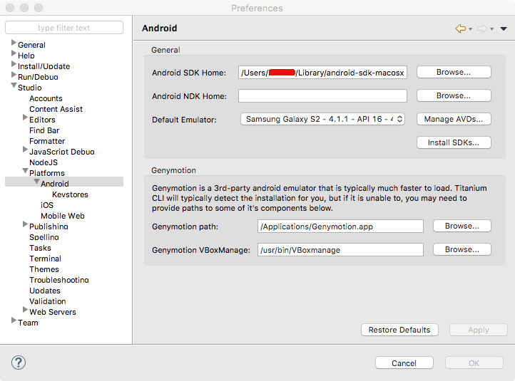

# Installing Genymotion

## Overview

Genymotion Desktop provides a library of Android virtual machines that run in Oracle's VirtualBox. It is an alternative to the Android SDK's emulators. Genymotion is faster than the Android SDK's ARM-based emulators and more reliable than x86 emulators that use Intel's HAXM technology.

Genymotion is free for personal use, however you can purchase a license for commercial use.

## Compatibility and download

Genymotion support is available for Titanium CLI 3.3.0 and later, Titanium SDK 3.3.0 and later, and Studio 3.3.0 and later.

If your app uses any Titanium Modules, they must be compiled for x86 architectures in order for your app to run on Genymotion.

Google's APIs such as Maps and Play Services are not distributed separately , so Genymotion virtual machine images do not include them out-of-the-box. The Google APIs can be found online and once downloaded, can be installed into your Genymotion virtual machine by dragging and dropping the file in the running virtual machine window.

You will need to register for a Genymotion Cloud account. For an updated list of requirements, see [Genymotion User Guide: Requirements](https://cloud.genymotion.com/page/doc/#collapse3) .

### Oracle VirtualBox

Genymotion requires Oracle VirtualBox. If you do not have VirtualBox installed, you can either download a Genymotion installers that includes VirtualBox (recommended) or manually install it.

To manually install VirtualBox, see the following:

* For Mac OS X, go to **[Download VirtualBox](https://www.virtualbox.org/wiki/Downloads)** and get the **Mac OS X .dmg** file. Open the .dmg file and follow the installation steps. When finished, reboot.

* For Windows, Genymotion provides two installers: a ready-to-run installer that provides VirtualBox and a standard installer that does not. Genymotion recommends using the ready-to-run installer. If you want to manually install VirtualBox, g o to **[Download VirtualBox](https://www.virtualbox.org/wiki/Downloads)** and get the **Windows .exe** file. Open the .exe file and follow the installation steps. When finished, reboot.

::: warning ⚠️ Warning
If you have Intel Hardware Accelerated Execution Manager (HAXM) for Android installed, you may not be able to run VirtualBox. Previously, there have been conflicts with HAXM and VirtualBox.
:::

### Genymotion Cloud account

In order to download Genymotion and Genymotion virtual devices, you will need a Genymotion Cloud account. To sign up for an account, visit [https://www.genymotion.com/account/login/](https://www.genymotion.com/account/login/). You will need to verify your e-mail address before downloading files.


Download the appropriate Genymotion installer from [https://www.genymotion.com/download/](https://www.genymotion.com/download/). You will need to be logged into your Genymotion Cloud account to download.

## Installation

### Mac OS X

1. Download the Mac OS X installer (DMG file) from Genymotion.

2. Open the installer to launch it.

3. Drag the **Genymotion.app** and **Genymotion Shell.app** icons to the **Applications** folder.

4. Launch **Genymotion.app** from the **Applications** folder.

5. The Genymotion application starts. A dialog prompts you to "Add a first virtual device". Click **Yes**.

6. In order to add a virtual device, you need to connect to the Genymotion Cloud service. Click **Connect**.

7. You are prompted to enter your Genymotion Cloud account credentials. Input your credentials, then click **Connect**.

8. After your account has been verified, select a device and click **Next**.

9. Optional: change the name of the device. Click **Next**.

10. Click **Finish** after the download completes or click **Add** to download more virtual devices.

### Windows

1. Download the Windows installer (EXE file) from Genymotion.

2. Double-click the installer to launch it.

3. Choose a language and click **OK**.

4. Click **Next** to accept the defaults, then click **Install** to start the installation process.

5. After Genymotion installs and if you chose to use the ready-to-run Genymotion installer, the VirtualBox installer starts.

6. Click **Next** to accepts the defaults, then click Install to start the installation process.

7. After the VirtualBox installer completes, uncheck to start VirtualBox, then click **Finish**.

8. The VirtualBox installer disappears and returns to the Genymotion installer. Leave the **Launch Genymotion** option checked, then click **Finish**.

9. The Genymotion application starts. A dialog prompts you to "Add a first virtual device". Click **Yes**.

10. In order to add a virtual device, you need to connect to the Genymotion Cloud service. Click **Connect**.

11. You are prompted to enter your Genymotion Cloud account credentials. Input your credentials, then click **Connect**.

12. After your account has been verified, select a device and click **Next**.

13. Optionally change the name of the device. Click **Next**.

14. Click **Finish** after the download completes or click **Add** to download more virtual devices.

## Configuring Genymotion

### Titanium CLI

To enable support for Genymotion with the Titanium toolchain, you need to configure the Titanium CLI. If you have not modified the default installation of VirtualBox and Genymotion, you only need to set the `genymotion.enabled` value to true with the `appc ti config` command. If you are using Studio, restart Studio after updating the CLI configuration.

```bash
appc ti config genymotion.enabled true
```

The table below describes the default locations. If you have a custom installation of either VirtualBox or Genymotion, you need to set the below CLI options in order to use it with the Titanium toolchain.

| CLI Option | Description | Defaults by OS |
| --- | --- | --- |
| `genymotion.home` | Path to Genymotion virtual devices | * Mac OS X: `/Users/<user>/.Genymobile/Genymotion/deployed/`<br />    <br />* Windows: `C:\Users\<user>\AppData\Local\Genymobile\Genymotion\deployed\` |
| `genymotion.path` | Path to Genymotion | * Mac OS X: `/Applications/Genymotion.app`<br />    <br />* Windows: `C:\Program Files\Genymobile\Genymotion` |
| `genymotion.executables.genymotion` | Path to Genymotion `genymotion` executable | * Mac OS X: `/Applications/Genymotion.app/Contents/MacOS/genymotion`<br />    <br />* Windows: `C:\Program Files\Genymobile\Genymotion\genymotion.exe` |
| `genymotion.executables.player` | Path to Genymotion `player` executable | * Mac OS X: `/Applications/Genymotion.app/Contents/MacOS/player.app/Contents/MacOS/player`<br />    <br />    * Before 2.6.0: `/Applications/Genymotion.app/Contents/MacOS/player`<br />        <br />* Windows: `C:\Program Files\Genymobile\Genymotion\player.exe` |
| `genymotion.executables.vboxmanage` | Path to VirtualBox `vboxmange` executable | * Mac OS X: `/usr/bin/vboxmanage`<br />    <br />* Windows: `C:\Program Files\Oracle\VirtualBox\VboxManage.exe` |

### Studio

Studio uses the configuration settings from the Titanium CLI to support Genymotion. In case the Titanium CLI is unable to detect the settings, you may override these settings in the **Preferences** dialog.

1. Open Preferences:

    1. For Mac OS X systems, from the menu, select **Appcelerator Studio** > **Preferences**.

    2. For Windows systems, from the menu, select **Windows** \> **Preferences**.

2. In Preferences, navigate to **Studio** \>  **Platforms** \> **Android**.

3. In the Genymotion section, update the paths to the executables as needed.



## Using Genymotion

### Launch a Genymotion virtual device from the CLI

To launch an Android application on a Genymotion virtual device, run the following CLI command:

```bash
appc run -p android -C <GENYMOTION_AVD_NAME>
## Example
appc run -p android -C "Nexus 7 - 4.2.2 - API 17 - 800x1280"
```

Where `<GENYMOTION_AVD_NAME>` is the name given to the Genymotion virtual device when you downloaded it. To get a complete list of Android virtual devices, run the `appc ti info -t android` command. The Genymotion devices are listed at the end right before any warning messages.

### Launch a Genymotion virtual device from Studio

Genymotion virtual devices are listed under the same drop-down menu as your Android virtual devices. Follow the same procedure to launch a Genymotion emulator as you would an Android emulator.

For example, to launch a project in run mode:

1. Select the project in the **Project Explorer** view.

2. In the global tool bar, select **Run** from the **Launch Mode** drop-down list.

3. From the **Target** drop-down list, select **Android Emulator** then choose a Genymotion virtual device.

4. Click the **Launch** button to start the build process if the **Launch Automatically** option is not enabled under the **Target** drop-down list.

In the screen shot below, there are three virtual devices to choose: a user-created Android virtual device, a Genymotion virtual device and an Android virtual device created by the Titanium SDK.


## Troubleshooting

### I cannot see a list of virtual devices under the Target drop-down list

1. In the `tiapp.xml` file of the application you want to run, check to make sure the Titanium SDK is version 3.2.0 or greater.

2. Double-check your Studio configuration settings in Preferences.

    1. For Mac OS X systems, from the menu, select **Appcelerator Studio** > **Preferences**.

    2. For Windows systems, from the menu, select **Windows >** **Preferences**.

    3. Navigate to **Studio >** **Platforms > Android.**

3. Restart adb, then restart Studio. To restart adb, from a terminal, run:

    ```
    adb kill-server
    adb start-server
    ```

### Failed to start daemon

When building an application, if the following error(s) is reported:

```
[ERROR] Error: Failed to start ADB (code 255): ADB server didn't ACK
* failed to start daemon *
```

or

```
adb server is out of date.  killing...
cannot bind 'tcp:5037'
ADB server didn't ACK
* failed to start daemon *
error:
```

This indicates the ADB version shipped with Genymotion is out of date with the Android platform tools. To fix this issue, manually set the ADB tool to use in the Genymotion settings:

1. Launch Genymotion.

2. Click **Settings** to open the Settings dialog.

3. Click the **ADB** tab.

4. Select **Use custom Android SDK tools**.

5. In the **Android SDK** textbox, enter the path to your Android SDK or click the **Browse** button to navigate to it.

6. Click **OK.**

Rebuild the application.

Note that if you restart your computer, this setting may not persist in Genymotion and you will need to set the Android SDK path again.

## Further reading

* [Genymotion User Guide](https://cloud.genymotion.com/page/doc/)

* [Genymotion FAQ](https://cloud.genymotion.com/page/faq/)
