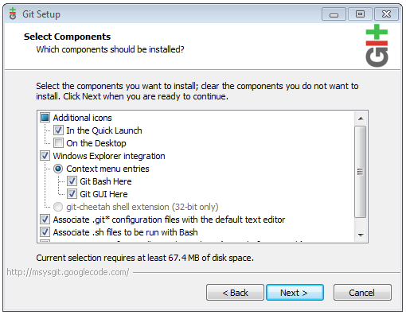
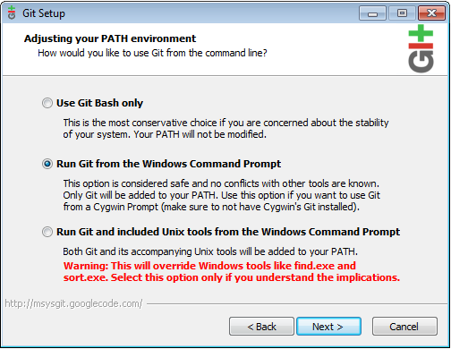

# Installing Git

## Compatibility and download

[Git](http://en.wikipedia.org/wiki/Git_%28software%29) is the optional, but **highly recommended**, way of obtaining and staying up-to-date with the latest mobile projects located in our [Github repository](https://github.com/appcelerator).

Obtain the version that pertains to your particular Operating System from the link provided:

| Operating System | Package Name | Package Version | Download Location |
| --- | --- | --- | --- |
| OS X | git | Latest | [Official Website](http://git-scm.com/download) |
| Windows | msysgit | Latest | [Official Website](http://git-scm.com/download) |
| Ubuntu | git | Latest | Default Repositories |

## Installation

### OS X

Note that the typical file system location of this software can be found in the [mac OS Software Locations](/guide/Titanium_SDK/Titanium_SDK_Getting_Started/Installation_and_Configuration/Software_Locations_and_Environment_Variables/#macos-software-locations) section of these guides.

* open the git disk image (file with a `.dmg` extension). Open the resulting disk mount that will appear on your desktop

* open the installer package (file with a `.pkg` extension) and continue until the following screen

* verify that you system meets the storage requirements and click install


* if prompted, enter the credentials of a user with administrative privileges

### Windows

Note that the typical file system location of this software can be found in the [Windows Software Locations](/guide/Titanium_SDK/Titanium_SDK_Getting_Started/Installation_and_Configuration/Software_Locations_and_Environment_Variables/#windows-software-locations) section of these guides.

* log in under your usual user account, right-click the git Installer and select _Run as administrator_. Enter the Administrator password, if you are prompted for it, and proceed until the first screenshot below

* verify that the destination location matches the one described for git in the [Windows Software Locations](/guide/Titanium_SDK/Titanium_SDK_Getting_Started/Installation_and_Configuration/Software_Locations_and_Environment_Variables/#windows-software-locations) section, and then proceed


* ensure that the components are configured as follows



* at _Adjusting your PATH environment_, enable **Run Git from the Windows Command Prompt**



* at _Configuring the line ending conversations_, select **Checkout as-is, commit as-is**


* proceed to complete the installation

* as the location to `git` was automatically added by the installer to your system's `PATH`, as shown in the third screenshot above, there is no need to perform this step manually

### Ubuntu

Note that the typical file system location of this software can be found in the [Ubuntu Software Locations](/guide/Titanium_SDK/Titanium_SDK_Getting_Started/Installation_and_Configuration/Software_Locations_and_Environment_Variables/#ubuntu-software-locations) section of these guides.

Git may be installed using the **System** \> **Administration** \> **Synaptic Package Manager** tool, and selecting the `git-core` package.

## Testing the installation

Run the following commands from the command-line or terminal on any operating system to determine whether git has been installed and configured correctly:

```
git version
```

You should receive results similar to the following, where the command is recognized, and returns the correct version.

```
appcel$ git version
git version 1.7.7
```
