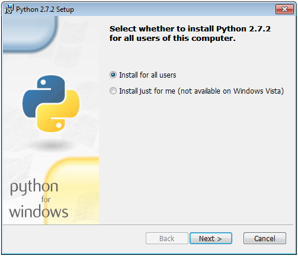

# Installing Python

## Compatibility and download

Python is required to compile the Titanium SDK from source using SCons.

Titanium supports the following versions of Python for each respective Operating System:

| Operating System | Package Version | Package Architecture Version | Download Location |
| --- | --- | --- | --- |
| OS X | 2.x.x (currently, 2.7.x) | 32bit and 64bit | Installed on OS by default |
| Windows | 2.x.x (currently, 2.7.x) | 32bit **only** | [Official Python Website](http://www.python.org/download/) |
| Ubuntu | 2.x.x (currently, 2.7.x) | 32bit and 64bit | Default Repositories |

Download the installer from the applicable download location above.

## Installation

### OS X

Note that the typical file system location of this software can be found in the [mac OS Software Locations](/guide/Titanium_SDK/Titanium_SDK_Getting_Started/Installation_and_Configuration/Software_Locations_and_Environment_Variables/#macos-software-locations) section of these guides.

OS X ships with _Python_ installed by default.

### Windows

Note that the typical file system location of this software can be found in the [Windows Software Locations](/guide/Titanium_SDK/Titanium_SDK_Getting_Started/Installation_and_Configuration/Software_Locations_and_Environment_Variables/#windows-software-locations) section of these guides.

See the [Software Locations and Environment Variables](/guide/Titanium_SDK/Titanium_SDK_Getting_Started/Installation_and_Configuration/Software_Locations_and_Environment_Variables/) guide if you need help with setting your system `PATH` or other system variables.

* Log in using your usual user account, right-click the Python Windows Installer and select _Run as administrator_. Enter the Administrator password, if you are prompted for it, and proceed until the first screenshot below.

* Select **Install for all users** and proceed with the installation.

    

* As shown below, the default destination directory is not ideal. Change it to the one for Python listed in [Windows Software Locations](/guide/Titanium_SDK/Titanium_SDK_Getting_Started/Installation_and_Configuration/Software_Locations_and_Environment_Variables/#windows-software-locations) above.

    

* When the destination directory is correct, proceed with the following step.

    

* Ensure that all packages are selected for install and that your system has enough free disk space to accommodate them.

    

* Proceed with the installation until complete

* Add the Python location to the system's `PATH`. Refer to [Configuring Environment Variables on Windows](/guide/Titanium_SDK/Titanium_SDK_Getting_Started/Installation_and_Configuration/Software_Locations_and_Environment_Variables/#configuring-environment-variables-on-windows) for more information.

### Ubuntu

Note that the typical filesystem location of this software can be found in the [Ubuntu Software Locations](/guide/Titanium_SDK/Titanium_SDK_Getting_Started/Installation_and_Configuration/Software_Locations_and_Environment_Variables/#ubuntu-software-locations) section of these guides.

See the [Software Locations and Environment Variables](/guide/Titanium_SDK/Titanium_SDK_Getting_Started/Installation_and_Configuration/Software_Locations_and_Environment_Variables/) guide if you need help with setting your system `PATH` or other system variables.

Python may be installed using the **Applications** \> **Ubuntu Software Center** tool.
