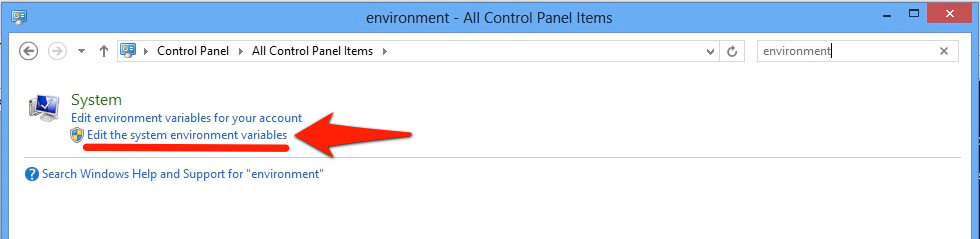
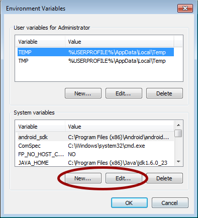

# Software Locations and Environment Variables

## Overview

The following will explain where all the software is located on a typical Titanium system and how to configure the associated environment variables for each Operating System.

## Configuration

### macOS Software Locations

The paths shown are the locations on our running systems. As these configurations are tried and tested with Titanium, try to keep yours as similar as possible to this.

| Package | Environment Variable | Local Path | Notes |
| --- | --- | --- | --- |
| Android SDK Home | ANDROID\_SDK | `~/Library/Android/sdk` | Root location of the Android SDK as installed by Android Studio |
| Android Tools | PATH | `~/Library/Android/sdk/tools` | Location of `android` (Android SDK Manager) and `emulator` executables |
| Android Platform Tools | PATH | `~/Library/Android/sdk/platform-tools` | Location of `adb` (Android Debug Bridge) executable |
| git | N/A | `/usr/bin` | Location of git executable |
| npm | N/A | `/usr/local/bin` | Location of npm executable |
| Oracle JDK | N/A | `/usr/bin` | Location of Java executables, `java` and `javac` (automatically symlinked) |
| python | N/A | `/usr/bin` | Location of python executable |
| Titanium SDK Home | N/A | `~/Library/Application Support/Titanium` | Location of Mobile and Desktop SDKs (containing `mobilesdk`, `modules`, `runtime` & `sdk`directories) |


### Windows

#### Windows Software Locations

The paths shown are the locations on our running systems. As these configurations are tried and tested with Titanium, try to keep yours as similar as possible to this.

::: warning ⚠️ Warning
Paths to these tools and project files should not contain spaces or special characters, such as dollar signs, ampersands, etc. Some of the development tools do not support having spaces in the path, such as scons if you want to build the Titainum SDK from source.
:::

| Package | Environment Variable | Local Path | Notes |
| --- | --- | --- | --- |
| Android SDK Home | N/A | `%LOCALAPPDATA%\Android\sdk` | Root location of the Android SDK as installed by Android Studio |
| Android Tools | PATH | `%LOCALAPPDATA%\Android\sdk\tools` | Location of `android` (Android SDK Manager) and `emulator` executables |
| Android Platform Tools | PATH | `%LOCALAPPDATA%\Android\sdk\platform-tools` | Location of `adb` (Android Debug Bridge) executable |
| git | PATH | `%PROGRAMFILES%\Git\bin` | Location of git executable (default installation path by Studio) |
| npm | PATH | `%PROGRAMFILES%\nodejs` | Location of npm executable (default installation path by Studio) |
| Oracle JDK (Binaries) | PATH | `%PROGRAMFILES%\Java\jdk<version>\bin` | Location of Java executables, `java` and `javac` (default installation path by Studio) |
| Oracle JDK (Home) | JAVA\_HOME | `%PROGRAMFILES%\Java\jdk<version>` | Location of the JDK (default installation path by Studio) |
| python | PATH | `C:\Python27` | Location of python executable |
| Titanium SDK Home | N/A | `%PROGRAMDATA%\Titanium` | Location of Mobile and Desktop SDKs (containing `mobilesdk`, `modules`, `runtime`& `sdk` directories) |

Be aware of the following environment variables that exist by default on Windows 7 systems, which can be used when configuring the environment variables above:

| Environment Variable | Value | Notes |
| --- | --- | --- |
| `%SystemRoot%` |  | C:\\Windows |
| `%PROGRAMFILES%` | `C:\Program Files (x86)` | Windows 64-bit systems |
| `%PROGRAMFILES%` | `C:\Program Files` | Windows 32-bit systems |
| `%PROGRAMDATA%` | `C:\ProgramData` |  |
| `%USERPROFILE%` |  | Path to the current user profile |

::: warning ⚠️ Warning
Bear in mind the following caveats:

* All Windows systems must have the following paths **at the beginning** of their `PATH` environment variable to function properly:

    ```
    %SystemRoot%\system32;%SystemRoot%;%SystemRoot%\System32\Wbem;
    ```

:::

#### Configuring Environment Variables on Windows

Configure system variables using the Control Panel

* Open the Windows Control Panel and search for 'environment'.

* Click **Edit the system environment variables**. The _System Properties_ dialog appears displaying the **Advanced** tab.

    

* Click the **Environment Variables** button.


* Use the **New** or **Edit** buttons at the bottom of the dialog to add or change system variables.



### Ubuntu Software Locations

Below is a summary of where Titanium-related components are typically stored and the system variables that should be configured.

::: warning ⚠️ Warning
The paths shown are the locations on our running systems. As these configurations are tried and tested with Titanium, try to keep yours as similar as possible to this.
:::

| Package | Environment Variable | Local Path | Notes |
| --- | --- | --- | --- |
| Android SDK Home | ANDROID\_SDK | `~/Android/sdk` | Root location of the Android SDK as installed by Android Studio |
| Android Tools | PATH | `~/Android/sdk/tools` | Location of `android` (Android SDK Manager) and `emulator` executables |
| Android Platform Tools | PATH | `~/Android/sdk/platform-tools` | Location of `adb` (Android Debug Bridge) executable |
| git | N/A | `/usr/bin` | Location of git executable |
| npm | N/A | `/usr/local/bin` | Location of npm executable |
| Oracle JDK | N/A | `/usr/bin` | Location of Java executables, `java` and `javac` (symlinked using `update-alternatives`) |
| python | N/A | `/usr/bin` | Location of python executable (automatically symlinked) |
| Titanium SDK Home | N/A | `~/.titanium` | Location of Mobile and Desktop SDKs (containing `mobilesdk`, `modules`, `runtime` & `sdk`directories) |
