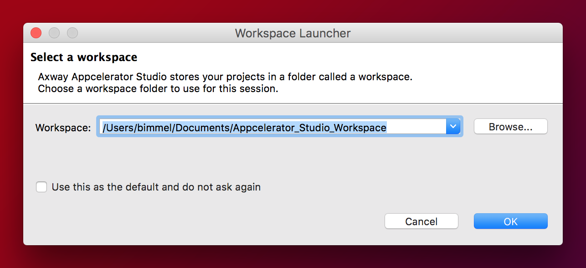

# Titanium SDK Getting Started

## Overview

This guide walks through the steps of installing and configuring Studio and third-party SDKs and tools required to develop native mobile applications with Studio. If you prefer to use your own editor or IDE, you can integrate the Titanium command-line tools into your environment (see [Setting up the Titanium CLI](/guide/Titanium_SDK/Titanium_SDK_Guide/Titanium_Command-Line_Interface_Reference/) for instructions).

## Prerequisites

Your system environment must meet the following requirements to run Studio:

* **Operating System:** A recent version of Windows or Mac OS X

* **Memory:** 8 GB RAM minimum system memory (2 GB RAM available memory). 16 GB RAM recommended.

* **Java Runtime:** Oracle JDK (no other brand of Java is suitable)

* **Node.js:** Required for the Titanium command-line tools like the CLI, Alloy and AMPLIFY Runtime Services

::: tip 💡 Hint
For Windows, you can use either 32-bit or 64-bit versions of Java JDK. Please refer to [Studio Java Support](/guide/Titanium_SDK/Titanium_SDK_Getting_Started/Installation_and_Configuration/Titanium_Compatibility_Matrix/Studio_Java_Support/) for more information.
:::

For more details, please refer to [Prerequisites](/guide/Titanium_SDK/Titanium_SDK_Getting_Started/Prerequisites/) document.

For a complete list of compatibility of system environments, dependencies, and other requirements, please review [Titanium Compatibility Matrix](/guide/Titanium_SDK/Titanium_SDK_Getting_Started/Installation_and_Configuration/Titanium_Compatibility_Matrix/) document.

## Download and install Studio

To download Studio you must have an AMPLIFY Appcelerator Services account. Visit our [Sign Up](http://www.appcelerator.com/signup/) page to create an account.

1. Log in to [https://platform.axway.com/](https://platform.axway.com/).

2. Expand the Axway menu  available at top-left of screen and click on [App Builder Studio](https://platform.axway.com/#/product/studio).

3. Download the installer or ZIP file for your operating system.

4. Launch the downloaded installer.

For detailed install instructions, see [Axway Appcelerator Studio Getting Started](/guide/Axway_Appcelerator_Studio/Axway_Appcelerator_Studio_Getting_Started/).

### First Launch

The first time you launch Studio you need to select a workspace, or folder where Titanium stores your project files and IDE preferences.

::: tip 💡 Hint
By default, upon each launch, Studio asks you to select a workspace. To hide this dialog on subsequent launches, select the **Use this as the default and do not ask again** option.
:::

On the Studio launch screen, enter your AMPLIFY Appcelerator Services account credentials and click **Login**. Studio remembers your login credentials until you sign out of Studio.

::: tip 💡 Hint
Studio requires an internet connection to authenticate the user to the Appcelerator cloud. If you are behind a proxy, click **Proxy Setup...** to configure your proxy settings.
:::

### Installing the platform SDKs

To develop native applications with Titanium you need the SDKs and tools for those native platforms installed on your system. For example, to develop Android applications you need the Android SDK and toolchain installed.

The first time you launch Studio the **Platform Configuration** dialog opens. This dialog indicates which platform SDKs are installed and which are not, and lets you easily install individual SDKs. In the following screenshot, the system has none of the native SDKs installed.

**To install the platform SDKs**:

1. Select the platforms you want to install.

2. Optionally click **Settings** next to each platform to customize the installation configuration. For more details, see [Installing Platform SDKs](/guide/Titanium_SDK/Titanium_SDK_Getting_Started/Installation_and_Configuration/Installing_Platform_SDKs/).

3. Click **Configure** to start the installation process.

Studio begins downloading and installing each SDK you selected, according to the settings you specified. In the case of iOS, Studio launches the App Store application installed on your Mac to the XCode download page.

**Please ask your Confluence administrator to update the license for the [MultiExcerpt Plugin for Confluence 4+](https://plugins.atlassian.com/plugins/biz.artemissoftware.confluence.multiexcerpt.MultiExcerptMacro) .**
**Admin Info: The error is: license VERSION\_MISMATCH**

### Checking for Studio and SDK updates

When Studio launches for the first time, it automatically downloads and installs the latest Titanium SDKs and additional command-line tools. Once complete, confirm that no further updates are pending and that Studio is at the latest version.

From the menu bar, select **Help** \> **Check for Axway Appcelerator Updates** to verify that all the official Titanium components are installed and repeat this step until there are no more updates available.

## First Titanium app

To create your first Titanium app, please review [Hello Titanium App Tutorial](/guide/Titanium_SDK/Titanium_SDK_Getting_Started/Hello_Titanium_App_Tutorial.html).

## Troubleshooting

If you are experiencing problems after following these setup instructions, please follow the more detailed [Setting up Studio](/guide/Titanium_SDK/Titanium_SDK_Getting_Started/Installation_and_Configuration/Setting_up_Studio/) guide.

## Next steps

You can learn more about Titanium by opening the Studio Dashboard, then

* Watching the Appcelerator University videos

* Follow [Creating Your First Titanium App](/guide/Titanium_SDK/Titanium_SDK_Getting_Started/Creating_Your_First_Titanium_App/) to build your first Alloy application
