# Transitioning to the New UI Layout System

## Overview

Release 2.0 includes a set of changes to the layout system designed to provide more control over layout and improve the parity between platforms by having all platforms implement a single, well-defined set of behaviors.

These changes affect existing layout behavior on all platforms, so you may see UI changes in your application. This document details:

* How the new layout system works

* Behavior changes from 1.8.2 to 2.0

* How to update your application to work with the new layout system

## Understanding the UI Layout System Changes

This section explains the new layout system implemented in Release 2.0. While many of the details are familiar from previous releases, there are a number of changes designed to unify layout behavior on the different platforms.

### Summary of Layout Properties

The following table summarizes the layout properties that affect the layout of views.

<table class="confluenceTable"><thead class=" "></thead><tfoot class=" "></tfoot><tbody class=" "><tr><td class="confluenceTd" rowspan="1" colspan="1"><p>Name</p></td><td class="confluenceTd" rowspan="1" colspan="1"><p>Description</p></td></tr><tr><td class="confluenceTd" rowspan="1" colspan="1"><p><code>width</code></p></td><td class="confluenceTd" rowspan="1" colspan="1"><p>Defines the width of a UI component.</p></td></tr><tr><td class="confluenceTd" rowspan="1" colspan="1"><p><code>height</code></p></td><td class="confluenceTd" rowspan="1" colspan="1"><p>Defines the height of a UI component.</p></td></tr><tr><td class="confluenceTd" rowspan="1" colspan="1"><p><code>left</code></p></td><td class="confluenceTd" rowspan="1" colspan="1"><p>Pins the left side of a UI component relative to its parent. Measured from the parent's left bound.<br>Acts as padding between UI siblings in horizontal layouts.</p></td></tr><tr><td class="confluenceTd" rowspan="1" colspan="1"><p><code>right</code></p></td><td class="confluenceTd" rowspan="1" colspan="1"><p>Pins the right side of a UI component relative to its parent. Measured from the parent's right bound.<br>Acts as padding between UI siblings in horizontal layouts.</p></td></tr><tr><td class="confluenceTd" rowspan="1" colspan="1"><p><code>top</code></p></td><td class="confluenceTd" rowspan="1" colspan="1"><p>Pins the top of a UI component relative to its parent. Measured from the parent's top bound.<br>Acts as padding between UI siblings in vertical layouts.</p></td></tr><tr><td class="confluenceTd" rowspan="1" colspan="1"><p><code>bottom</code></p></td><td class="confluenceTd" rowspan="1" colspan="1"><p>Pins the bottom of a UI component relative to its parent. Measured from the parent's bottom bound.<br>Acts as padding between UI siblings in vertical layouts.</p></td></tr><tr><td class="confluenceTd" rowspan="1" colspan="1"><p><code>center</code></p></td><td class="confluenceTd" rowspan="1" colspan="1"><p>Dictionary with properties <code>x</code> and <code>y</code>. Pins the center of the view to the defined point. Measured from parent's left and top bounds.</p></td></tr><tr><td class="confluenceTd" rowspan="1" colspan="1"><p><code>layout</code></p></td><td class="confluenceTd" rowspan="1" colspan="1"><p>Defines how the component lays out its children. One of "vertical", "horizontal" or "composite".<br>Default is "composite". The value "absolute" is a synonym for "composite".</p></td></tr><tr><td class="confluenceTd" rowspan="1" colspan="1"><p><code>zIndex</code></p></td><td class="confluenceTd" rowspan="1" colspan="1"><p>Stack order of UI component in its parent. Higher values are rendered towards the top, in front of components with lower values.<br>If no <code>zIndex</code> value is set, components stack in the order in which they are added to the parent, with the last child added displayed on top of earlier children. Any component with a defined <code>zIndex</code> value is displayed in front of any components with undefined <code>zIndex</code>. Does not affect the actual layout of this component.</p></td></tr><tr><td class="confluenceTd" rowspan="1" colspan="1"><p><code>size</code></p></td><td class="confluenceTd" rowspan="1" colspan="1"><p>Could be used as a layout parameter prior to Release 2.0. In Release 2.0, <code>size</code> is a read-only parameter that can be used to determine the dimensions of the view. See <a class="document-link " href="#!/guide/Transitioning_to_the_New_UI_Layout_System-section-src-30088148_TransitioningtotheNewUILayoutSystem-ControlSizeandPositionandPost-LayoutEvent">#Control Size and Position and Post-Layout Event</a> for details.</p></td></tr><tr><td class="confluenceTd" rowspan="1" colspan="1"><p><code>rect</code></p></td><td class="confluenceTd" rowspan="1" colspan="1"><p>New in Release 2.0, <code>rect</code> is a read-only parameter that can be used to determine the size and position of the view. See <a class="document-link " href="#!/guide/Transitioning_to_the_New_UI_Layout_System-section-src-30088148_TransitioningtotheNewUILayoutSystem-ControlSizeandPositionandPost-LayoutEvent">#Control Size and Position and Post-Layout Event</a> for details.</p></td></tr></tbody></table>

### View Types and Default Layout Behavior

In previous releases, using the value 'auto' for a control's width or height resulted in platform-dependent behavior. Depending on the platform and the type of view involved, 'auto' either caused the view to fill its parent, or to conform to the size of its contents.

This release introduces two new constants, `Titanium.UI.FILL` and `Titanium.UI.SIZE`, designed to replace the 'auto' keyword. With these values you can explicitly specify either type of 'auto' behavior.

It is recommended that you remove use of the 'auto' keyword, which will be deprecated in a future release.

In this release, the behavior of the 'auto' keyword has been defined on a per-control basis, so each control has a logical default behavior if you are using the 'auto' keyword.

Views are logically grouped into three categories:

* Views that should fill the parent view by default

* Views that should size themselves to their content by default

* Views that should fill in the horizontal direction only (for example, toolbars)

Windows fill the screen by default.

#### Auto Size Views

For the following views, specifying 'auto' for either `height` or `width` is
the same as specifying `Ti.UI.SIZE`.

* Button

* Label

* ImageView

* ProgressBar

* Switch

* TextArea

* TextField

* Picker

* ButtonBar

* TableViewSection

#### Auto Fill Views

For the following views, specifying 'auto' for either \`height\` or \`width\` is
the same as specifying `Ti.UI.FILL`.

* View

* TabGroup

* VideoPlayer

* TableView

* WebView

* ScrollView

* ScrollableView

#### Auto Fill Width Views

The following views fill the available **width** by default, and scale vertically to fit
their contents.

* Slider

* TableViewRow

* Toolbar

* SearchBar

For these views, 'auto' specifies `FILL` behavior when it is used as a
`width` value, and `SIZE` behavior when it is used as a `height` value.

### Layout Precedence

This section describes the precedence rules that determine which settings take precedence if conflicting layout parameters are specified.

<table class="confluenceTable"><thead class=" "></thead><tfoot class=" "></tfoot><tbody class=" "><tr><td class="confluenceTd" rowspan="1" colspan="1"><p>&nbsp;</p></td><td class="confluenceTd" rowspan="1" colspan="1"><p>Name</p></td><td class="confluenceTd" rowspan="1" colspan="1"><p>Notes</p></td></tr><tr><td class="confluenceTd" rowspan="1" colspan="1"><p>1</p></td><td class="confluenceTd" rowspan="1" colspan="1"><p><code>width</code></p></td><td class="confluenceTd" rowspan="1" colspan="1"><p>If <code>width</code> is defined, it takes precedence and the positioning pins are not used to determine the view's width.<br>If <code>width</code> is not defined, and at least two horizontal positioning pins are defined, the width is calculated implicitly from the pins. For example, <code>left</code> and <code>right</code> or <code>left</code> and <code>center.x</code>. If all three horizontal pins are defined, the width is determined by the <code>left</code> and <code>center.x</code> pins. If width cannot be implicitly calculated it follows the view's default sizing behavior.</p></td></tr><tr><td class="confluenceTd" rowspan="1" colspan="1"><p>2</p></td><td class="confluenceTd" rowspan="1" colspan="1"><p><code>left</code></p></td><td class="confluenceTd" rowspan="1" colspan="1"><p>If <code>left</code> is defined, it always takes precedence for positioning the view horizontally.</p></td></tr><tr><td class="confluenceTd" rowspan="1" colspan="1"><p>3</p></td><td class="confluenceTd" rowspan="1" colspan="1"><p><code>center.x</code></p></td><td class="confluenceTd" rowspan="1" colspan="1"><p>Used to position the view horizontally if <code>left</code> is not set.<br>If <code>left</code> is set, this property is not used to position the view, although it may be used to determine its width.</p></td></tr><tr><td class="confluenceTd" rowspan="1" colspan="1"><p>4</p></td><td class="confluenceTd" rowspan="1" colspan="1"><p><code>right</code></p></td><td class="confluenceTd" rowspan="1" colspan="1"><p>Used to position the view horizontally when neither <code>left</code> or <code>center.x</code> is set.<br>If either <code>left</code> or <code>center.x</code> is set, this property is not used to position the view, although it may be used to determine its width.</p></td></tr><tr><td class="confluenceTd" rowspan="1" colspan="1"><p>5</p></td><td class="confluenceTd" rowspan="1" colspan="1"><p><code>height</code></p></td><td class="confluenceTd" rowspan="1" colspan="1"><p>If <code>height</code> is defined, it takes precedence and the positioning pins are not used to determine the view's height.<br>If <code>height</code> is not defined, and at least two vertical positioning pins are defined, the height is determined implicitly from the pins. If all three vertical pins are defined, the height is determined by the <code>top</code> and <code>center.y</code> pins. If height cannot be implicitly calculated it follows the view's default sizing behavior.</p></td></tr><tr><td class="confluenceTd" rowspan="1" colspan="1"><p>6</p></td><td class="confluenceTd" rowspan="1" colspan="1"><p><code>top</code></p></td><td class="confluenceTd" rowspan="1" colspan="1"><p>If specified, always takes precedence for positioning the view horizontally.</p></td></tr><tr><td class="confluenceTd" rowspan="1" colspan="1"><p>7</p></td><td class="confluenceTd" rowspan="1" colspan="1"><p><code>center.y</code></p></td><td class="confluenceTd" rowspan="1" colspan="1"><p>Used to position the view vertically if <code>top</code> is not set.<br>If <code>top</code> is defined, this property is not used to position the view, although it may be used to determine its height.</p></td></tr><tr><td class="confluenceTd" rowspan="1" colspan="1"><p>8</p></td><td class="confluenceTd" rowspan="1" colspan="1"><p><code>bottom</code></p></td><td class="confluenceTd" rowspan="1" colspan="1"><p>Used to position the view vertically if neither <code>top</code> or <code>center.y</code> is set.<br>If either <code>top</code> or <code>center.y</code> is set, this property is ignored. this property is not used to position the view, although it may be used to determine its height.</p></td></tr></tbody></table>

### Batch Layout Updates

Another change in this release involves _batch layout updates_. In previous releases, each update to a layout parameter (such as `top`, `left`, `height`, and so on) could trigger a layout cycle. This results in a lot of repeated work.

To avoid this, you can batch layout updates, so multiple layout changes only result in a single layout cycle. The [applyProperties](#!/api/Titanium.UI.View-method-applyProperties) method allows you to update a set of layout parameters in a single operation. For example:

```
myView.applyProperties({
  top: 50,
  left: 50,
  width: 200
});
```

::: warning ⚠️ Warning
The `applyProperties` method is new in Release 3.0. When working with 2.X releases of the Titanium SDK, [updateLayout](#!/api/Titanium.UI.View-method-updateLayout) can be used in place of `applyProperties` in the above code sample.

The `applyProperties` method can be used to bulk-update properties on _any_ Titanium object, while `updateLayout` does the same thing, but only works on view objects. So `updateLayout` is deprecated in Release 3.0 in favor of the more general `applyProperties`.
:::

### Control Size and Position and Post-Layout Event

In previous releases, there was no reliable means to determine the size and position of a control after it was laid out. In this release, the [rect](#%21/api/Titanium.UI.View-property-rect) and [size](#%21/api/Titanium.UI.View-property-size) properties can be used to determine the size and position of the view.

Because layout can occur asynchronously, it is sometimes difficult to determine the actual size of a control after it has been laid out. To address this issue, a new `postlayout` event has been added that is fired when a layout cycle completes. For example:

```javascript
var postLayoutCallback  = function(e){
  Ti.API.info(String.format("Layout done, left: %f, width: %f", myView.rect.x, myView.rect.width));
  myView.removeEventListener('postlayout', postLayoutCallback);
}
myView.addEventListener('postlayout', postLayoutCallback);
myView.updateLayout({
  left: '25%',
  width: '25%'
});
```

Note that updating a view's layout in the `postlayout` event can cause an infinite loop of layout events. Furthermore, endless `postlayout` cycles can be avoided by careful coding. For instance, only listen to the `postlayout` event for specific views, not for the entire window. If you are laying out some elements based on the position or size of another element, you can cache the last known size of the element you are interested in, and only make layout changes if the size actually changes.

Bear in mind that even non-layout parameters may affect the layout; for example, changing a label's text may make its size change.

In previous releases, it was possible to change a view's size on iOS by updating the `size` dictionary. As this is now a read-only property on all platforms, doing so is no longer supported.

### Universal Unit Support

All platforms now support specifying units for size and position values. The following table lists the supported units:

| Unit | Abbreviation | Note |
| --- | --- | --- |
| pixels | px |  |
| density-independent pixels | dip or dp | Equivalent to Apple "points." |
| inches | in |  |
| millimeters | mm | Android, iOS only |
| centimeters | cm | Android, iOS only |
| points | pt | 1/72 of an inch. Android only. Not to be confused with Apple "points." |

On Android, a density-independent pixel (DIP) corresponds to one pixel on a 160DPI display.

On iOS, a DIP corresponds to one pixel on a non-Retina display, which is 163DPI for iPhone/iPod touch and 132DPI for the iPad. A DIP corresponds to 2 pixels of width or height on a Retina display.

On Mobile Web, both a DIP and a pixel are equal to one browser pixel, which may not correspond to a pixel on the display. From testing, most browsers seem to report a DPI value of 96DPI, regardless of the actual display density.

Absolute measures, such as inches, are dependent on the device correctly reporting its density. On Mobile Web, these values are unlikely to be exact.

If no units are specified, a system-default unit is assumed. The system default unit is:

* pixels on Android

* DIP on iOS

* DIP on Mobile Web

### Horizontal and Vertical Layouts

There are no significant changes to the function of the relative layout modes, horizontal and vertical, but the same [precedence rules](#layout-precedence) apply.

UI components with the layout parameter defined as either 'vertical' or 'horizontal' follow the same layout principles as the composite layout, but the view adds extra layout logic. Each child is laid out inside its own pre-calculated "sandbox", such that no two sandboxes overlap. Due to this two-step nature horizontal and vertical layouts are inherently slower than the composite layout, which simply uses the parent bounds as its sandbox.

A UI component with its layout parameter defined as 'vertical' stacks all its children one below the other. All child sandboxes have the same width (set to the parent's width). The `top` and `bottom` properties are used to define vertical padding between the children. The `left`, `right` and `center.x` properties are used to determine the child's horizontal positioning. Defining a child with FILL width behavior fills the parent width. Defining a child with FILL height behavior in a vertical layout will fill all the remaining vertical space in the layout, causing all children added after this child to be outside the bounds of the parent and hence invisible.

A UI component with its layout parameter defined as 'horizontal' will layout its children next to each other left to right. Starting in Release 2.1, UI components support a `horizontalWrap` flag which determines whether the children should be wrapped to fit on multiple rows (default) or remain in a single row (more like the behavior of a 'vertical' layout).

In both cases, the `left` and `right` elements are used as padding between the children, and the `top` and `bottom` properties are used to position the children vertically.

With `horizontalWrap` set to `true`, if a child cannot fit in the width remaining the child element is moved to the next row. The height of the row is defined as the height of the tallest element in a row. All children in a row have the same sandbox height.

With `horizontalWrap` set to `false`, all children are placed in a single row.

::: warning ⚠️ Warning
Prior to Release 2.1, horizontal layout behavior was not consistent across platforms. In particular:

* Mobile Web did not wrap to a second row and aligned all children to the top of the parent view if no `top` or `bottom` pins were defined.

* Android centered the first row if no `top` or `bottom` pins were defined.

* iOS placed the first row against the top of the parent view if no `top` or `bottom` pins were defined.

* On iOS **Prior to Release 2.0.1**, the sandbox height of a child was independent of its siblings.
:::

### Special Cases for Parent and Child Sizing

In some cases, the size values for a parent and child may conflict:

* When a UI component follows SIZE behavior but the calculated dimensions are larger than the bound of the parent, the child bounds are restricted by parent bounds.

* When a child follows FILL behavior and the parent follows SIZE behavior, the parent effectively follows FILL behavior (the child will try and push the parent bounds until a constraining bound can be determined).

* When a child has its dimensions defined as a percentage (child dimension based on parent bounds) and the parent follows SIZE behavior (parent dimensions based on child bounds) the result is undefined.

## Behavior Changes in Release 2.0

This section summarizes how the new UI layout behavior differs from the previous behavior on each platform.

### iOS Behavior Changes

The behavior changes in IOS for composite layout are listed below with sample code illustrating the changes. Screen shots are attached showing the difference in behavior between Release 1.8.2 and Release 2.0.

#### Clipping

iOS now follows the same behavior as Android, and clips child views to the bounds of their parents.

**Test Code**

```javascript
var win = Ti.UI.createWindow({});
//Clipping.
var parent = Ti.UI.createView(\{backgroundColor: 'red', width: '100', height: '100'\})
var child = Ti.UI.createView(\{backgroundColor: 'green', width: 150, height: 150, left: 5, top: 5\});
parent.add(child);
win.add(parent);
win.open();
```

| 1.8 Behavior | 2.0 Behavior |
| --- | --- |
| 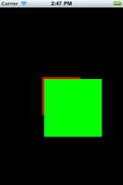 | 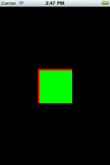 |

#### Auto Sizes in iOS

When width or height parameters are specified as "auto", components will follow the specification as defined in the [UI Composite Layout Behavior Spec](/guide/Titanium_SDK/Titanium_SDK_Guide/Contributing_to_Titanium/Platform_Development/Specs/UI_Composite_Layout_Behavior_Spec/). In previous versions of the Titanium SDK "auto" enforced SIZE behavior on iOS.

**Test Code**

```javascript
var win = Ti.UI.createWindow({});
//parent will follow SIZE in 1_8_X, FILL in 2_0_X
var parent = Ti.UI.createView({ backgroundColor: 'red', width: 'auto', height: 'auto' })
var child = Ti.UI.createView( {backgroundColor: 'green', width: 100, height: 100, left: 5, right: 5, top: 5, bottom: 5 });
parent.add(child);
win.add(parent);
win.open();
```

| 1.8 Behavior | 2.0 Behavior |
| --- | --- |
| 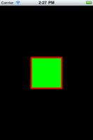 | 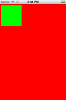 |

To restore 1.8 behavior on iOS, you can simply replace any "auto" sizes with `Ti.UI.SIZE`.

#### Undefined Sizes in OS

When width or height parameters are undefined, an attempt will be made to calculate these parameters implicitly. If they cannot be calculated implicitly, they will follow "auto" behavior. In previous versions of the Titanium SDK undefined width or height enforced FILL behavior.

For any views that don't have sizes defined _and_ can't be sized implicitly, set an explicit size of `Ti.UI.FILL` to restore the 1.8 behavior.

**Test Code**

The following excerpt shows a label with undefined size and no position pins. In 1.8, this uses the FILL behavior, but in 2.0, it uses the SIZE behavior.

```javascript
var win = Ti.UI.createWindow({});
var label = Ti.UI.createLabel({text: 'I am label', backgroundColor: 'red'});
win.add(label);
win.open();
```

| 1.8 Behavior | 2.0 Behavior |
| --- | --- |
| 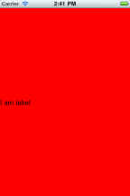 | 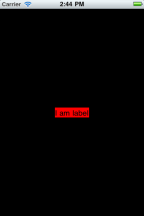 |

The following excerpt shows a label with undefined size and position pins. In 1.8, this uses the FILL behavior, but in 2.0, the size is calculated implicitly from the position pins.

```javascript
var win = Ti.UI.createWindow({});
//Implicit width calculation in 2_0_X
var parent = Ti.UI.createView({backgroundColor: 'red', width: '100', height: '100'})
var child = Ti.UI.createView({backgroundColor: 'green', left: 5, top: 5, center: {x: 20, y: 20}});
parent.add(child);
win.add(parent);
win.open();
```

| 1.8 Behavior | 2.0 Behavior |
| --- | --- |
|  | 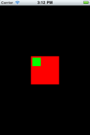 |

To restore a view's 1.8 behavior on iOS, explicitly specify sizes as `Ti.UI.FILL`.

#### Positioning Pins in iOS

In previous versions of the Titanium SDK, the precedence of positioning pins was `center.x`, `left`, `right` for horizontal positioning and `center.y`, `top`, `bottom` for vertical positioning. It now follows the precedence defined above: that is, `top` and `left` take precedence over the `center` values.

When no positioning pins are defined the child is placed at the center of the parent.

**Test Code**

The following excerpt creates a view that has conflicting position pins. In Release 1.8, the `center` values take precedence, but in 2.0, the `left`,`top` values take precedence.

```javascript
var win = Ti.UI.createWindow({});
var parent = Ti.UI.createView({backgroundColor: 'red', width: '100', height: '100'})
var child = Ti.UI.createView({backgroundColor: 'green', width: 50, height: 50, left: 5, top: 5, center: {x: 60, y: 60}});
parent.add(child);
win.add(parent);
win.open();
```

| 1.8 Behavior | 2.0 Behavior |
| --- | --- |
| 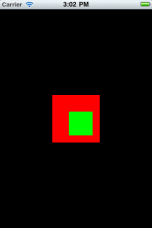 | 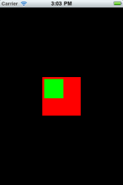 |

Note that in this example, an animation that moved the child view by changing its `center` value would not work, because the `center` value is overridden by the `left` and `top` values.

#### Horizontal Layout in iOS

In previous versions of the Titanium SDK, the sandbox height of a child was independent of its sibling's dimensions. Now all children in a row have the same sandbox height. (See section on [#Horizontal and Vertical Layouts](#horizontal-and-vertical-layouts) below).

**Test Code**

The following code sample creates a view with horizontal layout that contains two children. In Release 1.8, the green child is laid out flush to the top of the parent view. In Release 2.0, the green child is centered relative to its larger neighbor.

Note that there are still inconsistencies between Android, iOS and Mobile Web in the handling of horizontal layouts. This is a known issue.

```javascript
var win = Ti.UI.createWindow({});
//Horizontal Layout behavior. Green child centered vertically (No positioning pins)
var parent = Ti.UI.createView({backgroundColor: 'red', layout: 'horizontal', width: 100, height: 100})
var child1 = Ti.UI.createView({backgroundColor: 'green', height: 20, width: 50});
var child2 = Ti.UI.createView({backgroundColor: 'blue', height: 40, width: 50});
parent.add(child1);
parent.add(child2);
win.add(parent);
win.open();
```

| 1.8 Behavior | 2.0 Behavior |
| --- | --- |
| 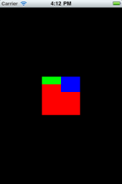 | 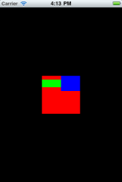 |

### Android Behavior Changes

The behavior changes in Android for composite layout are listed below with sample code illustrating the changes. Screen shots are attached for both Release 1.8 and Release 2.0.

#### Layout Precedence in Android

In previous releases, the positioning properties would determine the width or height of a view even when width or height was specified explicitly. With the new layout rules, the specified width/height take precedence, and then positioning properties afterwards. If one positioning property conflicts with another, properties lower in the precedence chain are ignored.

**Test Code**

```javascript
var win = Ti.UI.createWindow({});
var parent = Ti.UI.createView({backgroundColor: 'red'})
//child width/height calculated from top/bottom/right/left properties in 1_8_X, and height/width will be 100 in 2_0_X
var child = Ti.UI.createView({backgroundColor: 'green', width: 100, height: 100, left: 5, right: 5, top: 5, bottom: 5})
parent.add(child);
win.add(parent);
win.open();
```

| 1.8 Behavior | 2.0 Behavior |
| --- | --- |
| 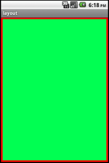 | 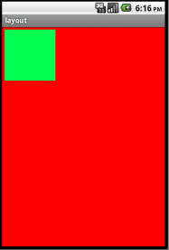 |

#### Undefined Sizes in Android

When width or height parameters are undefined, an attempt will be made to calculate these parameters implicitly. If they cannot be calculated implicitly, they will follow "auto" behavior. In previous releases, undefined width or height would result in looking at the center values first.

**Test Code**

The following excerpt shows a child view with positioning pins but no defined width or height. In 1.8, this resulted

```javascript
var win = Ti.UI.createWindow({backgroundColor: 'white',});
//Implicit width calculation in 2_0_X
var parent = Ti.UI.createView({backgroundColor: 'red', width: '100', height: '100'})
var child = Ti.UI.createView({backgroundColor: 'green', left: 5, top: 5, center: {x: 20, y: 20}});
parent.add(child);
win.add(parent);
win.open();
```

| 1.8 Behavior | 2.0 Behavior |
| --- | --- |
| 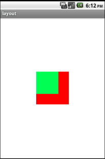 | 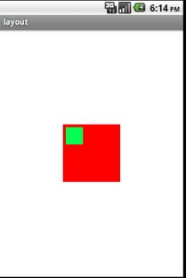 |

#### Positioning Pins in Android

In previous versions of the Titanium SDK, the precedence of positioning pins was (center.x, left, right, center.y, top, bottom). It now follows the precedence defined above. When no positioning pins are defined the child is placed at the center of the parent.

**Test Code**

```javascript
var win = Ti.UI.createWindow({});
//Positioning precedence. center used in 1_8_X. left and top used in 2_0_X
//Animation child center will not work in 2_0_X because both left and top are defined
var parent = Ti.UI.createView({backgroundColor: 'red', width: '100',height: '100'})
var child = Ti.UI.createView({backgroundColor: 'green', width: 50, height: 50, left: 5, top: 5, center: {x: 60, y: 60}});
parent.add(child);
win.add(parent);
win.open();
```

| 1.8 Behavior | 2.0 Behavior |
| --- | --- |
| 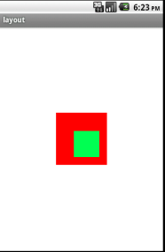 |  |

### Mobile Web Layout Behavior

On the Mobile Web platform, if you do not specify a height or width for a view (or define the size implicitly using `left`, `center` or other layout properties), they use the default behavior defined above - either fill, size, or fill width.

If a value of 'auto' is specified for `height` or `width`, it is interpreted as `Ti.UI.SIZE`. This differs from the 'auto' behavior on Android and iOS. However, using either `SIZE` or `FILL` explicitly should result in the same layout on all three
platforms.

## Migrating Applications to Release 2.0

When migrating applications to Release 2.0, you should focus on reducing or eliminating the use of 'auto' sizes in favor of explicitly selecting SIZE or FILL behavior.

In most cases, simply leaving the width and height undefined should give reasonable default behavior for all view types, which was not always true in previous releases.

On iOS, the following changes apply:

* Any UI component with the `width` property defined as "auto" can safely define its `width` parameter as `Ti.UI.SIZE` to return to 1.8 behavior.

* Any UI component with the `width` property undefined and with less than 2 positioning pins defined can safely define its `width` parameter as `Ti.UI.FILL` to return to 1.8 behavior.

The same principles apply to the `height` property.

On Android, the 'auto' behavior remains the same for most components. However, it is recommended to remove any 'auto' sizes in favor of explicitly specifying the desired behavior.

After replacing 'auto' values, if you are still seeing layout changes, they are likely due to the changes in the precedence order of layout properties.

If you are using `size` as a read/write property, you must rewrite these references to set the `width` and `height` properties directly.

If your code specifies size and position values with units and relies on the units being ignored on iOS, it will break in 2.0. This should only cause problems if you specify a unit _other than_ DIPs, which is the default unit on iOS.
