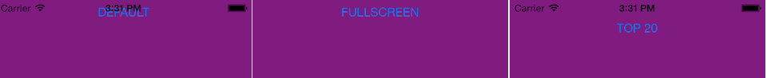
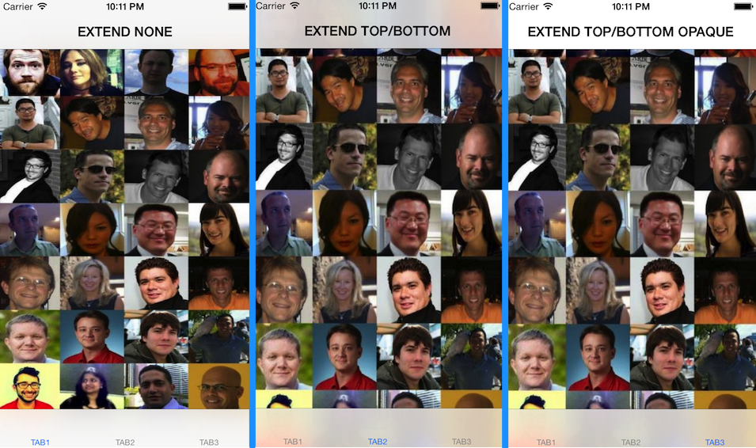
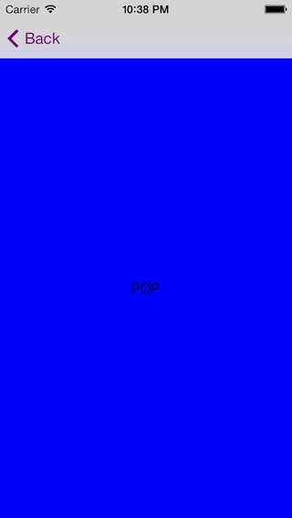

# iOS 7 Migration Guide

## Overview

This guide discusses the changes since Release 3.1.3 to support iOS 7. Even though this guide talks about the changes made for iOS 7, some of these changes affect previous iOS versions, such as the New Windows Architecture. Note that support for iOS 5.x and earlier was removed in Release 3.2.0.

Release 3.1.3 targets and supports 32-bit iOS apps, which will run correctly on all Apple iOS devices including the 64-bit iPhone 5S. A future SDK will provide support for 64-bit iOS apps.

::: warning ⚠️ Warning
Unless otherwise noted, all new features and changes were introduced in Release 3.1.3.
:::

### Summary of changes to the Titanium SDK

This section briefly lists the changes made to the Titanium SDK to support iOS 7. For details, see the sections below.

* New App icons and Spotlight & Settings icons for iOS 7.

* New Windows UI architecture:

    * On iOS 7, all lightweight windows, including the root window, are full screen and extend underneath the default transparent status bar. Current applications may need to adjust the layout of windows if they rely on the `top` property.

    * On iOS 7, the status bar and navigation bar are translucent by default. On iOS 6 and prior, they are not translucent.

    * The status bar is controlled by the currently displayed window and can no longer be dynamically shown or hidden in iOS 7.

    * On iOS 6 and prior, setting the `statusBarStyle` property to new `Titanium.UI.iOS.StatusBar.LIGHT_CONTENT` constant behaves the same as setting it to `Titanium.UI.iOS.StatusBar.TRANSLUCENT_BLACK`.

    * On iOS 7 and later, setting the `statusBarStyle` property to either `Titanium.UI.IOS.StatusBar.TRANSLUCENT_BLACK` or `Titanium.UI.iOS.StatusBar.OPAQUE_BLACK` behaves the same as setting it to the new `Titanium.UI.iOS.StatusBar.LIGHT_CONTENT`constant.

    * The Window's `translucent` and `barColor` property no longer affects the appearance of the toolbar. Pass these parameters in with the Window's `setToolbar` method as an optional dictionary parameter.

    * Orientation modes can only be set before opening a window and force orientation modes are no longer animated.

    * Modal windows do not have a navigation bar by default and only support their own orientation modes.

    * Non-modal windows cannot be opened on top of modal windows. Any non-modal opens behind an already opened modal and animations are ignored.

* New API to support iOS 7:

    * New [iOS NavigationWindow](#!/api/Titanium.UI.iOS.NavigationWindow) object to support a navigation controller. The iPhone NavigationGroup is deprecated and removed in Release 3.2.0.

    * New API elements to support extending view edges.

    * New API elements to support tint color.

    * New API element to support audio recording.

    * New API elements to support iOS 7 animated transitions (since Release 3.2.0).

    * New API elements to support default text styles (since Release 3.2.0).

    * New API elements to support iOS 7 attributed strings (since Release 3.2.0). See [Attributed Strings](/guide/Titanium_SDK/Titanium_SDK_How-tos/User_Interface_Deep_Dives/Attributed_Strings/).

    * New API elements to support downloading content in the background (since Release 3.2.0). See [iOS Background Services](/guide/Titanium_SDK/Titanium_SDK_How-tos/Platform_API_Deep_Dives/iOS_API_Deep_Dives/iOS_Background_Services/).

    * New API elements to support dynamic animations (since Release 3.2.0). See the [Titanium.UI.iOS.Animator API reference](#!/api/Titanium.UI.iOS.Animator).

* API elements not supported on iOS 7:

    * Controlling the status bar on the fly. Since Release 3.2.0, you can use the Window's `statusBarStyle` property to dynamically change the style of the status bar. You cannot dynamically control whether to show or hide it.

### Apple's To-Do list to support iOS 7

The following information is taken from the [iOS 7 UI Migration Guide: Scoping the Project](https://developer.apple.com/library/prerelease/ios/documentation/UserExperience/Conceptual/TransitionGuide/Scoping.html#//apple_ref/doc/uid/TP40013174-CH7-SW1). These are Apple's recommended steps to update your application to iOS 7. iOS 7 introduces many UI changes, such as borderless buttons, translucent bars and full-screen layout for views. For more details, review the [iOS 7 Developer Library: iOS 7 UI Transition Guide](https://developer.apple.com/library/prerelease/ios/documentation/UserExperience/Conceptual/TransitionGuide/index.html#//apple_ref/doc/uid/TP40013174) . Note that not all features listed in the iOS 7 UI Transition Guide have been exposed in the Titanium SDK, such as Auto Layout or Dynamic Type features.

**Things Every App Must Do**

* Update the app icon. In iOS 7, app icons for high-resolution iPhone and iPod touch are 120 x 120 pixels; for high-resolution iPad, app icons are 152 x 152 pixels. (To learn more about all icon sizes, see [“Icon and Image Sizes”](https://developer.apple.com/library/prerelease/ios/documentation/UserExperience/Conceptual/MobileHIG/IconMatrix.html#//apple_ref/doc/uid/TP40006556-CH27) .) Note that iOS 7 doesn’t apply shine or a drop shadow to the app icon. And, although iOS 7 still applies a mask that rounds the corners of an app icon, it uses a different corner radius than earlier versions of iOS. See the iOS 7 Icons section below.

* Update the launch image to include the status bar area if it doesn’t already do so. This is a difference of 20 pixels in height, that is, the image is stretched 20 more pixels if you do nothing.

* Support Retina display and iPhone 5 in all your artwork and designs, if you’re not already doing so.

**Things Every App Should Do**

* Make sure that app content is discernible through translucent UI elements—such as bars and keyboards—and the transparent status bar. In iOS 7, views use full-screen layout.

* Redesign custom bar button icons. In iOS 7, bar button icons are lighter in weight and have a different style.

* Prepare for borderless buttons by reassessing the utility of button background images and bezels in your layout.

* Examine your app for places where the metrics and style changes of controls and views affect the layout and appearance. For example, switches are wider, grouped tables are no longer inset, and progress bars are thinner. For more information on specific UI elements, see [Bars and Bar Buttons](https://developer.apple.com/library/prerelease/ios/documentation/UserExperience/Conceptual/TransitionGuide/Bars.html#//apple_ref/doc/uid/TP40013174-CH8-SW1), [Content Views](https://developer.apple.com/library/prerelease/ios/documentation/UserExperience/Conceptual/TransitionGuide/ContentViews.html#//apple_ref/doc/uid/TP40013174-CH10-SW1), [Controls](https://developer.apple.com/library/prerelease/ios/documentation/UserExperience/Conceptual/TransitionGuide/Controls.html#//apple_ref/doc/uid/TP40013174-CH9-SW1) and [Temporary Views](https://developer.apple.com/library/prerelease/ios/documentation/UserExperience/Conceptual/TransitionGuide/TempViews.html#//apple_ref/doc/uid/TP40013174-CH11-SW1).

* Expect users to swipe up from the bottom of the screen to reveal Control Center. If iOS determines that a touch that begins at the bottom of the screen should reveal Control Center, it doesn’t deliver the gesture to the currently running app. If iOS determines that the touch should not reveal Control Center, the touch may be slightly delayed before it reaches the app.

* Revisit the use of drop shadows, gradients, and bezels. Because the iOS 7 aesthetic is smooth and layered—with much less emphasis on using visual effects to make UI elements look physical—you may want to rethink these effects.

### iOS 7 behavior changes

The following section lists notable behavior changes to iOS 7.

#### ButtonBar and TabbedBar

On iOS 7, Apple changed the style of segmented controllers, which effects what can be customized for the ButtonBar and TabbedBar objects in the Titanium SDK. You can no longer set the background color or style of these objects. iOS 7 only supports one style and setting the tint color.

In Release 3.1.3 and later, with iOS 7 and later, when you set the `backgroundColor` property for these objects, you will be setting the tint color, and the `style` property is ignored. For iOS 6 and prior, the `backgroundColor` and `style` properties still works the same since these are supported on older version of iOS.

#### Navigation transitions

On iOS 7, when transitioning between two windows in a navigation stack, the bottom window slides half way off the screen, pauses then the top window appears. This is noticeable if you do not specify a background color for your top window, which makes it transparent. As long as you specify a background color for the top window, the application will appear to transition the same as previous iOS versions.

On iOS 6 and earlier, the bottom window would slide off screen as the top window appears on screen at the same time.

### iOS 7 known issues

Due to known bugs with iOS 7, the following issues cannot be resolved in the Titanium SDK:

* Setting any of the image properties for a Slider causes unpredictable behavior. Try to use a default slider if possible.

## iOS 7 icons

For iOS 7, you need to supply the following icon files (if you are using the default appicon.png name) for a universal iOS application.

| iOS Device | Purpose | Dimensions | DPI | File name | Titanium folder location |
| --- | --- | --- | --- | --- | --- |
| iPhone/iPod retina | App icon | 120 x 120 | 72 | appicon-60@2x.png | Resources or Resources/iphone |
| iPad non-retina | App icon | 76 x 76 | 72 | appicon-76.png | Resources or Resources/iphone |
| iPad retina | App icon | 152 x 152 | 72 | appicon-76@2x.png | Resources or Resources/iphone |
| Universal non-retina | Spotlight & settings | 40 x 40 | 72 | appicon-Small-40.png | Resources or Resources/iphone |
| Universal retina | Spotlight & settings | 80 x 80 | 72 | appicon-Small-40@2x.png | Resources or Resources/iphone |

::: warning ⚠️ Warning
iOS 7 does not support non-retina iPhones and iPods.
:::

## New windows architecture

The iOS windowing system was re-architected to support iOS 7 and enforce strict UI behavior. Before, certain combinations of actions, such as using both forced orientations and transition animations, would cause undesired behavior. This section discusses some behavior changes from previous releases that were introduced in Release 3.1.3.

### Lightweight windows

On iOS 7 and later, all lightweight windows, including the first root window, are displayed as fullscreen with a transparent status bar. Lightweight windows are windows without a navigation controller, that is, not contained in a NavigationWindow or TabGroup. Any view objects added to the top of the window appear behind the transparent status bar. If your UI layout relies on the `top` property, you may need to readjust your layout.

You can also either set the `fullscreen` property to true to hide the status bar or set the `top` property to 20 to move the window below the status bar to compensate for this behavior change. The image below shows three different windows. The first uses the default behavior, so the button appears behind the transparent status bar. The second sets the `fullscreen` property to true to hide the status bar. The third sets the `top` property to 20 to move the window below the status bar.



```javascript
// Function to test if device is iOS 7 or later
function isiOS7Plus() {
  // iOS-specific test
  if (Titanium.Platform.name == 'iPhone OS') {
    var version = Titanium.Platform.version.split(".");
    var major = parseInt(version[0],10);

    // Can only test this support on a 3.2+ device
    if (major >= 7) {
      return true;
    }
  }
  return false;
}

var iOS7 = isIOS7Plus();
var theTop = iOS7 ? 20 : 0

var window = Ti.UI.createWindow({top: theTop});

// Set the background color to non-black to see the status bar
// Or set the Window statusBarStyle property to a non-default value
Ti.UI.setBackgroundColor('purple');
var win = Ti.UI.createWindow({
    // Remove the status bar
    // fullscreen: true
    // Moves the Window below the status bar
    top: theTop
});
var button = Ti.UI.createButton({top: 0, title: 'BLAH BLAH BLAH'});
win.add(button);
win.open();
```

### Status bar

In Release 3.1.3 and later, the status bar is controlled by the current window that appears on screen. By default, the status bar is displayed unless you specify the Window's `fullscreen` property to true before opening the window. You can also control the appearance of the status bar using the Window's `statusBarStyle` property (new API element for Release 3.1.3). These properties can also be set on any top-level container, which include NavigationWindow, SplitWindow and TabGroup objects.

Prior to Release 3.1.3, if you created a fullscreen window then opened a window without specifying the `fullscreen` property. The recently opened window would also appear fullscreen. In Release 3.1.3 and later, since the default value is to show the status bar, the recently opened window displays.

On iOS 7, the status bar cannot be controlled on the fly with `Titanium.UI.iOS.setStatusBarStyle`, `Titanium.UI.iOS.setStatusBarHidden`, `Titanium.UI.iOS.showStatusBar` or `Titanium.UI.iOS.hideStatusBar` . You need to either set the `fullscreen` property to hide the status bar or `statusBarStyle` to change the status bar style before opening the window. In Release 3.2.0, you can use the `statusBarStyle` property to change the status bar style on the fly.

iOS 7 also introduces a new light content status bar style that is exposed as the [Titanium.UI.iOS.StatusBar.LIGHT\_CONTENT](#!/api/Titanium.UI.iOS.StatusBar-property-LIGHT_CONTENT) constant in the Titanium SDK. Use this constant to specify a status bar for use with a dark background. If you want the entire application to use this style, add the following key to your `tiapp.xml` file:

```xml
<ios>
    <plist>
        <dict>
            <key>UIStatusBarStyle</key>
      <string>UIStatusBarStyleLightContent</string>
        </dict>
    </plist>
</ios>
```

On iOS 6 and prior, setting the `statusBarStyle` property to `Titanium.UI.iOS.StatusBar.LIGHT_CONTENT` constant behaves the same as setting it to `Titanium.UI.iOS.StatusBar.TRANSLUCENT_BLACK`.

On iOS 7 and later, setting the `statusBarStyle` property to either `Titanium.UI.iOS.StatusBar.TRANSLUCENT_BLACK` or `Titanium.UI.iOS.StatusBar.OPAQUE_BLACK` behaves the same as setting it to `Titanium.UI.iOS.StatusBar.LIGHT_CONTENT`.

### Toolbar

The Window's `translucent` and `barColor` property no longer affects the appearance of the toolbar. Pass these parameters in with the Window's [setToolbar](#!/api/Titanium.UI.Window-method-setToolbar) method. Note that the window requires a navigation controller for the tool bar to appear, that is, the window needs to be placed in a NavigationWindow.

Prior to Release 3.1.3, the Window's `translucent` and `barColor` property controlled the appearance of the toolbar.

```javascript
var win = Ti.UI.createWindow({backgroundColor: 'white', navBarHidden: true});
var button1 = Ti.UI.createButton({title: 'Uno'});
var button2 = Ti.UI.createButton({title: 'Dos'});
var button3 = Ti.UI.createButton({title: 'Tres'});
win.setToolbar([button1, button2, button3],
    {
        animated: false, // true by default
        translucent: false, // true for iOS 7+, false otherwise
        barColor: 'blue',
        tintColor: 'orange' // iOS 7+ only
    }
);
var navWin = Ti.UI.iOS.createNavigationWindow({window: win});
navWin.open();
```

### Orientation modes

In Release 3.1.3 and later, you need to set the `orientationModes` property before opening the window. The `setOrientationModes` method no longer works.

Forced orientations are no longer animated and occur after an open or close transition animation. A forced orientation occurs when a device is oriented in a mode not supported by the window. For example, opening a landscape-only window when the device is oriented in portrait mode. The window will force itself to landscape mode. Previously, both the forced orientation and transition animations were done at the same time causing undesired behavior in some cases.

For modal window orientation modes, see the Modal Windows section.

### Modal windows

In Release 3.1.3 and later, modal windows no longer provide a navigation bar by default. If you set any of the navigation bar properties on the modal window, such as `leftNavButton`, `rightNavbutton` and `titleControl`, you need to first create a NavigationWindow object with the `modal` property set to true (new API object for Release 3.1.3) and place a Window object, defining the navigation bar properties, inside the NavigationWindow object. For example, the code below creates a modal window with a custom title control.

```javascript
var win = Ti.UI.createWindow({
    backgroundColor: 'blue',
    titleControl: Ti.UI.createLabel({
        text: 'Enable feature?',
        shadowColor: 'gray',
        shadowOffset: {x: 2, y: 2}
    })
});

var navWin = Ti.UI.iOS.createNavigationWindow({
    modal: true,
  window: win
});
navWin.open();
```

Modal windows only support its own orientation modes. It does not inherit from orientation modes from its hosted windows. Prior to Release 3.1.3, modal windows would try to use the orientation modes from its hosted window.

If you open a non-modal window, after opening a modal window, the non-modal window appears behind modal window and animations are ignored. Prior to Release 3.1.3, this incorrect behavior was supported.

### Other window properties

The following properties are defined on a per window basis:

* `barColor` – Background color of navigation bar. Defaults to nil.

* `navTintColor` (new API for Release 3.1.3) – Tint color for the navigation bar. Only supported on iOS 7 and later. Defaults to nil.

* `barImage` – Background image for navigation bar. Defaults to NULL.

* `translucent` – Controls if the navigation bar is translucent or not. Defaults to true on iOS 7 and later, false on older versions.

* `tabBarHidden` – Defaults to false.

* `navBarHidden` – Defaults to false. No longer supported as a valid parameter to the `open` method since the modal window no longer has a default navigation bar.

## New APIs

The following new API elements are introduced with Release 3.1.3 to support iOS 7 (unless otherwise noted). For more details, see the sections below.

| API element | type | notes |
| --- | --- | --- |
| [Font.textStyle](#!/api/Font-property-textStyle) | property | **Introduced in Release 3.2.0.** Use a predefined font text style. |
| [Module.URLSession](#!/api/Modules.URLSession) | module | **Introduced in Release 3.2.0.** Wrapper for the NSURLSession class that allows the application to download large content in the background. |
| [Titanium.App.iOS.backgroundfetch](#!/api/Titanium.App.iOS-event-backgroundfetch) | event | **Introduced in Release 3.2.0.** Fired when iOS signaled the application that it can download updates in the background. |
| [Titanium.App.iOS.silentpush](#!/api/Titanium.App.iOS-event-silentpush) | event | **Introduced in Release 3.2.0.** Fired when a push notification was received indicating there is content to download. |
| [Titanium.Media.requestAuthorization](#!/api/Titanium.Media-method-requestAuthorization) | method | Request permission to record audio. |
| [Titanium.UI.iOS.Animator](#!/api/Titanium.UI.iOS.Animator) | object | **Introduced in Release 3.2.0.** Creates an animator object to support dynamic animations. |
| [Titanium.UI.iOS.AttributedString](#!/api/Titanium.UI.iOS.AttributedString) | object | **Introduced in Release 3.2.0.** Creates an attributed string object. **Supported on iOS 6 and later.** |
| [Titanium.UI.iOS.createTransitionAnimation](#!/api/Titanium.UI.iOS-method-createTransitionAnimation) | method | **Introduced in Release 3.2.0.** Creates an animated transition when opening or closing a window. |
| [Titanium.UI.iOS.NavigationWindow](#!/api/Titanium.UI.iOS.NavigationWindow) | object | Creates a navigation window. Deprecates Titanium.UI.iOS.NavigationGroup. |
| [Titanium.UI.Tab.activeIconIsMask](#!/api/Titanium.UI.Tab-property-activeIconIsMask) | property | Defines if the active icon property of the tab must be used as a mask. |
| [Titanium.UI.Tab.iconIsmask](#!/api/Titanium.UI.Tab-property-iconIsmask) | property | Defines if the icon property of the tab must be used as a mask. |
| [Titanium.UI.TabGroup.tabsTintColor](#!/api/Titanium.UI.TabGroup-property-tabsTintColor) | property | Sets the tint color of the tabs. |
| [Titanium.UI.View.tintColor](#!/api/Titanium.UI.View-property-tintColor) | property | Sets the key color for all child objects if that property is not defined, for example, text color or default icons. |
| [Titanium.UI.Window.autoAdjustScrollViewInsets](#!/api/Titanium.UI.Window-property-autoAdjustScrollViewInsets) | property | Specifies whether or not the view controller should automatically adjust its scroll view insets. |
| [Titanium.UI.Window.extendEdges](#!/api/Titanium.UI.Window-property-extendEdges) | property | Specifies how far the view should be extended specified as an array of constants. |
| [Titanium.UI.Window.includeOpaqueBars](#!/api/Titanium.UI.Window-property-includeOpaqueBars) | property | Specifies if the edges should extend beyond opaque bars (e.g., navigation bar, tab bar, and toolbar). |
| [Titanium.UI.Window.navTintColor](#!/api/Titanium.UI.Window-property-navTintColor) | property | Sets the tint color of the navigation bar. |
| [Titanium.UI.Window.statusBarStyle](#!/api/Titanium.UI.Window-property-statusBarStyle) | property | Sets the style of the status bar. Use one of the constants from Titanium.UI.iOS.StatusBar. **Supported on iOS 6 and later.** |
| [Titanium.UI.Window.transitionAnimation](#!/api/Titanium.UI.Window-property-transitionAnimation) | property | **Introduced in Release 3.2.0.** Use a transition animation when opening or closing windows. |

### Titanium.UI.iOS.NavigationWindow

The iOS NavigationWindow object deprecates the iPhone NavigationGroup object. The main differences are:

* NavigationWindow is a top-level container and does not need to be added to a window.

* Use the `openWindow` and `closeWindow` methods to add and remove windows instead of `open` and `close`.

The NavigationWindow object is a top-level window manager as opposed to a view controller that needed to be placed inside a window as it was with the iPhone NavigationGroup.

Rather than using the `open` and `close` methods to add or remove windows from the navigation group, the methods are called `openWindow` and `closeWindow`, respectively. These two methods act the same as NavigationGroup's `open` and `close` methods, where you specify a window object as the parameter to the method to add or remove that window.

The NavigationWindow's `open` and `close` methods act the same as the Window's `open` and `close` method to make the window appear and disappear.

The NavigationWindow can be used for the master and detail views of a SplitWindow object and content view of a Popover object.

The two code examples below compare and contrast how both the iOS NavigationWindow and iPhone NavigationGroup create and use the navigation controller.

**Example: New NavigationWindow**

```javascript
// Works with Release 3.1.3 and later
var rootWin = Ti.UI.createWindow({backgroundColor: 'red'});
var navWin = Ti.UI.iOS.createNavigationWindow({window: rootWin});
var secondWin = Ti.UI.createWindow({backgroundColor: 'blue'});

var b1 = Ti.UI.createButton({title: 'PUSH'});
rootWin.add(b1);

var b2 = Ti.UI.createButton({title: 'POP'});
secondWin.add(b2);
// use openWindow and closeWindow rather than open and close
b1.addEventListener('click',function(){ navWin.openWindow(secondWin); });
b2.addEventListener('click',function(){ navWin.closeWindow(secondWin); });

navWin.open();
```

**Example: Old NavigationGroup**

```javascript
// Will no longer work after Release 3.2.0
var topWin = Ti.UI.createWindow();
var rootWin = Ti.UI.createWindow({backgroundColor: 'red'});
var navGroup = Ti.UI.iOS.createNavigationGroup({window: rootWin});
var secondWin = Ti.UI.createWindow({backgroundColor: 'blue'});
// For NavigationGroup, you need to place it inside a top-level window
topWin.add(navGroup);

var b1 = Ti.UI.createButton({title: 'PUSH'});
rootWin.add(b1);

var b2 = Ti.UI.createButton({title: 'POP'});
secondWin.add(b2);
// open and close windows
b1.addEventListener('click',function(){ navGroup.open(secondWin); });
b2.addEventListener('click',function(){ navGroup.close(secondWin); });

topWin.open();
```

### Extended view region

In Release 3.1.3, the Titanium SDK exposes three new iOS 7 properties to extend the region of a NavigationWindow, TabGroup or Window. For example, you can extend a window to use the space behind the status and navigation bar.

* `extendEdges` - Extends the region of the window by specifying an array of edge constants: `Ti.UI.EXTEND_EDGE_NONE`, `Ti.UI.EXTEND_EDGE_TOP`, `Ti.UI.EXTEND_EDGE_LEFT`, `Ti.UI.EXTEND_EDGE_BOTTOM`, `Ti.UI.EXTEND_EDGE_RIGHT` or `Ti.UI.EXTEND_EDGE_ALL`. None by default.

* `includeOpaqueBars` - Set to true to extend the region of window behind opaque bars, that is, when the Window's `translucent` property is set to false. Off by default.

* `autoAdjustScrollViewInsets` **\-** Set to true to have the contents of a scrollable view's inset be automatically adjusted. Off by default.

The example below creates a tab group with three different tabs. The first tab uses the default behavior, which shows the entire image in between the opaque navigation bar and opaque tab controller. The second tab extends the background image behind a translucent navigation bar and translucent tab controller. The third tab extends the background image behind an opaque navigation bar and translucent tab controller.



```javascript
var tabGrp = Ti.UI.createTabGroup({
  backgroundColor: 'white',
});

var win1 = Ti.UI.createWindow({
  backgroundImage: 'test_image.png',
  title: 'EXTEND NONE',
});

var win2 = Ti.UI.createWindow({
  backgroundImage: 'test_image.png',
  title: 'EXTEND TOP/BOTTOM',
  extendEdges: [Ti.UI.EXTEND_EDGE_TOP, Ti.UI.EXTEND_EDGE_BOTTOM]
});

var win3 = Ti.UI.createWindow({
  backgroundImage: 'test_image.png',
  title: 'EXTEND TOP/BOTTOM OPAQUE',
  includeOpaqueBars: true,
  translucent: false,
  extendEdges: [Ti.UI.EXTEND_EDGE_BOTTOM, Ti.UI.EXTEND_EDGE_TOP],
});

var tab1 = Ti.UI.createTab({window:win1,title: 'TAB1'});
var tab2 = Ti.UI.createTab({window:win2,title: 'TAB2'});
var tab3 = Ti.UI.createTab({window:win3,title: 'TAB3'});

tabGrp.addTab(tab1);
tabGrp.addTab(tab2);
tabGrp.addTab(tab3);

tabGrp.open();
```

### Tint color

In Release 3.1.3, the Titanium SDK exposes the iOS 7 tint color feature as three properties:

* `Titanium.UI.View.tintColor` - sets the key color for the UI element. This property can be set by any Titanium View object, including Windows. If undefined, inherits the tint color from its parent.

* `Titanium.UI.TabGroup.tabsTintColor` - sets the key color for the active tab in the tab group.

* `Titanium.UI.Window.navTintColor` - sets the key color for the window's navigation bar. If undefined and `tintColor` is defined for the Window or NavigationWindow, the `tintColor` is used.

The tint color feature sets the key color of UI elements, such as the button title, label text and template image. If you set the tint color for a parent object and none of its children, the children inherit the tint color from the parent.

The example below sets the `tintColor` property for the NavigationWindow to black. Since this is the only place it is defined, the key color for all UI elements are black except for the navigation bar for the second window because the `navTintColor` property is set to purple. If this property was not set, the text in the navigation bar would be black.



```javascript
var rootWin = Ti.UI.createWindow({backgroundColor: 'red'});
var navWin = Ti.UI.iOS.createNavigationWindow({
  window: rootWin,
  tintColor: 'black'
});
var secondWin = Ti.UI.createWindow({
  backgroundColor: 'blue',
  navTintColor: 'purple',
});

var b1 = Ti.UI.createButton({title: 'PUSH'});
rootWin.add(b1);

var b2 = Ti.UI.createButton({title: 'POP'});
secondWin.add(b2);

b1.addEventListener('click',function(){ navWin.push(secondWin); });
b2.addEventListener('click',function(){ navWin.pop(secondWin); });

navWin.open();
```

### Request permission to record audio

In iOS 7, the application needs to request permission to record audio. Use the [Titanium.Media.requestAuthorization](#!/api/Titanium.Media-method-requestAuthorization) method to make the request. iOS will prompt the user to either allow or deny the application to record audio. If the user denies recording permission but the application tries to record audio, the application only records silence.

```
Ti.Media.requestAuthorization(function(e){
    if (e.success) {
        startRecorder();
    } else {
        alert('Access to Recorder is not allowed');
    }
});
```

### Animated transitions

iOS 7 introduced new animation capabilities for transitioning Windows in a NavigationWindow or Tab, which is available in Release 3.2.0 and later. Create a transition animation object with the [Titanium.UI.iOS.createTransitionAnimation](#!/api/Titanium.UI.iOS-method-createTransitionAnimation) method to specify animation objects to hide the current window and show the new window, then assign the transition animation object to the Window's [transitionAnimation](#!/api/Titanium.UI.Window-property-transitionAnimation) property.

In this example, the red window opens with a transition animation, while closing it uses the default behavior where it slides off screen. To add a transition animation when the red window closes, define a transition animation for the blue window.

```javascript
var transition = Ti.UI.iOS.createTransitionAnimation({
    duration: 300,
    // The show transition makes the window opaque and rotates it correctly
    transitionTo: {
        opacity: 1,
        duration: 300,
        transform: Ti.UI.create2DMatrix()
    },
    // The hide transition makes the window transparent and rotates it upside down
    transitionFrom: {
        opacity: 0,
        duration: 300 / 2,
        transform: Ti.UI.create2DMatrix().rotate(180),
    }
});

var win2 = Ti.UI.createWindow({
    backgroundColor: 'red',
    title: 'Red Window',
    transitionAnimation: transition,
    opacity: 0,
    transform: Ti.UI.create2DMatrix().rotate(180)
});
var button2 = Ti.UI.createButton({
    title: 'Close Red Window'
});
button2.addEventListener('click', function(){
    nav.closeWindow(win2);
    // In order to see the blue window again,
    // need to reverse the transition animation
    win1.opacity = 1;
    win1.transform = Ti.UI.create2DMatrix().rotate(0);
});
win2.add(button2);

var win1 = Ti.UI.createWindow({
    backgroundColor: 'blue',
    title: 'Blue Window',
    // Uncomment to use a transition animation when the blue window is closed
    // transitionAnimation: transition
});
var button1 = Ti.UI.createButton({title: 'Open Red Window'});
button1.addEventListener('click', function(){
    nav.openWindow(win2);
});
win1.add(button1);

var nav = Ti.UI.iOS.createNavigationWindow({
    window: win1
});
nav.open();
```

### Predefined text styles

iOS 7 introduces predefined font text style. The `Font` object supports a new property, [textStyle](#!/api/Font-property-textStyle) , available from Release 3.2.0 and later. Assign this property a `Titanium.UI.TEXT_STYLE_*` constant to use a predefined text style. If this property is assigned a valid value, all other font properties are ignored.

```javascript
var win = Ti.UI.createWindow({
  backgroundColor: 'white',
  layout: 'vertical'
});

var label1 = Ti.UI.createLabel({
  top: 25,
  text: 'Lorem Ipsum',
  font: {textStyle: Ti.UI.TEXT_STYLE_HEADLINE}
});
win.add(label1);

var label2 = Ti.UI.createLabel({
  top: 25,
  text: 'Lorem Ipsum',
  font: {textStyle: Ti.UI.TEXT_STYLE_SUBHEADLINE}
});
win.add(label2);

var label3 = Ti.UI.createLabel({
  top: 25,
  text: 'Lorem Ipsum',
  font: {textStyle: Ti.UI.TEXT_STYLE_BODY}
});
win.add(label3);

var label4 = Ti.UI.createLabel({
  top: 25,
  text: 'Lorem Ipsum',
  font: {textStyle: Ti.UI.TEXT_STYLE_CAPTION1}
});
win.add(label4);

var label5 = Ti.UI.createLabel({
  top: 25,
  text: 'Lorem Ipsum',
  font: {textStyle: Ti.UI.TEXT_STYLE_CAPTION2}
});
win.add(label5);

var label6 = Ti.UI.createLabel({
  top: 25,
  text: 'Lorem Ipsum',
  font: {textStyle: Ti.UI.TEXT_STYLE_FOOTNOTE}
});
win.add(label6);

win.open();
```

### Attributed strings

As of Release 3.2.0, the Titanium SDK supports attributed strings allowing the application to manage and apply specific attributes, such as font and kerning, to characters or range of characters in a string.

See [Attributed Strings](/guide/Titanium_SDK/Titanium_SDK_How-tos/User_Interface_Deep_Dives/Attributed_Strings/).

### Background services

As of Release 3.2.0, the Titanium SDK supports downloading large content while the application is in the background.

See [iOS Background Services](/guide/Titanium_SDK/Titanium_SDK_How-tos/Platform_API_Deep_Dives/iOS_API_Deep_Dives/iOS_Background_Services/).

### Dynamic animations

As of Release 3.2.0, the Titanium SDK supports the built-in iOS dynamic animations, which are supported on iOS 7 and later. The animator provides physics-related capabilities and animations using the iOS physics engine.

See the [Titanium.UI.iOS.Animator API reference](#!/api/Titanium.UI.iOS.Animator).

## Deprecated and removed APIs

The following API elements are obsolete or do not work on iOS 7. These elements are deprecated in Release 3.1.3 and removed in Release 3.2.0 except the setter methods.

| API element | type | notes |
| --- | --- | --- |
| Titanium.UI.iPhone.createNavigationGroup | method | Use Titanium.UI.iOS.createNavigationWindow to create the new NavigationWindow object. |
| Titanium.UI.iPhone.NavigationGroup | object | Use the new Titanium.UI.iOS.NavigationWindow view object. |
| Titanium.UI.iPhone.setStatusBarStyle | setter method | Does not work on iOS 7. Use the Window's statusBarStyle property. |
| Titanium.UI.iPhone.setStatusBarHidden | setter method | Does not work on iOS 7. Set the Window's fullscreen property to true before opening it. |
| Titanium.UI.iPhone.showStatusBar | method | Does not work on iOS 7. Shown by default or set the Window's fullscreen property to false before opening it. |
| Titanium.UI.iPhone.hideStatusBar | method | Does not work on iOS 7. Set the Window's fullscreen property to true before opening it. |
| Titanium.UI.setOrientationModes | setter method | Does not work on iOS. Set the Window's orientationModes property before opening it. |
