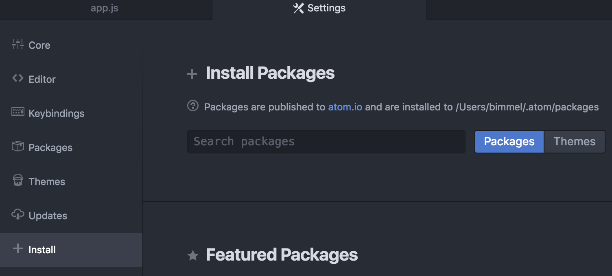
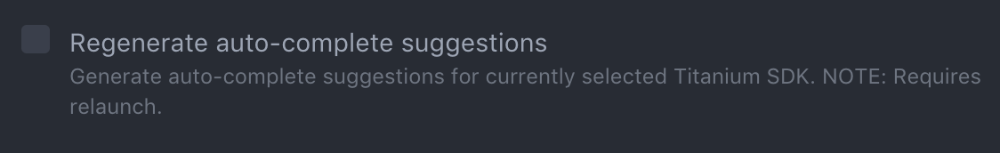

# Atom Package

## Overview

With the release of [SDK 7.0.0](/guide/Titanium_SDK/Titanium_SDK_Release_Notes/Titanium_SDK_Release_Notes_7.x/Titanium_SDK_7.0.0.GA_Release_Note/), Axway Appcelerator introduces the Titanium package for **[Atom](https://atom.io/)**. The initial release includes the following features:

* Toolbar with quick access to build commands and code signing assistance

* Output console

* Autocomplete for properties, methods, and events of Titanium objects and project references

* Jump-to-definition support

* Create new Alloy widgets, controllers, views, styles, models, or alloy.jmk files in existing projects

* Utilize the Atom Command Palette to initiate commands

::: warning ⚠️ Warning
Atom 1.21 or later is required.
:::

## Installation

Installing the Atom Package for Axway Appcelerator can be accomplished via the editor itself or by using the apm CLI command.

### Via Atom Editor



Installation via the editor is just like any other Atom package.

1. Open **Atom**.

2. Navigate to the package/theme installer: **Packages** > **Settings view** > **Install Packages/Themes**.

3. In the **Install Packages** section, type _appcelerator-titanium_ in the Packages search field. You should see the appcelerator-titanium \-atom-plugin listed in the results of this package search.

4. Click the **Install button**.

### Via CLI

If you have the apm command installed, from the command line run:

apm install appcelerator-titanium

### Dependencies

Some functionality provided by the Appcelerator Titanium package, such as jump-to-definition, requires the [Atom IDE](https://ide.atom.io) package to be installed. Follow the above instructions but search for the package named _atom-ide-ui_.

## Features

### Commands

| Command | Description |
| --- | --- |
| `appc:build` | Build using the current selected command and configuration |
| `appc:stop` | Stop the current build |
| `appc:console` | Toggle the console |
| `appc:generate` | Open dialog to generate a new alloy file or component |
| `appc:open view` | Open the related Alloy XML file |
| `appc:open style` | Open the related Alloy TSS file |
| `appc:open controller` | Open the related JavaScript file |
| `appc:open close related` | Toggle the related Alloy XML, TSS and Javascript files |

### Snippets

With [1.1.0](/guide/Titanium_SDK/Titanium_SDK_Guide/Atom_Package/Atom_Package_Release_Notes/Atom_Package_1.1.0_Release_Note/) of the package, we introduced snippets.

Code snippets for common Alloy and Titanium APIs are provided for use in Alloy controllers and modules. A description of the snippet and link to documentation are provided where appropriate. Type the prefix and the autocomplete overlay will be displayed with matching snippets.

| Prefix | Description |
| --- | --- |
| `tidebug` | Debug log message |
| `tierror` | Error log message |
| `tiinfo` | Info log message |
| `tiwarn` | Warn log message |
| `titrace` | Trace log message |
| `tiaddevent` | Add event listener |
| `tiremevent` | Remove event listener |
| `tifireevent` | Fire event |
| `tialer` | Show alert dialog |
| `tiopt` | Show option dialog |
| `tianim` | View animation |
| `tifile` | Open file |
| `tisound` | Play sound |
| `tiaudio` | Play local or remote audio |
| `tivideo` | Play local or remote video |
| `ticamera` | Open camera |
| `alglo` | Alloy Globals object |
| `alcfg` | Allog CFG object |
| `alcon` | Alloy create controller function |
| `alcol` | Alloy create collection function |
| `almod` | Alloy create model function |
| `alwid` | Alloy create widget function |
| `ifios` | iOS conditional statement |
| `idand` | Android conditional statement |
| `Irwin` | Windows conditional statement |

### Shortcuts

As of [1.1.0](/guide/Titanium_SDK/Titanium_SDK_Guide/Atom_Package/Atom_Package_Release_Notes/Atom_Package_1.1.0_Release_Note/), we introduced shortcuts:

| Keymap | Operation |
| --- | --- |
| `ctrl + alt + a` | Open or close related files |
| `ctrl + alt + c` | Open related Controller |
| `ctrl + alt + s` | Open related Style |
| `ctrl + alt + v` | Open related View |

### Build tools

#### Toolbar

The toolbar provides a UI for commonly used commands when developing a Titanium application.


1. Build select and run: Select to run on simulator or device, package for ad-hoc or App Store distribution, or a custom build option.

2. Platform select: Select available platforms to build on.

3. Target select: Select simulator/emulator or local device. When attaching a device, select Refresh Targets option to add it to the target list.

4. Code signing and keystore configuration: When building for device (iOS) or distribution (iOS and Android) the option to configure code signing or keystore credentials are available.

5. Info panel: Provides information about the active project.

6. Generate component: Presents a dialog to generate a Titanium component: Controller, View, Style, Model, Widget or Alloy.jmk file.

7. Console: Toggle display of the console which outputs debug information during build and run.

#### Build


The build select button executes and provides selections of the build command. Depending on the target platform selected, the drop-down will display options for the `appc run` command:

* Run: build and run the app on selected simulator/emulator or device

* Ad-hoc: (iOS only) build and package the app for ad-hoc distribution using selected code signing

* Publish: build and package the app for distribution through the App Store or Google Play using selected code signing or keystore credentials

* Custom: execute `appc run -d <project_dir>` with custom arguments

##### iOS code signing

When building for a device and ad-hoc or App Store distribution, a certificate and provisioning profile must be selected. Click the [code signing/keystore button](#toolbar) to display the code signing options.


Certificates are populated according to the selected build option (developer/distribution). Available provisioning profiles are displayed but only those which match the selected certificate and app ID are enabled.

##### Android keystore

When building for distribution through Google Play, the app must be signed with a keystore. Click the [code signing/keystore button](#toolbar) to display the keystore options.

The path to the keystore can be entered manually or by using the file picker. Keystore path and alias are stored in package configuration.

#### Console


The console displays debug logging during the build and run. The log level is passed to the `appc run` command so selecting the log level does not alter output from the current executing command. There are options to automatically scroll the console to the latest message and to open it when a build is initiated.

By default the executing command is displayed in the console to aid debugging. This can be disabled in the package settings.

### Autocompletion

Autocomplete support is provided to help speed up development by providing quick references to Titanium APIs and Alloy markup as well as references to modules, widgets, and assets within your project.

#### Generation

On initial launch, autocomplete suggestions are generated for the current selected Titanium SDK. You can check and set this using the CLI:

```bash
$ appc ti sdk

...

Installed SDKs:
   7.0.0.GA [selected]  7.0.0.GA

$ appc ti sdk select
```

Autocomplete suggestions can be regenerated by selecting the _Regenerate autocomplete suggestions_ option from the package settings and relaunching Atom.



#### Titanium and Alloy

Titanium APIs and Alloy markup suggestions are provided in Titanium JavaScript and Alloy XML and TSS files. This includes classes, properties, methods, and events. Addition information is provided with a link to the associated documentation. Deprecated properties are also indicated.


#### Project references

Suggestions for other controllers, modules, and widgets are presented when referencing through a Titanium function or Alloy markup.

#### Class and ID references

Suggestions for classes and IDs declared or defined in related Alloy XML and TSS files are presented.


#### Images

Image suggestions are presented where appropriate including a thumbnail preview and information about the scaled versions available.


### Alloy file and component generation


A UI for the `alloy generate` command is provided. The **Generate File** dialog is presented by clicking the **+** icon in the toolbar or using the command from the menu or palette. Select the type of file or component to generate and provide the required information. The generated file(s) are then opened.

### Open related files

Opening Alloy-related files is supported (see [Commands](#commands)).

* From View, open related Style and/or Controller

* From Style, open related View and/or Controller

* From Controller, open related View and/or Style

### Jump-to-definition

Jump-to-definition support is provided for quickly accessing the definition or usage of Alloy markup and to easily generate new definitions. Images can be opened directly from their path.

#### Alloy

From Views, click through to style definitions for tags, classes, and IDs in related or global TSS. Click through to event definitions in the related controller.


A prompt is displayed to generate undefined styles or functions.


#### Strings

Click on localized string references to jump to their definition. The option to generate undefined strings is provided.

#### Images

Click on an image path to open the image in a new tab. For iOS, where multiple scaled images exist with the same name the first is opened (e.g. @2x).
