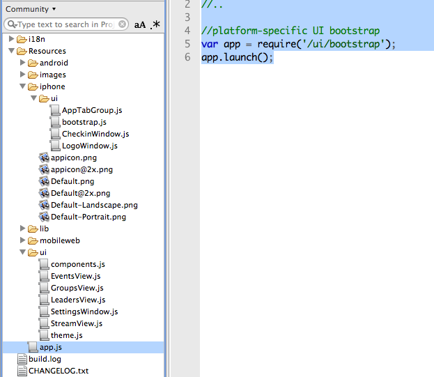

# Community app

This document contains information on where to download the community app and overview of core concepts and conventions.

## Download

You can download the project from this GitHub repo: [https://github.com/appcelerator-titans/App](https://github.com/appcelerator-titans/App).

**As of this writing, the repo was structured such that you cannot directly import it into Studio** (via the Import > GitHub repo option). This is because the repo includes additional files, such as source graphics, which requires an extra level of directory structure. So, download the zip and import the Community directory into Studio.

## Core Concepts and Conventions

This app features a number of Titanium current-practices, including:

* A CommonJS modules pattern

* Minimal additions to the global namespace

* Heavy use of the platform build directories to create user experiences tailored to the user's operating system

* Wrapping of proxies to avoid the need to extend the Titanium objects

This app is not a template for new projects. It is a living app, one that is in constant development by our Development Relations team. We encourage you to pull ideas from the app rather than specific code.

### CommonJS pattern

Appcelerator's recommended practice is to implement app functionality as a set of CommonJS modules. These modules can represent UI components, factories for app components, or functional libraries (such as a network or database library). The Community app makes extensive use of modules.

### Global namespace

As outlined elsewhere in these guides, JavaScript has limited notion of scope. You're asking for a world of hurt if you go dumping a lot of variables into the global scope. This app adds a single variable to the global scope. And with slight modification could even eliminate that.

A common use for the global namespace in Titanium apps is as a storehouse for "session" data that must be passed between portions of your app. With the CommonJS pattern, modules have their own global namespace and don't have access to the app's global space. This is a similar challenge faced by multi-context apps. The Community app doesn't have a specific need for passing such data. Common solutions for this problem center around creating an object and passing it to each module as needed.

For example, you could create a single global App object to which you may append objects as needed. While there may be times when another global object is needed, everything will be placed in this namespace and documented in order to stay organized and avoid conflicts. e.g. `App.livedata = {}`; could be the home of transient session data for this app.

```javascript
var App = {}; // app to which you'll store objects, properties, & session data
var someComponent = require('foo').init(App); // pass the object into the module
someComponent.doSomething(App.livedata.someProperty); // or pass a specific property to a method
```

### Platform build directories

The Community app makes heavy use of an under-appreciated feature of Titanium: the platform build directories. Titanium supports an overrides system by which you can provide platform-specific files that will be used in place of those in the main Resources branch. Here's the app.js:

```javascript
//do any global bootstrapping - none needed now
//..

//platform-specific UI bootstrap
var app = require('/ui/bootstrap');
app.launch();
```

But when you look at the Resources/ui folder, you won't find a file named bootstrap.js. That's because there are platform-specific versions of that file as shown in this screenshot.



Platform build directories (overrides) eliminate the need for `if(platform) // do this` type branching in your code. Instead, all the platform-specific code is merged into your project at build time. This can increase execution performance and reduce code complexity. Of course, those benefits come with two costs: slightly longer build time, plus the need to manage multiple versions of files. In this app's case, the UI on each platform varies and takes specific advantage of platform-specific conventions. So the benefit outweigh the costs.

### Wrapping proxy objects

A key gotcha that we try to point out frequently is that you should not extend or override any of the Titanium proxy objects (e.g. a table row object, view, or something like Ti.App). While JavaScript is very flexible, the underlying native languages are not. Neither is the bridge between JavaScript and nativeland. Adding a property or two to a proxy is probably okay, adding objects or methods is likely to cause your app to crash.

Still, there are times when it's so hard to resist storing some data in a proxy. For that, we suggest you wrap proxies in standard JavaScript objects and extend those JavaScript objects. The Community app does this. See the `/ui/components.js` for example code. Here's an excerpt:

```javascript
function Component(/*Titanium Proxy Object*/ tiView) {
  this.viewProxy = tiView;
}

//Wrappers for common Titanium view construction functions
Component.prototype.add = function(tiChildView) {
  var v = tiChildView.viewProxy||tiChildView;
  this.viewProxy.add(v);
};
// ... lots more here
```

The other modules could then call on this component object to wrap Titanium proxies, like this:

```javascript
var ui = require('/ui/components');
var myview = new ui.Component(new ui.View({
     height:44,
     top:0,
     backgroundImage:'/images/sliver.png'
}));
myview.someMethod = function() {
    // do stuff here
};
```

Because these wrapped objects have a slightly different interface (different methods & properties) than the standard objects they represent, you probably want to use them only when required.
