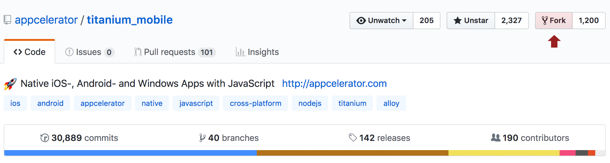
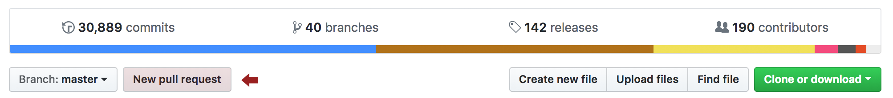
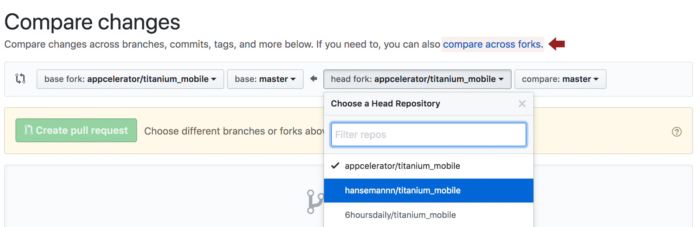

# Pull Request Guide

So you want to make a contribution to the **Titanium SDK**? Got a bug you want to fix, or a feature you want to add? This is the guide that will help you do so. It'll walk you through all the necessary steps for creating a successful pull request against the [titanium\_mobile github repository](https://github.com/tidev/titanium_mobile).

Aside from functioning in an educational capacity, this guide also serves to make the process of integrating your pull requests a more uniform task for our platform engineers. Observing the steps in this guide for each pull request will:

* Make pull requests that are easier to integrate

* Define the expectations on those submitting pull requests

* Give you an opportunity to expedite the acceptance of your own pull requests. **Complete, high quality pull requests will receive priority**.

## Prerequisites

* Familiarity with the open source [Apache 2.0 license](http://www.apache.org/licenses/LICENSE-2.0.html), the license that governs the Titanium SDK.

* A working knowledge of [Git and Github](/guide/Titanium_SDK/Titanium_SDK_Guide/Contributing_to_Titanium/Platform_Development/Git_and_Github/)

* A [github.com account](https://github.com/signup/free)

You must also have all of the software required to build the Titanium SDK from source. For details, see [Building the Titanium SDK From Source](/guide/Titanium_SDK/Titanium_SDK_Guide/Contributing_to_Titanium/Platform_Development/Building_the_Titanium_SDK_From_Source/).

There are a number of GUI interfaces for git. This guide provides instructions for using git from the command line, but these can easily be adapted to other tools.

## Pull Request Process

[#1. Review and sign the Contributors License Agreement (CLA).](#1.-review-and-sign-the-contributors-license-agreement-cla.)
[#2. Find or create a Jira ticket to associate with your pull request.](#2.FindorcreateaJiratickettoassociatewithyourpullrequest.)
[#3. Fork the Titanium SDK Repository on Github.](#3.ForktheTitaniumSDKRepositoryonGithub.)
[#4. Clone, setup remotes, and branch.](#4.-clone,-setup-remotes,-and-branch.)
[#5. Make your changes to the development branch.](#5.-make-your-changes-to-the-development-branch.)
[#6. Compile and test the modified titanium\_mobile project.](#6.-compile-and-test-the-modified-titanium_mobile-project.)
[#7. Add or modify the API docs (if necessary).](#7.AddormodifytheAPIdocs(ifnecessary).)
[#8. Rebase your development branch with the master (optional).](#8.Rebaseyourdevelopmentbranchwiththemaster(optional).)
[#9. Submit pull request in Github.](#9.SubmitpullrequestinGithub.)

### 1\. Review and sign the Contributors License Agreement (CLA).

To contribute to any of Appcelerator's open source projects, such as Titanium or Alloy, you must sign a standard Open Source Contributors License Agreement (CLA). As with most open source projects, legal issues regarding intellectual property rights require us to protect ourselves, our contributors and our users from any future ownership claims from third-parties.

The CLA is a simple form you can sign electronically by visiting the following URL:

* [https://cla.appcelerator.com](https://cla.appcelerator.com)

You must first electronically sign the before you can contribute code, documentation or any other materials to the project. **You are only required to do this once**.

### 2\. GitHub issue to associate with your pull request.

File a new GitHub issue on the main repository ([tidev/titanium_mobile](https://github.com/tidev/titanium_mobile)) by filling out the template with the feature, bugfix or improvement you want to contribute. Our team links GitHub issues with Jira, so it can be tracked by the internal engineering team

Once you have created/found the GitHub issue that you would like to address with your pull request, remember it. The ticket number will be used to identify your development branch in a later step. In addition, code for testing your pull request should be included in the Jira ticket.

For comprehensive instructions on everything associated with submitting Jira tickets, see [How to Report a Bug or Make a Feature Request](/guide/Titanium_SDK/Titanium_SDK_Guide/Contributing_to_Titanium/How_to_Report_a_Bug_or_Make_a_Feature_Request/).

### 3\. Fork the Titanium SDK Repository on GitHub.

To be able to submit changes to the Titanium SDK, you first need your own forked copy of the `titanium_mobile` project available on GitHub. You'll need a GitHub account of your own to be able to do so. To create your own fork of titanium\_mobile, you simple need to:

1. Log in to your GitHub account.

2. Go to the [appcelerator/titanium\_mobile](https://github.com/tidev/titanium_mobile) project on GitHub.

3. Click the "Fork" button at the top of the screen.



That's it. You will now have a forked copy of the `appcelerator/titanium_mobile` repository under your GitHub account. Instead of being called `appcelerator/titanium_mobile`, though, it will now be called `YOUR_ACCOUNT/titanium_mobile`, where `YOUR_ACCOUNT` is your GitHub account name.

### 4\. Clone, setup remotes, and branch.

There are multiple ways to clone the Titanium project locally. You can either use a Git desktop app like [Tower](https://www.git-tower.com/), [GitHub Desktop](https://desktop.github.com/) and [Source Tree](https://www.sourcetreeapp.com/), or alternatively the CLI. Guides for the desktop apps can be found on their documentation. To clone your project from the CLI, you need to do

```
git clone git@github.com:YOUR_ACCOUNT/titanium_mobile.git   # YOUR_ACCOUNT is your Github account name
cd titanium_mobile
git remote add appcelerator git://github.com/appcelerator/titanium_mobile.git
git checkout master
git checkout -b PROJECT-NUMBER   # PROJECT-NUMBER is from step 2. For example, TIMOB-1234 or TC-432
```

It is assumed that if you are planning to develop against the `titanium_mobile` project, you already have `git` installed for your system. If you do not, please use our guide for getting set up: [Installing Git](/guide/Titanium_SDK/Titanium_SDK_Getting_Started/Installation_and_Configuration/Installing_Titanium_Advanced_Tools/Installing_Git/)

In the commands above, we are performing 3 distinct `git` operations to prepare for developing against the titanium\_mobile project.

* **`git clone`**
    Given a remote repository, `clone` will create a local copy of the recently forked repository that you can modify. As noted above, you need to replace **`YOUR_ACCOUNT`** with your Github account name

* **`git remote add`**
    This command adds the original `appcelerator/titanium_mobile` repository as a remote source for your local repository. This allows you to update your local repository with any changes that are made to the main `appcelerator/titanium_mobile` repository.

* **`git checkout`**
    This command, when given the `-b` option, creates a local development branch by the name `PROJECT-NAME`. As mentioned above, the name should correspond to the Jira ticket that you identified in step 2. So if you are planning to address ticket number 1234 in the TIMOB project, your full command would look like this:

    ```
    git checkout -b TIMOB-1234
    ```

You only need to clone your Github repo and set up the remote repository once. For any subsequent pull requests, you'd do the following:

```
git checkout master              # return to the master branch
git pull appcelerator master     # update the master branch with the latest code from the main repo
git checkout -b PROJECT-NUMBER  # create a new branch based on the current state of the master branch
```

### 5\. Make your changes to the development branch.

This is where you will make your changes to the Titanium SDK. There's a few things to consider when doing so:

* Follow the Titanium coding standards: [Coding Standards](/guide/Titanium_SDK/Titanium_SDK_Guide/Contributing_to_Titanium/Platform_Development/Coding_Standards/).

* Functionality added in a pull request must work on all supported versions of our platform. For example, any pull request submitted for both Android and iOS must support Android 2.2+ and iOS 4.0+ as of Titanium SDK 1.8.

* Parity between platforms must be preserved when adding functionality, where possible. To achieve this, you have 2 options

    * Submit any pull requests for both Android and iOS

    * Submit your pull request for one platform, then submit a "parity" Jira ticket for the unsupported platform.

For example, let's assume you submitted a new feature on Android that has a corresponding feature on iOS, but you did not implement it on iOS. What you would do it submit the Android-only pull request, then create a [Titanium Community](https://jira-archive.titaniumsdk.com/TC) Jira ticket indicating that your pull request is not implemented in iOS. That way our platform engineers, as well as other community members, will have an opportunity to resolve the parity issue.

It takes the burden of implementing on multiple platforms out of your hands, but it is in turn likely that your pull request will take longer to accept as the parity issues are resolved.

### 6\. Compile and test the modified titanium\_mobile project.

For now, compiling and testing your modified SDK is a very basic process.

1. Go to titanium\_mobile/build

2. Run `npm install` to update the required Node modules

3. Run `node scons.js cleanbuild` to do a clean build for iOS and Android that also packages and installs the SDK. If you only want to build for one platform, add either "ios" or "android" to the command

4. Run your test app with the CLI against your newly installed SDK.

See [Building the Titanium SDK From Source](/guide/Titanium_SDK/Titanium_SDK_Guide/Contributing_to_Titanium/Platform_Development/Building_the_Titanium_SDK_From_Source/) for detailed instructions for building the SDK.

Code that you use to test your pull request should be included in the associated Jira ticket. This test case will be part of the validation process.

### 7\. Add or modify the API docs (if necessary)

If the changes you've made to `titanium_mobile` have added to or changed the public Javascript API in any way, you need to change the API docs to reflect that. Let's assume you have added a property named **`myNewProperty`** to **`Titanium.UI.View`**. Let's tak a look at how we would modify the API docs to document the new property.

The API docs are part of the `titanium_mobile` project and can be found at:

```
/path/to/titanium_mobile/apidoc
```

The directory structure inside `titanium_mobile/apidoc` is organized by namespace, just as the API docs are in the Developer Center. In our case, we are looking for `Titanium.UI.View`, so we go to the following directory:

```
/path/to/titanium_mobile/apidoc/Titanium/UI
```

and then we open the **`View.yml`** file in our favorite editor. We would then scroll down to the **`properties`** section of the YML document and find where we would put our new property, alphabetically. In our case, `myNewProperty` would be between the existing `layout` and `opacity` properties. The updated documentation would look something like this:

```
// layout documentation
  - name: myNewProperty
    summary: Useful new property for keeping track of stuff.
    description: |
        This property is added as an example of how to add/modify existing
        API docs documentation. The description here is a more comprehensive
        overview of the property which can include information regarding
        its functionality, usage, and limitations.
    type: String
    default: 'stuff'
// opacity documentation
```

When you are done making your modifications, be sure to build and validate the new API docs. You can do that with the following commands.

```
cd /path/to/titanium_mobile/apidoc
node validate.js               # 1. validate the generates API docs
node docgen.js                 # 2. generate the API docs in /path/to/titanium_mobile/dist/apidoc/
```

For a more detailed account of this process, see:

* [Contributing API Documentation](/guide/Titanium_SDK/Titanium_SDK_Guide/Contributing_to_Titanium/Documentation/Contributing_API_Documentation/)

* [Titanium API Doc Style Guide](/guide/Titanium_SDK/Titanium_SDK_Guide/Contributing_to_Titanium/Documentation/Titanium_API_Doc_Style_Guide/)

### 8\. Rebase your development branch with master (optional)

If you have made a number of commits related to your fix over time, you may want to rebase your changes on the master titanium branch. This step is optional.

```
git commit ...                           # commit code changes as usual
git checkout master                      # go back to the master branch
git pull appcelerator master             # make sure the master is up to date
git checkout PROJECT-NUMBER              # go back to your development branch
git rebase master                        # rebase your development branch as the master
```

### 9\. Submit pull request in GitHub.

To raise a Github pull request, follow these steps:

1. Push your changes to your Github fork.

    ```
    git push origin PROJECT-NUMBER
    ```

2. Go to the `appcelerator/itanium_mobile` repository. Usually, it will be highlighted automatically and prompt you to create a pull request. If not, open a pull request manually (steps 3-6)

3. Open your GitHub `titanium_mobile` repository in your browser, select the development branch that you have pushed using the branch selector on the left.

4. Confirm that your last commit is displayed beneath.

5. Click the "New pull request" button:

    
6. Click the "compare across forks" link, select your fork and branch from the list:

    

    Add a message using the form on the following page, and click the "Create Pull Request" button to submit it. Some guidelines:

    1. Put the JIRA ticket first, in brackets, e.g.: [\[TIMOB-26010\] Android: Add a missing null check in getResponseHeaders](https://github.com/tidev/titanium-sdk/pull/10025)

    2. If you have multiple JIRA tickets, list them. You should only have 1 ticket per PR, e.g.: [\[TIMOB-10350\] \[TIMOB-9558\] Anvil test case for xml test suite](https://github.com/tidev/titanium-sdk/pull/5039)

    3. If you are doing a back port, put the branch name after the JIRA number in parenthesis. Use the ACTUAL name of the branch, e.g.: [\[TIMOB-25936\] (7\_1\_X) iOS: Fix appendSection & appendRow on main-thread](https://github.com/tidev/titanium-sdk/pull/9987)

    4. Use the title of the JIRA ticket (or a close approximation) for titling the PR.

    5. Add a link to the JIRA ticket in the description of the PR.

At this point, your request is ready for review. In most cases a member of the Titanium core team should review your request within a few days. Reviews may take longer if there is a large volume of pull requests outstanding.

::: tip 💡 Hint
A pull request is a request for the HEAD of the branch. Any commits that you push to your branch, up until the moment the pull request is merged, will be merged into the master branch.
:::

## Frequently Asked Questions

Q. What does it mean if my PR is rejected? Does **Rejected** in bold mean they really don't like it?

A. It's common for a PR to be rejected when it is first made. This could be because it fails functional testing, needs changes to the code style, or because the description of the issue and/or solution is not clear enough for the reviewer to test the change. In this case, the reviewer should give clear guidance about what needs to be fixed for the PR to be processed.

A PR can also be rejected if the feature is determined to be a bad fit for the project – for example, something that would be better implemented as a module.

And many reviewers use bold for **Accepted** or **Rejected** so they stand out from the rest of the text. It's not personal – really.

Q. What happens if I need to make changes to my pull request? Do I need to submit a new one?

A. If your PR hasn't been merged, simply pushing new changes to your Github branch will update the pull request. If the reviewer requests changes to your PR, simply add a new commit on the branch and push it to Github.
